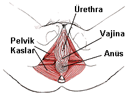

Bize basit gibi görünen ve hergün birkaç kere tekrarladığımız vücut olayları aslında çok karmaşık mekanizmalarla meydana gelmektedir. Bunlardan bir tanesi de idrar yapmaktır. İdrar yapma fizyolojik, nörolojik, psikolojik, anatomik ve sosyolojik olayların bileşkesidir.

Böbreklerden süzülen idrarın dışarı atılıncaya kadar biriktirildiği organ olan mesane ve idrarı mesaneden dış dünyaya taşıyan ürethra, pelvis boşluğu içinde bulunur. İdrar yapmada görev alan bu organlar pelvis boşluğunu alttan destekleyen kas grupları tarafından yerinde tutulur. Bu kas tabakalarındaki gevşeme ve zayıflıklar idrar tutmada güçlüğüne yol açabilirler. Gevşeme ve zayıflıkların en önemli nedeni yapılmış olan normal doğumlardır. Sonuçta pelvik kaslardaki gevşemeler sonucu mesane sarkması (sistosel), rektum sarkması (rektosel) ve idrar tutamama (üriner inkontinans) görülebilir. İlerlemiş bir sistosel vakasında ameliyat dışında yapacak pek birşey yoktur. Oysa sistosel çok fazla değilse, kasları güçlendirmeye yönelik yapılacak birkaç küçük egzersiz ile şikayetler giderilebilir. İdrar sarkması olmasa bile gebelik esnasında pelvik kasları güçlendirmek ileride idrar problemi yaşanma olasılığını azaltabilir.

**Kegel egzersizleri ile çalıştırılan pelvik kaslar**

Pelvik kasları güçlendirmek için yapılan egzersizlere, ilk kez tanımlayan hekimin anısına Kegel Egzersizleri adı verilir. Egzersizlerin mantığı çok basittir: Çalışan ve sık kullanılan kasların gelişmesi. Tıpkı vücut geliştirme sporu yapanlarda olduğu gibi kullanılan kas grupları bir süre sonra gelişmeye ve güçlenmeye başlar. Pelvik kasları güçlendirmenin asıl amacı idrar yakınmalarının önüne geçmek olmakla birlikte bu kas gruplarını kullanmayı bilen kadınlar cinsel ilişkiden de daha fazla keyif alırlar. Kegel egzersizlerinin başarısı uygun teknik kullanmaya ve düzenli egzersiz programına uymaya bağlıdır.

Pekçok kadın pelvik tabanı destekleyen kasları bulmakta güçlük çeker. Egzersizler esnasında karın ya da uyluk kaslarını çalıştırılar ki bu kas gruplarının pelvik yapılar ile hiçbir ilişkisi yoktur. Pelvik kasları öğrenmek için birkaç teknik mevcuttur.

Tuvalate oturun ve idrar yapmaya başlayın. İdrar normal akım hızına ulaştıktan sonra pelvik kaslarınızı kullanarak idrarı durdurmaya çalışın.İdrarı durdurmak için kullandığınız kaslar pelvik kaslarınızdır. Bu hareketi doğru kas grubunu kullandığınızı anlayana kadar tekrarlayın. Bu esnada karın, kalça ve uyluk kaslarınızı kasmayın.

Uygun kasları öğrenmek için bir diğer teknik de vajinaya bir parmak yerleştirmek ve daha sonra parmak etrafındaki kasları kasmaya çalışmaktır. Bu esnada idrar tutarmış gibi yapmak faydalı olur.

Yinde de doğru kas grubunu çalıştırdığından emin olamayan kişiler için elektrik stimulasyon tekniği uygulanabilir. Kaslara yerleştirilen elektrodlar yardımı ile hangi kas gruplarının kasıldığı anlaşılabilir.

Uygun egzersiz şekli  
1\. İlk önce mesaneyi boşaltarak egzersizlere başlayın  
2\. Pelvik kasları kasın ve 10’a kadar sayın  
3\. Kasları tamamen gevşetin ve 10’a kadar sayın  
4\. Günde 3 kez (sabah, öğlen ve akşam) bu şekilde 10’ar defa tekrarlayın

Bu egzersizler günün her anında ve her yerde yapılabilir. Oturarak ya da yatarak yapılabilir. 4-6 hafta sonunda gelişme fark edilecek düzeyde olacaktır. İleri vakalarda değişikliklerin ortya çıkması 3 ay kadar alabilir.

Egzersizlerin sıklığı ya da sayısının arttırılması zannedilenin aksine durumun iyileşmesini hızlandırmaz. Tam tersine kasların yorulmasına neden olarak idrar tutamama probleminin daha da artmasına neden olur.

Kegel egzersizleri esnasında bel ve karın bölgesinde ağrı olmaması gerekir. Bu bölgelerde ağrı varlığı egzersizlerin hatalı yapıldığı anlamına gelir. Yine bazı kişiler egzersiz esnasında nefeslerini tutarlar ve göğüs kaslarını da kasarlar. Oysa tekniğin kısa sürede etkili olabilmesi için sadece pelvik kasların kasılması oldukça önemlidir.
