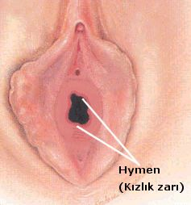
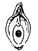
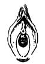
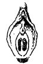
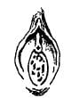
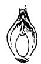
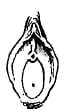
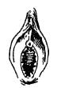
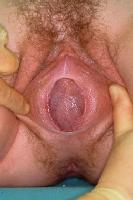

Hemen hemen bütün toplumlarda değişik derecelerde sosyolojik öneme sahip olan kızlık zarı tıbbi literatürde Hymen (himen) olarak adlandırılır. Hymen aynı zamanda Yunan ve Roma mitolojisinde Baccus (Dionysus) ve Venüs’ün (Afrodit) oğlu olan ve elinde bir meşale tutan evlilik ve düğün tanrısının adıdır. Gerdek gecesi bu Tanrı’ya adandığından kızlık zarı da aynı isimle anılmaktadır. Mitolojik bireylerin yanısıra 19. yüzyılda yaşamış bir besteci olan Frederic Hymen Cowen’de talihsiz bir seçimle bu kelimeyi yaşamı boyunca isim olarak taşımıştır.

Kızlık zarının fizyolojik amacı ve görevi kadın vücudunun bugüne kadar açıklanamamış pekçok sırrından birisidir. Spesifik bir görevi yokmuş gibi görünmesine rağmen özellikle embryonik dönemde mikroorganizma ve yabancı cisimlerin vajina içine girişini önlediği düşünülmektedir. Tıbbi açıdan bakıldığında ise özellikle gelişmiş toplumlarda en sık cinsel şiddete ve istismara maruz kalan çocukların tanınmasında incelenmektedir.

İnsanoğlunun tarihsel gelişimi süresince pekçok toplum hymeni saflığın ve el eğmemişliğin yani bekaretin sembolü olarak görmüştür. Bu inanışın yansımaları hala daha özellikle bizim toplumumuz gibi gelişmekte olan toplumlarda sıklıkla yaşanmaktadır.

Günümüzde kızlık zarının anatomik ya da fizyolojik değil sosyolojik bir fonksiyonu vardır.

**Anatomi**  
Kızlık zarı belirli bir yapıda değildir. Anatomik olarak vajinayı oluşturan ve mukoza adı verilen dokunun vajina girişini oluşturan doku kıvrımıdır. Yani kızlık zarı vajina içinde değil vajinanın hemen girişinde dudakların yaklaşık 1-1.5 santimetre içindedir ve küçük dudaklara bağlıdır.Dış genital oluşumlardan birisi olarak kabul edilir.Dışarıya bakan ön yüzü deriye, vajina içine bakan arka yüzü ise mukozaya benzer. Kız çocukların hemen hepsine bulunan hymen çok nadir olarak doğuştan hiç bulunmayabilir. Çocukluk çağında daha sert olan doku ergenlikle birlikte östrojen hormonunun salınmasına bağlı olarak değişime uğrar ve esneklik kazanır.

Kızlık zarı vajina girişini tamamen kapatmaz, ortasında adet kanının ve vajinal salgıların dışrıya akmasını sağlayan bir delik bulunur. Bu deliğin şekli ve yapısı hymen türlerinin belirlenmesinde kullanılır. Kızlık zarının şekli, kalınlığı ve elastikiyeti kişiler arasında büyük farklılıklar gösterir.

**Kızlık zarının türleri**

**Annüler Hymen  
**

En sık görülen hymen şeklidir. Burada kızlık zarı halka şeklinde vajna girişini kaplamaktadır. Ortasında yine halka şeklinde bir delik bulunur. Karadeniz ve arkadaşları yaptıkları araştırmada kadınların %94.7’sinde kızlık zarının annüler olduğunu göstermişlerdir. Yurtdışında yapılan çalışmlarda ise annüler kızlık zarının kadınların %60-95’inde bulunduğu saptanmıştır.

**Kresentrik Hymen**

Yarımay şekinde olan kızlık zarıdır. Genelde klitorise yakın kısımlarda zar daha incedir yada hiç yoktur. Arka kısımda ise daha beligindir. Görülme sıklığı %3.5 ile %20 arasında değişmektedir. Bu tür zarlar genelde ilişki sırasında yırtılmaz.

**Septalı Hymen**

Bu hymen türünde ortadaki deliğin ortasında bir köprü gibi görünen doku parçası vardır. Kadınların %1.5-5’inde hymen bu yapıdadır.

**Kribriform Hymen**

Hymenin ortasında tek değil birden fazla delik vardır. Bu görüntü dantele benzer. Görülme sıklığı %1’den daha azdır.

**İmperfore hymen**

Bu zar türünde vajina girişi tamamen kapalıdır ve hymenin ortasında delik yoktur. Bu zar türüne sahip kızlar hiç adet kanaması görmezler. Normal şekilde gerçekleşen kanama vücut dışına atılamaz ve hymen arkasında vajina içinde birikir. Oldukça ağrılı bir durumdur ve hymenin doktor tarafından cerrahi bir işlemle açılması gerekir.

**Mikroperfore hymen**

Hymen ortasındaki delik çok küçüktür. Adet kanaması olur ancak oldukça ağrılıdır. Bir kısım hastada cerrahi müdahale ile açılması gerekir.

**Multipar hymen**

Doğum yapmış kadınlarda kızlık zarından geri kalan kısımlar karünkül olarak adlandırılır.

Şekil dışında kızlık zarları deliğin ve serbest kenarın karakteri, zarın kalınlığı ve mukavemetine göre de sınıflandırlabilir.

Doğuştan açıklığı olmayan imperfore bir hymen ve arkasında birikmiş olan kan

Kızlık zarı genelde ilk ilişki ya da yabancı bir cisim girişi ile yırtılır. İlk cinsel ilişki esnasında hymen ortasındaki delik penis çapından küçük olduğu için halka şeklindeki zar birkaç yerden yırtılır ve az miktarda kanama meydana gelir. Bu yırtıklar birkaç gün içinde nedbeleşir ve bir daha kanama olmaz. Çok nadiren ilk ilişkiyi takip eden bir kaç ilişki sırasında da kanama görülebilir. Bazen bir ilişki olmasa da kızlık zarının serbest kenarı düz olmaz ve çentikler bulunur. Kadınların yaklaşık %20’sinde bu tür çentikler bulunur.

**İlk ilişkide kızlık zarı mutlaka bozulur mu ?**  
Hayır. Kızlık zarının özgün yapısı bazı kadınlarda penis girişine müsade eder ve çok defa ilişkide bulunsa bile zarda yırtık meydana gelmez. Bu tür zarlara duhule müsait ya da ilişkiye müsait zar adı verilir. Halk arasında ise elastik zar olarak adlandırılır. Kadınların %26-41’inde zar duhüle müsaittir ve ilk ilişkide kanama olmaz.

**Kızlık zarının bozulması ağrıya neden olur mu ?**  
Bazı kadınlarda ilk ilişki sırasında ciddi miktarda bir ağrı olabilir. Ancak genelde herhengi bir rahatsızlık olmaz. Burada erkeğin davranışı ve yaklaşımı son derece önemlidir. İlk ilişki ister istemez her kadında endişe ve korkuya neden olur. Erkeğin yavaş ve yumuşak davranışı olayın ağrısız olmasını kolaylaştırır.

**Kanamanın miktarı ne kadardır ?**  
Kanamanın miktarı genelde çok azdır ve kısa sürede kendiliğine durur. Çok nadiren hymen arkasından bir damar açığa çıkar ve kanama durmaz. Bu gibi durumlarda cerrahi müdahale ile dikiş atılmsı gerekebilir. Bazı durumlarda ise vajina girişinde va hatta içinde yırtıklar meydana gelebilir, şiddetli ve durmayan bir kanama görülebilir. Bu gibi durumlarda cerrahi müdahale ile dikiş atılması gereklidir. Atılan bu dikiş kızlık zarını onarmaz.

**Kızlık zarı bozulduğunda mutlaka kanama olur mu?**  
Hayır. Bazı durumlarda zarda yırtık meydana gelmesine rağmen kanama olmayabilir.

**Kanama olması kızlık zarının bozulduğunu mu gösterir?**  
Hayır. Bazı durumlarda kızlık zarı bozulmaz ancak dış kısımlarda yırtık ya da sıyrık olabilir ve buralardan kanamalar görülebilir.

**Kızlık zarı ilişki dışında başka bir yolla bozulabilir mi?**  
Kızlık zarı genelde vajina içine giren ve genişliği hymen ortasındaki halkadan daha büyük olan cisimler ile bozulur. Ancak bazen ata ya da bisiklete binme, bacakları çok açmayı gerektiren bale gibi aktiviteler ya da kaza ve travma sonrasında da bozulabilir ya da zedelenebilir.

**Mastürbasyon kızlık zarına zarar verir mi ?**  
Hayır. Vajina içine birşey sokmaya teşebbüs edilmediği taktirde mastürbasyon ile kızlık bozulmaz.

**Kızlık zarı kendi kendine iyileşir mi?**  
Hayır. Bir kez zedelenen kızlık zarı daha sonra hiç ilişki olmasa bile kendi kendini onarmaz.

**Kızlık zarının ne zaman bozulduğu anlaşılabilir mi ?**  
Hayır. Eğer aradan 7-8 günden fazla zaman geçmişse anlaşılamaz.

**Kızlık zarı bozulmadan hamile kalınabilir mi ?**  
Evet. Kızlık zarı gebeliğe karşı koruma sağlamaz. Kızlık zarı sağlamken (elastik ya da dışarı boşalma) spermler içeri girebilir ve dış gebelik de dahil olmak üzere hamilelik oluşabilir.

**Kızlık zarı bozulmadan muayene ya da kürtaj yapılabilir mi?**  
Evet. Zar yapısı uygun olan kişilerde hymen yapısına zarar vermeden spekulum incelemesi hatta kürtaj dahi yapılabilir. Öte yandan akıntı sorunu olan hemen hemen tüm bakire genç kızlarda ve kız çocuklarında vajinal kültür alınabilir.

**Kızlık zarının bozulduğu nasıl anlaşılır ?**  
Bu ancak muayene ile anlaşılır. Muayene son derece kısa ve ağrısız bir işlemdir. Doktorunuz gazlı bez ile büyük dudakları ayırarak kızlık zarını gözler. Kendi kendine kızlık muayenesi olmaz. Ayna ile hymeni görebilirsiniz ancak bunu yorumlamak deneyim gerektirir. Bazı durumlarda jinekolog bile buna karar veremeyebilir ve kolposkopik incelemeye gereksinim duyabilir. Özellikle doğal çentik bulunan hymen varlığında karar vermek güç olabilir.  
**Kanama öyküsü vb. ile kızlık zarının bozulup bozulmadığı anlaşılamaz.**

**Kızlık zarı tamir edilebilir mi?**  
Evet. Kızlık zarı tamir edilebilir ve bu işleme himenoplasti (hymenoplasty) ya da hymenorraphy adı verilir. Bunun için ne zaman ya da kaç defa ilişki olduğu önemli değildir. Doğum yapmış kadınlarda bile kızlık zarı tamir edilebilir. Kızlık zarının tamir edildiği ancak jinekolog ya da adli tabip tarafından anlaşılabilir. Ancak kızlık zarı tamirinde kanama olması %100 garanti edilemez. Gerçekte bozulmuş olan zarın tamamen tamir edilmesi ve eski haline getirilmesi olanaksızdır.Son derece ince yapıda olan bu doku genelde dikiş tutmaz. Ortamda bulunan fazla sayıdaki mikroorganizma nedeni ile yara yeri kolayca enfekte olabilir. Buna karşılık vajina duvarından alınan parçalar ile yeni bir hymen yapılabilir. Bu durumun hukuksal ve ahlaki boyutu tartışmalı olmakla beraber bizim toplumumuz gibi bekaret nedeni ile cinayetlerin bile yaygın olarak görüldüğü toplumlarda zaman zaman hayat kurtarıcı olabilmektedir.

Kızlık zarı tamiri ile ilgili olarak tüm dünyada tartışmalar sürmektedir. Ancak bu yapay bekaretin ne kadar gerekli olduğu konusunda fikir birliği yoktur. Özellikle batılı yazarlar bunun son derece gereksiz bir işlem olduğunu düşünürken bazıları işlemin etik açıdan estetik ameliyattan farklı olmadığı fikrindedirler. Açıkçası hymen onarımı talep eden kadınlar buna yaşadıkları toplumsal çevreye bağlı olarak sosyal statülerini, mutluluklarını hatta yaşamlarını devam ettirebilmek için gerek duyduklarını belirtmektedirler. Gerçekten de 1996 yılında Lancet dergisinde yayınlanan bir makelede kızlık zarı tamirinin Mısır’da ilk gece cinayetlerini %80 oranında azalttığı ileri sürülmektedir.

Yeniden elde edilen bekaretin bedeli çok da düşük değildir. Berkeley Tıp Dergisinde yayınlanan bir araştırmada Mısır’da kadınların bu işlem için 100-600 Amerikan doları ödedikleri, Türkiye’de ise ücretlerin 140-1500 Amerikan Doları arasında değiştiği belirtilmektedir.

**Her doktor bu ameliyatı yapabilir mi?**  
Hayır. Pekçok jinekolog bu ameliyatı prensip olarak yapmaz. Ancak Amerika Birleşik Devletleri de dahil olmak üzere dünyanın hemen her ülkesinde bu ameliyatı yapan doktor ve klinikler mevcuttur.

**Ameliyat ne zaman yapılmalıdır ?**  
Bu yapılacak olan ameliyatın türüne bağlıdır. Bazı ameliyatlar ilişkiden bağımsızken bazı tür dikişler evlenmeden 3 gün önce yapılmalıdır. İşlem genelde 30 dakika kadar süren, genel ya da lokal anestezi altında yapılabilen nispeten basit bir operasyondur.

**ÖNEMLİ NOT:** **BEN BU AMELİYATI YAPMIYORUM LÜTFEN BU KONU İLE İLGİLİ OLARAK BANA ULAŞMAYA ÇALIŞMAYINIZ**

**Kaynaklar**

*   Kandela P Egypt’s trade in hymen repair. Lancet 1996 Jun 347:1615

*   Karadeniz Z, Hancı İH, Gövsa F, Arsoy Y, Yavuz İC, Ege B. Kızlık zarları. 7.Ulusal Adli Tıp Günleri(1-5 Kasım 1993, Antalya) Poster sunuları kitabı,343-348, 1993.
*   Sue Yeon Choi Restoring Virginity:Hymen repair surgery saves lives at the expense of deception Berkeley Medical Journal Fall 1998 Edition ([http://www.ocf.berkeley.edu/~issues/fall98/hymenrep.html](http://www.ocf.berkeley.edu/~issues/fall98/hymenrep.html))
