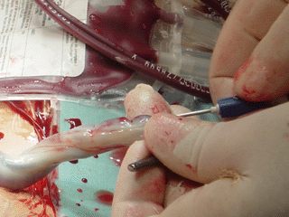

Bebeğinizin dünyaya merhaba dediği gün onu ilk kucağınıza aldığınız anda büyük bir olasılıkla bebeğinizle ilgili pekçok hayal aklınızın bir köşesinden geçecek. Onun ilk gülücüklerini, ilk adımlarını düşünüp mutlu olacaksınız. Onunla ilk tanıştığınız anda sanki ilk kez anne ya da baba deyişini kulaklarınızda duymanız da hayal dünyanızı süsleyebilir. Pek çok anne baba doğumdan hemen sonra çocuklarının gelecekleri ile ilgili hayal kurmaya başlarlar. Onun için yapacakları doğum günü partileri, birlikte çıkılacak tatiller, geziler hatta eğitim yaşamı ve evlilik gibi hayatının dönüm noktaları bile akla gelebilir. Büyük bir olasılıkla bebeğiniz ile ilgili aklınıza gelebilecek en son şey onun yakalaabileceği ciddi bir hastalık olasılığıdır.

Ancak bazı anne-babalar çocuklarının ileride ciddi bir hastalığa yakalanma olasılığını daha ilk günden hesaba katıyorlar ve bu olasılığa karşı önlem almaya çalışıyorlar. Bu önlemin adı kordon kanı saklanması.

**Kordon kanı nedir?**  
Anne karnındaki yaşamda bebek göbek kordonu ile plasantaya bağlıdır. Plasenta bebek ile anne arasındaki besin ve oksijen alış verişini sağlayan organdır. Doğumdan hemen sonra plasenta görevini tamamlayarak doğumun üçüncü evresinde rahim dışına atılır. Kordon kanı bebeğin doğumundan sonra göbek kordonu içinde kalan kandır. Bu kan bebeğin damarlarında dolaşan kandan daha farklıdır ve kan üretimde görev alan kök hücreleri içerir.

**Kordon kanının önemi nedir?**  
İnsanın yaşamını sürdürebilmesi için vazgeçilmez bir öge olan kan temel olarak plazma adı verilen sıvı içerisinde bulunan üç ana tip hücreden oluşur. Bu üç hücre kırmızı küreler (eritrosit), beyaz küreler (lökosit) ve trombositlerdir. Eritrositlerin görevi hücreler arasında oksijen ve karbondioksit taşınmasıyken lökositler organizmanın bağışıklık sisteminin temelini oluşturular. Trombositler ise diğer pıhtılaşma faktörleri ile birlikte kanın pıhtılaşmasında ve kanamanın kontrolünde görev alırlar.

Bu üç hücre grubunun hepsi de kemik iliğinde bulunan ve kök hücre adı verilen bir tür hücrenin farklışalması ile ortaya çıkarlar. Bir başka deyişle kemik iliğindeki kök hücreler her türlü kan hücresini üretme yeteneğindedirler ve bu üretim sürekli devam eder. .

Çocukluk çağı lösemileri (kan kanseri) ile bazı kan ve bağışıklık sistemi hastalıklarının varlığında kemik iliği görevini sağlıklı olarak yerine getiremez. Öte yandan bu hastalıkların tedavisinde başvurulan kemopterapi ya da radyoterapi gibi uygulamalar kemik iliğindeki kök hücrelere zarar verir. Hastalığın ve tedavinin türüne göre bazı hastalarda kemik iliği nakli kaçınılmaz olur. Bu durumda hastanın kemik iliği ile uyumlu olan sağlıklı bir vericiden alınan sağlıklı kemik iliği ve kök hücreleri hasta kişiye verilerek sağlıklı kan hücrelerinin yeniden üretimesi amaçlanır. Böyle bir durumda hastanın kendi akrabaları hatta kardeşleri arasında dahi uygun bir verici bulma olasılığı %25’ler civarındadır.

1980’li yılların başlarında bilimadamlarının yenidoğan bebeklerin kordon kanında da kemik iliğindekine benzer kök hücrelerin bulunduğunu fark etmeleri ile birlikte kordon kanından elde edilen bu hücrelerin belirli hastalıkların tedavisinde kullanılabileceği fikri ortaya çıktı. Elde edilen kordon kanının belirli koşullar altında toplanıp dondurularak saklanabileceği ve daha sonra gerek duyulduğunda çözülerek kullanılabileceğini fark eden Dr. David Harris 1992 yılında oğlunun kordon kanınını kendi laboratuvarında dondurarak sakladı. Daha sonra bu uygulamayı halka açması ile 1994 yılında Dünyadaki ilk kordon kanı bankası Amerika Birleşik Devletlerinde kurulmuş oldu. Takip eden yıllar içinde dünya üzerinde pekçok kordon kanı bankası kuruldu ve binlerce bebeğin kanı bu bankalarda koruma altına alındı.

**Kordon kanının saklanması ne işe yarar?**  
Kordon kanı bankalarında kanlar iki amaç için saklanmaktadır. Bunlardan ilk ve en önemli amaç bebeğin ileride kemik iliği nakli gerektirecek bir hastalığa yakalanması durumunda kendine ait sağlıklı kök hücreleri kullanılarak tedavi edilebilmesi ve bu sayede uygun kemik iliği vericisi aranması gerekliliğinin ortadan kalkmasıdır. Kişinin kendi hücre ve dokuları ile uyum sorunu olmayacağından bu oldukça önemli bir avantajdir. Bir diğer amaç ise saklanan kanın sahibi izin verdiği taktirde bu kanın başka hastaların tedavilerinde kullanılmasıdır.

Hastanın kendi kordon kanı ile tedavi konusunda çok fazla deneyim yoktur. Gerçekçi olmak gerekirse bu tür uygulamalarda hastalığın yeniden tekrar etme riski bulunmaktadır. Öte yandan bebeklerinin kordon kanının saklanmasını talep eden anne-babaların asıl amacı bebeğin kardeşlerinde ya da yakın akrabalarında hastalık ortaya çıktığında tedavi açısından kolaylık sağlanmasıdır. 1988 yılında Fankoni Aplastik anemi hastalığı bulunan bir çocuğun ilk kez kordon kanı ile tedavi edilmesinden bu yana yüzden fazla hasta bu yöntem ile tedavi edilmiştir. Günümüzde 40’dan fazla hastalığın tedavisinde teorik olarak kordon kanı kullanılabilmektedir.

Kişi büyüdükçe vücut hacmi arttığından kordon kanındaki kök hücre sayısı tedavide yetersiz olmaktadır. Bu yüzden kordon kanı yalnızca çocukluk ya da erken ergenlik çağındaki hastaların tedavisinde kullanılabilmektedir.

**Kordon kanı nasıl alınır?**  
Bebek doğduktan hemen sonra göbek kordonu bağlanır ve içindeki kan özel bir sistem yardımı ile torba içine toplanır. Toplanan kan 36 saat içinde laboratuvara gönderilir. burada kanın içindeki kök hüreler ayrıştırılarak özel yöntemler ile dondurulur ve saklanır. İşlem normal ya da sezaryen ile olan doğumlarda uygulanabilir. Fazla zaman almayan, kolay bir işlemdir. Dondurulan hücreler daha sonra gerek duyulduğunda çözülerek tedavide kullanılır. Ne kadar fazla kan toplanabilirse o kadar fazla kök hücre toplanmış demektir. Bununla birlikte yaklaşık 30- 60 mililitre kordon kanı alınması yeterli olmaktadır.

Kordon kanı saklanması, nispeten yüksek maliyetli bir uygulamadır. Tercih edilen laboratuvara göre dondurma işleminin ücreti 1500-2500 Amerikan Doları arasıda değişmektedir. Saklama ücretleri ise yıllık 90-100 Dolar civarındadır.

**Kordon kanı saklanması kimler için uygundur?**  
Kordon kanı saklanmasının kimler için uygun ve gerekli olduğu konusunda bilim çevrelerinde fikirbirliği sağlanamamıştır. Nispeten yeni olan bu uygulama ile ilgili olarak iki farklı görüş bulunmaktadır. Bazı araştırmacılar sadece ailelerinde kemik iliği nakli gerektirebilecek hastalık öyküsü bulunan çiftlerin bebeklerinde bu uygulamanın yapılmasını savunmaktadırlar. Bu görüşün en önemli savunucusu Amerikan Pediatri Derneğidir. Diğer araştırmacılar ise kök hücre çalışmalarındaki hızlı gelişimi göz önünde bulundurarak herkesin bu alternatifi kullanmalarını önermektediler. İleride elde var olan kök hücrelerden yararlanılarak laboratuvar ortamında bunların farklı şekillerde kullanılabileceği olasılığı bu tür bir yaklaşımı desteklemektedir. Günümüzde kordon kanı ile tedavi edilebilen hastalıkardan bazıları şunlardır:

*   Çocukluk çağı lösemileri
*   Aplastik anemiler (kemik iliğinde hücre üretiminin olmaması)
*   Orak hücreli anemi
*   Talasemi
*   Amegakaryositik trombositopeni
*   Nöroblastom
*   Bazı bağışıklık yetmezlikleri

İşlemin anne ve bebek açısından hiç bir risk taşımaması, olası bir hastalık durumunda tedavinin kemik iliği nakline göre daha kolay ve ucuz olması nedeniyle pekçok anne-baba adayı doğum sırasında bebeklerinin kordon kanının saklanmasını istemektedirler.

Kordon kanı saklanmasına karar verildiğinde beklenen doğumdan en az 1-2 hafta önce ilgili laboratuvar ve doğumu yaptıracak olan hekime durum bildirilmeli ve gerekli hazırlıkların yapılması sağlanmalıdır. Bu sayede gerekli ekipman ve belgeler doğum anında hazır bulundurulabilir.
