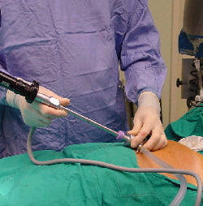
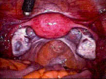

Dünyaya baktığımızda son 20 yılda cerrahi anlayışında köklü değişiklikler görmekteyiz. Vücut boşluklarını açmadan içeride olup bitenleri anlayabilme fikri tıbbın başlangıcından beri cerrahları heyecanlandıran en önemli özlemlerden birisidir. İlk kez 1901 yılında Georg Kelling isimli bir cerrah bu fikri hayata geçirebilmiş ancak laparoskopi bugünkü popülerliğine 1980’den sonra ulaşabilmiştir. Teknoloji ve tıp alanındaki gelişmeleri birbirine entegre eden en önemli gelişmelerden birisi olan laparoskopi, kameraların giderek küçülmesi sayesinde günümüzde pekçok hastalığın teşhis ve tedavisinde neredeyse ilk tercih edilmesi gereken bir yöntem haline gelmiştir.Kelime olarak bakıldığında skopi Yunanca’da gözlemlemek anlamına gelmektedir. Eğer gözlenen bölge göğüs boşluğu ise thorakoskopi, mesane ise sistoskopi, rahimin içi ise histeroskopi olarak isimlendirilmektedir. Laparokopi ise karın (batın) boşluğunun gözlenmesidir.

**Nasıl Yapılır ?**  
Laparoskopide temel alet minyatür bir teleskoptur. İşlem genel anestezi altında yapılır. Hasta uyuduktan sonra gerekli antiseptik temizlik yapılır. Hasta steril örtüler ile örtülür. Buraya kadar olan işlemler konvansiyonel cerrahi girişimler ile aynıdır.Yalnız hasta uyuduktan sonra lithotomi pozisyonuna alınır (jinekolojik muayene esnasında olduğu gibi) Daha sonra göbek deliğinden verres iğnesi adı verilen uzun bir iğne ile karın boşluğu içine girilir ve karbondioksit gazı verilir. Burada amaç gaz ile karın boşluğunu şişirerek barsakları itmek ve işlem için uygun bir oda yaratmaktır. Yaklaşık 3.5-4 litre gaz bu amaç için yeterli olur. Daha sonra göbek deliğinin içine ya da hemen altına 1 santimetre uzunluğunda bir kesi açılır. Bu kesiden trokar adı verilen 10 mm genişliğinde bir boru karın boşluğuna yerleştirilir. Bu borunun içinden de ışıklı bir teleskop yerleştirilir. Direk olarak gözle bakılabileceği gibi günümüzde teleskopun arkasına bir kamera yerleştirerek monitörden de gözlem yapılabilir. Teleskop yerleştirildikten sonra gözlem yapılır. (Gözlem esnasında rahat çalışabilmek maksadı ile daha önceden vajinal yoldan rahim içerisine bir manüpülatör yerleştirilir. Bu manipülatör ile bir asistan uterusu çeşitli yönlerde oynatabilir. Ayrıca yine bu cihaz ile rahim içerisine sıvı verilerek tüplerin açık olup olmadığı anlaşılabilir.) İlk gözlemden sonra kasık bölgesinde her iki yanda 5 milimetrelik iki kesi daha yapılır ve buralardan da trokarlar (bir çeşit özel boru) yerleştirilir. Bu trokarlardan da özel aletler yerleştirilerek ameliyatlar gerçekleştirilir.  
Operasyon sona erdiğinde tüm aletler çıkartılır. Kanama olup olmadığı kontrol edilir. Batın içerisindeki gaz mümkün olduğunca boşaltılır. Daha sonra yapılan kesiler onarılır. Bu kesilere ya hiç dikiş atılmadan özel flasterler ile yapıştırılır ya da dışarıdan görünmeyen estetik dikiş yapılır. Hasta yapılan operasyonun durumuna göre bazen 6-8 saat bazen de 24 saat gözlem altında tutulduktan sonra taburcu edilir.

**Kullanıldığı yerler**  
Laparoskopi ya da kısaca L/S klasik cerrahiye göre daha kısa hastanede kalış süresi, daha küçük kesiler ve çok daha kısa iyileşme dönemi nedeni ile avantajlıdır. Hemen hemen bütün cerrahi branşlarca kullanılan bu skopi teknikleri tanısal (diagnostik) ve tedavi edici (terapötik) olarak 2 türde yapılır. Tanısal amaçla yapılan laparoskopide adından da anlaşılabileceği gibi herhangi bir cerrahi müdahale yapılmaz sadece gözlem ile hastanın şikayetlerini yaratan nedenler araştırılır. Tanısal laparoskopinin jinekolojide en sık kullanıldığı alan infertilitedir.

**İnfertilite:** Açıklanamayan infertilite vakalarında tüplerin açık olup olmadığını, herhangi bir yapışıklık varlığını, overlerin durumunu değerlendirmek için L/S yapılır. İşlem esnasında vajinal yolla metilen mavisi adlı bir sıvı verilerek tüplerden geçip geçmediği, geçiş var ise bu geçişin sağlıklı olup olmadığı, yani kolay ya da zor geçişin varlığı değerlendirilir.  
**Kronik kasık ağrısı:** Laparoskopinin tanısal amaçlı kullanım alanlarından bir diğeri de açıklanamayan kronik kasık ağrısı vakalarında bu durumun nedenlerini araştırmaktır. L/S sırasında herhangi bir patoloji saptandığında buna yönelik girişime geçilebilir.  
**Tüp Ligasyonu :** Laparoskopinin girişimsel olarak ilk ve en sık kullanıldığı alan gebelikten korunmak maksadı ile tüplerin bağlanmasıdır. Açık cerrahiye göre çok avantajlıdır.  
**Over kistleri:** Basit kitlerin pek çoğu laparoskopi ile çıkartılabilir. L/S esnasında over bırakılarak sadece kist de alınabilir:  
**Polikistik over:** Hem polikistik overin saptanması hem de tedavisi amacı ile L/S yapılabilir. L/S esnasında polikistik over saptandığında over yüzeyi çok sayıda alandan delinerek yumurtlamanın kolaylaştırılması sağlanabilir (drilling)  
**Endometriozis:** Laparoskopiden en fazla yarar gören hasta gruplarının başında endometriozis hastaları gelmektedir. L/S ile endometriozisin hem tanısı konur, hem şiddeti saptanır hem de endometriotik odaklar yakılarak tedavisi sağlanır. Ayrıca çukulata kistleri de bu işlem esnasında çıkartılır.**  
Yapışıklıklar:** Önceden geçirilmiş operasyonlar ya da enfeksiyonlar bağlı olarak gelişen yapışıklıkların açılmasında L/S tercih edilebilir.  
**Dış gebelik:** Komplike olsun ya da olmasın dış gebeliklerin cerrahi tedavisinde laparoskopi çok yararlı ve etkili bir yöntemdir.  
**Myomektomi:** uygun vakalarda küçük subseröz myomlar L/S ile çıkartılabilir.  
**Histerektomi:** L/S eşliğinde histerektomi (rahimin çıkartılması) operasyonu yapılabilir. Ancak bu ameliyat esnasında uterusu yerinde tutan bağlar kesilip uterus gevşetildikten sonra işleme vajinal yoldan devam edildiğinden laparoskopi asiste vajinal histerektomi adı verilmektedir (LAVH).

Laparoskopide kadın üreme  
organlarının normal görünümü

**Risk faktörleri**  
Laparoskopi hemen bütün hastalarda uygulanabilmesine rağmen bazı durumlarda uygulanması sakıncalı ya da güç olabilir. Bu durumlar arasında:

*   İleri derecede şişmanlık
*   Kalp hastalıkları
*   Daha önceden geçirilmiş batın operasyonları
*   Gebelik
*   Batını dolduran büyük kitleler

sayılabilir. Özellikle önceden geçirilimiş büyük batın ameliyatlarını takiben yapışıklık görülme sıklığı yüksek olduğundan trokarlar yerleştirilirken barsakların zedelenme olasılığı artar. Bu nedenle bu tür hastalarda L/S esnasında çok dikkatli olmak gerekir.

**Avantajları**  
Laparoskopi ile ilgili en sık sorulan sorulardan birisi kozmetik bir problem yaratıp yaratmayacağıdır. Tüm kesiler kolay gizlenebilecek bölgelerde olduğundan ve çok az iz bırakarak iyileşen küçük kesiler kullanıldığından L/S sonrası bikini giyilebilir. Bu belkide laparoskopinin en az önem arz eden avantajıdır. Diğer avantajları ise:

*   Kaslarda kesi yapılmaz sadece delik açılır
*   İşlem sonrası kesi yerine bağlı görülen ağrı en az seviyededir.
*   Hastanede kapılan enfeksiyon riski çok düşüktür
*   Operasyon sonrası gelişen komplikasyon riski en azdır
*   Normal hayata dönüş çok çabuk olur
*   Yara yeri fıtığı görülme riski çok azdır
*   Fizyolojiyi ve anatomiyi bozmaz
*   İşlem videoya kaydedilebildiğinden teşhiste güçlük olduğunda diğer cerrahlar ile konsülte etme şansı daha fazladır
*   Bazı durumlarda açık cerrahiye göre daha kolay bir görüş alanı sağlar.

**Komplikasyonları**  
Tırnak çekme gibi son derece basit cerrahi işlemler dahi bazı komplikasyonları beraberinde getirir. Laparoskopide de birtakım komplikasyonlar görülebilir.

*   Genel anesteziye bağlı komplikasyonlar
*   Barsak, mesan damar gibi yapılarda zedelenme
*   Kan pıhtısı ya da karbondioksitin dolaşıma geçerek emboliye neden olması (tıkanıklık)
*   Enfeksiyon
*   Kanama
*   Ağrı
*   Verilen gazın batın boşluğuna değil de cilt altına verilmesi sonucu gelişen amfizem

Bunların dışında verilen karbondioksit tamamen boşaltılamadığı için, gaz diyaframı yukarıya doğru itebilir ve ameliyat sonrası bir süre özellikle sağ tarafta omuz ağrısı görülebilir. İşlem sırasında her an için açık cerrahiye geçme olasılığı mevcuttur. Bu gelişen bir komplikasyon ya da işlemin L/S ile yapılamayacak durumda olması nedeni ile olabilir.

**Mini Laparoskopi (Mikrolaparoskopi)**  
Teknolojideki baş döndürücü gelişmeler laparoskopi tekniklerinin ve cihazlarının da gelişmesine olanak tanımıştır. lasik laparoskopi 10 ve 5 milimetrelik trokar ve aletlerle yapılırken son birkaç yıl içinde daha ince ve küçük aletler ve teleskoplar üretilmiştir. Bu araştırmalardaki asıl amaç maliyetleri düşürmek olmasına karşın ofis laparoskopisi gibi bir gelişmeye de yol açmıştır. Mikro laparoskopide kullanılan trokar ve aletler 2-4 milimetre çapındadır. İşlem muayenehane şartlarında ve lokal anestezi ile de yapılmabilmektedir. Mikro laparoskopi temel olarak tanısal amaçlarla yapılmakta, işlem esnasında bir patoloji saptanırsa geleneksel laparoskopiye geçilmektedir. Neredeyse bir iğne deliği kadar olan kesiler ile yapılan bu girişimlerden birkaç saat sonra hasta normal yaşantısına dönebilmektedir.

Mikrolaparoskopinin en önemli avantajlarından birisi, daha önceden majör cerrahi operasyon geçirmiş, ve yapışıklık olma olasılığı yüksek vakalarda klasik laparoskopiye göre çok daha güvenli olmasıdır.Yine yapılan bir cerrahi girişimden 2-4 hafta sonra mikrolaparoskopi yapılrak yeni gelişmekte olan yapışıklıklar engellenebilir. Bir başka kullanım amacı ise ağrı lokalizasyonudur. Genel anestezi vermeden, hafif sedatizasyon ile laparoskopi yapılırken belirli alanlara dokunularak kasık ağrısının artıp artmadığı araştırılır ve tedavi için oldukça yararlı bilgiler elde edilebilir.

Henüz daha emekleme aşamasında olan mikrolaparoskopi alanındaki gelişmeler sayesinde belki de ileride pekçok hastalık ameliyata bile gerek kalmadan muayenehane şartlarında ve hastaneye yatmadan tedavi edilebilecektir.

Son yapılan araştırmalarda laparoskopinin gebelik esnasında dahi çok düşük komplikasyon oranları ile yapılabileceği ileri sürülmektedir. Laparoskopi 21. yüzyılın cerrahi yönteminin en güçlü adayıdır.
