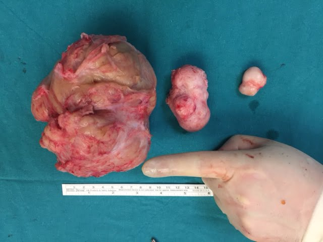

Kadın doğum uzmanları olarak en fazla karşılaştığımız patolojilerin başında halk arasında rahim uru olarak da bilinen miyomlar gelmektedir. Kadınların büyük kısmında bulunan miyomlar birkaç milimetreden 20-30 santimetreye kadar değişen boyutlarda olabileceği gibi bir ya da çok daha fazla sayıda da olabilirler.

Çoğu zaman sorun yaratmayan ve rutin muayenede fark edilen miyomlar rahim içinde yerleştikleri bölgeye göre gebeliği de olumsuz etkileyebilirler. Örneğin erken doğum riski myom varlığında %16-18’e kadar çıkabilmektedir. Yine gebelikte myomun yapısı bozularak dejenere olabilir ve ağrıya yol açabilir.

Yine yerleştiği yere göre doğum kanalını tıkayarak vajinal doğumu güçleştirebilir hatta sezaryen gerekliliği riskini arttırabilir. Çok büyük miyomlar bebeğin büyümesini olumsuz yönde etkileyebilir. Plasenta myomun üzerine yerleşirse zamanından önce ayrılmasına neden olabilir

**Myomlar genetik midir?**  
Bu konuda net bir bulgu yoktur ancak bazı ırklarda daha fazla görülmesi, annesi myom nedeni ile ameliyat olanlarda daha sık görülmesi gibi nedenler ile genetik bir yatkınlık olduğu düşünülmektedir ancak bu durumun kesin mekanizması bilinmemektedir.

Kabaca kadınların yaklaşık yarısı sıklıkla 30-50 yaşlar arasında myom tanısı alırlar ve bunların bir kısmının ameliyat olması gerekir.

Rahiminizde myom olabileceğini düşündüren belirtiler şunlardır:

**1) Adetlerde değişim: Kanama miktarınızda ve süresinde belirgin bir artış varsa**  
Miyomların neden olduğu en belirgin bulgu adet kanamalarının gıderek uzaması ve miktar olarak artmasıdır. Kanama zaman zaman o kadar fazla olabilir ki, sosyal yaşantınız bundan etkilenebilir.

Tampon kullanıyorsanız beklemediğiniz kadar kısa bir sürede kan tampondan taşabilir. Ped değiştirme sıklığı giderek artar.

Çiğer parçası gibi görünen pıhtılar gelebilir.

Uzun ve fazla miktardaki kanamaya ek olarak adet dışı dönemlerde de kanamalar veya lekelenmeler olabilir.

Kanama miktarının fazla olması uzun dönemde halsizlik yorgunluk gibi belirtilere neden olabilir. Kendinizi sürekli yorgun ve enerjisi tükenmiş hissedebilirsiniz.

**2) Kasıklarınızda ağrı varsa**  
Miyomlar yine bulunduğu bölgeye ve büyüklüğüne göre kasık ağrısına neden olabilir. Bu ağrılar yumurtlama zamanı ya ad adet kanaması ile alakasız dönemlerde de görülebilir.

Bazen myomlar dejenere olabilir. Çok değişik dejenerasyonlar vardır. Eğer miyom çok hızlı büyürse ve kan akımı myomun büyüme hızına uygun değilse myom hücrelerinden bazıları ölebilir ve bu durum da ağrıya neden olabilir. Ağrı genelde sağda ya da solda değil tam orta hatta hissedilir.

Ölen hücreler genelde myomun orta kısmındakiler olduğunda miyom dejenere olsa da dışarıya doğru büyümeye devam edebilirler.

**3) Daha sık idrarar çıkma gereksinimi hissediyorsanız ya da karnınızın alt kısmında dolgunluk hissi varsa**  
Mesanenize yakın olan miyomlar baskı yaratarak daha sık idrara gitme ihtiyacı duymanıza neden olabilirler. Tam ortadaki pubik kemiğinize yakın yerde baskı ve dolgunluk hissi varsa bu myomdan kaynaklanıyor olabilir.

Eğer çok büyük myomlar varsa bunlar barsağın son kısmına baskı yaparak kabızlık hissine neden olabilir.

**4) Karnınızda şişlik ve elinize gelen sertlik varsa**  
Büyük veya çok sayıda miyom varlığında ön taraftaki pubik kemik üzerinde ele gelen sertlik ve kitle sıklıkla görülür. Bazen bunu kilo artışı ile karıştırmanız mümkündür. Eğer elinize gelen böyle bir kitle ve sertlik varsa, kilo verdiğiniz halde karnınız küçülmüyorsa myomunuz olabilir. Böyle bir durumda panik olmayın ama hemen muayene olun.

Eğer yukarıdaki yakınmalardan biri ya da birkaçı varsa hemen muayene olun. Muayene sırasında yapılacak basit bir ultrason incelemesi ile myomların tanısı konulur ve eğer gerekiyorsa tedavi için doktorunuz sizi yönlendirecektir.
