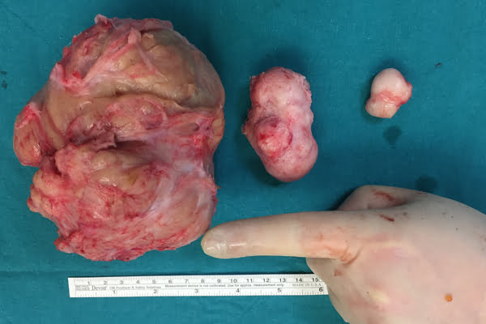
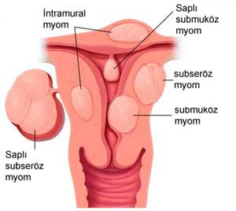
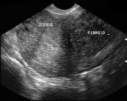

Değişik nedenlerle jinekoloğa giden pekçok kadının arkadaşlarına biraz da korkarak “bende ur varmış” dediğine birçoğumuz şahit olmuşuzdur.Halk arasında ur olarak adlandırılan bu durum aslında myomdur. Fibroid ya da leiomyoma adı da verilen myomlar, düz kas ve bağ dokusu içeren iyi huylu (kanser olmayan) kitlelerdir. Uterusun (rahim) kalın duvarı 3 tabakadan oluşur. Bunlardan en içte olanı endometrium adını alır ve adet siklusu boyunca değişimler gösterir ve eğer gebelik olmaz ise dökülerek adet kanaması ile birlikte atılır.. Ortadaki kas tabakasına myometrium denir. Uterusun en kalın tabakasıdır ve istemsiz çalışan düz kaslardan oluşur.Bu kaslar adet kanaması esnasında rahim içinde biriken kanı, doğum esnasında ise bebek ve plasentayı rahim dışına atmak için kasılır.. Uterusu dışarıdan çevreleyen zar tabakasına ise seroza ismi verilir. Bu tabaka rahimi diğer organlardan ayırır ve yerinde tutunabilmesi için destek bağları oluşturur. Gebe olmayan bir kadının rahminin büyüklüğü kişinin yaşı ve geçirmiş olduğu gebelik sayısına göre değişkenlik gösterir. Ortalama ağırlığı 80 gram kadardır.

Myomlar işte bu myometrium tabakasını oluşturan düz kaslardan köken alan iyi huylu tümörlerdir.Sadece kas hücresi içermezler. Aslında myom daha gerçekçi bir tanımla bağdokusu tarafından bir arada tutulan düz kas hücreleridir.Büyüklükleri toplu iğne başından karpuz büyüklüğüne kadar değişkenlik gösterir. Kadın pelvisinde en sık görülen tümördür. İyi tarafı hemen her zaman iyi huylu olması ve kansere dönme olasılığının ihmal edilebilecek kadar düşük olmasıdır. Hastaların %75’i kendisinde myom olduğundan dahi habersizidir. Kötü tarafı ise her 4-5 kadından birinde ortaya çıkmasıdır. Büyüklüklerinin çok değişken olması nedeni ile bu oranın aslında gerçeği yansıtmadığı, dikkatli bir inceleme yapılacak olursa myom görülme sıklığının %80’den daha fazla bulunacağı ileri sürülmektedir.Tek bir tane olabileceği gibi sayılamayacak kadar çok da olabilir.Her bir myom kitlesine myom çekirdeği ya da myom nüvesi adı verilir.Genelde birden fazla sayıda olma eğilimindedir.Myomlar sıklıkla 30-40 yaşlar arasında ortaya çıkar ve replasman tedavisi almayanlarda menopoz sonrası küçülür. Ergenlik öncesi görülmesi son derece nadirdir.

Myomlar genelde birden fazla sayıda olma eğilimindedirler. Bazen tek bir myom nüvesi belirgin derecede büyüyebilir ve çok büyük boyutlara ulaşabilir. Bu gibi hastalarda da büyük olasılıkla bir kaç milimetrelik bile olsa başka myom nüveleri de mevcuttur. Myomlar rahimde büyümeye neden olurlar. Myomlu bir rahimin büyüklüğü ifade edilirken gebelik cesameti tanımı kullanılır. Gebelik sırasında hangi haftada rahimin ne kadar büyüdüğü bilindiği için myomlu bir rahimin muayenesinde de bu bilgiden yararlanılır ve rahim büyüklüğü örneğin 10 haftalık ya da 14 haftalık gebelik cesametinde şeklinde tanımlanır.

**Nedenleri**  
En sık görülen pelvik kitle olmasına rağmen hiçkimse myomların neden ve nasıl ortaya çıktığına açıklayamamıştır. Bazı kadınlarda hiç görülmez iken bazı kadınlarda sürekli yeni myomların çıkma nedeni de belirsizdir.

Nedenleri tam olarak bilinmese de pekçok hekim bu kitlelerin kadınlık hormonu olan östrojen etkisi ile geliştiğine inanırken azımsanamayacak sayıda başka bir grupta östrojen ile ilgili olmadığını düşünmektedir. Myom ve östrojen hakkında bilinen gerçekleri şöyle sıralayabiliriz:

Ergenlik öncesinde vücut henüz östrojen salgılamazken görülmezler  
Östrojen içeren doğum kontrol hapları gibi ilaçların etkisi ile büyürler  
Vücudun fazla miktarda östrojen ürettiği gebelik esnasında hızlı büyüme gösterirler  
Östrojenin azaldığı ve hatta tamamen yok olduğu menopoz sonrası dönemde küçülürler  
Menopoz sonrası yeni myom çıkması son derece nadirdir.  
Dışarıdan östrojen alan kadınlarda büyürler  
Myomlar yüksek düzeyde östrojen bulunduran kadınlarda gelişse de laboratuvar bulguları myomu olan kadınların birçoğunda östrojen düzeylerinin normal olduğunu göstermektedir. Bu nedenle myom gelişiminde büyük olasılıkla östrojen tek sorumlu değildir. Östrojen düzeylerinin çok yükseldiği gebelik esnasında bu kitlelerin büyümesini bazı yazarlar östrojene değil, gebelik esnasında rahime giden kan miktarının büyük oranda artması ve neticede myomların fazla miktardaki kana cevap olarak büyümelerine bağlamaktadırlar.

Bazı çalışmacılar da diğer bir kadınlık hormonu olan progesteron’un da myom gelişiminde rolü olduğunu ileri sürmektedirler. Yapılan bazı klinik deneylerden elde edilen sonuçlar progesteron ile tedavi edilmiş kadınlardan çıkartılan myomlarda daha fazla sayıda hücre bulunduğunu ve bazı hastalarda progesteronu bloke eden ilaçlar kullanıldığında myomların küçüldüğünü göstermektedir. Bu bulgulara rağmen myom ile progesteron arasındaki ilişki açık değildir.

**Türleri**

Myomlar lokalizasyonlarına bağlı olarak değişik türde şikayetler yaratırlar. Bu nedenle de rahimde yerleştikleri yerlere göre sınıflandırılırlar.  
Submuköz Myom: Hemen uterusun içini döşeyen endometrium tabakasının altında yerleşmiştir. Büyüdükçe endometriumu içeri doğru iter. Bu itilme adet düzensizliklerine neden olabilir.Bir süre sonra myom rahim boşluğuna doğru büyümeye başlar ve orijinal yerine ince bir sap ile bağlı kalır. Büyümeye ya da sarkmaya devam eder ise rahimden dışarıya hatta vajinadan vücut dışına sarkabilir.Myom hareket ettikçe sapının etrafında dönebilir ve adet aralarında kanamaya neden olabilir. Bu tür myomlarda enfeksiyon da ortaya çıkabilir.

İntramural Myom: Uterusu oluşturan kas tabakasının (duvarın) içinde yer alan myomlardır. Myom nüvesi büyüdükçe rahim de büyür.

Subseröz Myom: Uterusun dış yüzünden köken alan ve dışarı doğru büyüyen myomlardır. Genelde kanama problemi yaratmaz.

Saplı Myom: Herhangi bir subseröz ya da submüköz myom büyümeye devam edip de rahim ile bağlantısı sadece ince bir bağ ile sağlanır ise bu durumda saplı myomdan söz edilir.Eğer myom kendi etrafında döner ise sapı yani dolayısı ile kan bağlantısı da bozulur ve myom nüvesinde dejenerasyon meydana gelir. Eğer myomun sapı geniş bir tabana oturmuş ise buna sessile tipte myom adı verilir

İnterligamentöz Myom: Uterusu yerinde tutan ve ligaman adı verilen bağların arasında gelişen tümörlerdir.Bunların cerrahi ile çıkartılması son derece güçtür.

Paraziter Myom: Büyüyen myom nüvesi başka bir organa yanaşıp buna yapışırsa bir süre sonra rahim ile rasındaki bağlantı kopabilir ve myom yeni bağlandığı dokudan beslenmeye başlayabilir. Bu durumda parazitik myomdan söz edilir.

Gerçekçi olmak gerekirse myomların hemen hepsi aslında birden fazla anatomik lokalizasyonda bulunur. Örneğin myomun büyük bir kısmı şntramural olmasına rağmen submüköz veya subseröz komponenti de vardır. Bu durumun istisnası saplı subseröz myomlardır.

**Tanı**  
Jinekolojik muayene esnasında en sık fark edilen tümörler myomlardır. başka bir nedenle karın boşluğunun açıldığı ameliyatlar sırasında da kolaylıkla fark edilebilirler.Ancak pek çok myom başka bir nedenden dolayı yapılan muayene esnasında şans eseri fark edilir ya da daha sık rastlanılan şekilde hiçbir zaman farkına varılmaz.

Son 20 yıldır yaygın şekilde kullanılan ultrasonografi myomlardaki en önemli tanı aracıdır. Yumurtalıklara yakın bulunan myom nüveleri over tümörleri ile karıştırılabilir.

Myomların ayırıcı tanısında normal gebelik, yumurtalık bölgesinde kitle, adenomyozis, uterusa ait şekil bozuklukları, komşu organ tümörleri, vajinal kanamaya yol açan diğer durumlar gözönünde tutulmalıdır.

**Belirtiler**  
Myomların çoğu belirti vermemesine rağmen %25 vakada bazı şikayetler yaratır.Bunlardan en sık görüleni aşırı ve anormal vajinal kanama, ağrı ve karın şişliğidir.  
Fazla kanama: Myomlu kadınların yaklaşık %30’unda adet kanamaları normalden fazla olur. Fazla kanamaya yol açan submüköz tipte myomlardır.Kitle büyüdükçe endometrium dokusunu iter ve dolayısı ile bu dokunun yüzölçümü artar. Kanamaya müsait alan fazlalaştığı için kanamanın miktarı da artar. İlk başlangıçta kanamanın süresi değişmez iken sadece kaybedilen kanın miktarı fazlalaşır. Daha sonra yavaş yavaş süre de uzamaya başlar. Bu fazla kanamalar bir süre sonra kansızlığa yani anemiye neden olur. Bazı myom türleri ise kanama fazlalığı ile birlikte ara kanamalara da yol açabilir. Myomlu hastaları doktora gitmeye mecbur eden en önemli bulgu bu kanama bozukluklarıdır. Myom ile birlikte kanamalar o kadar fazla olabilir ki kişi neredeyse saatte bir ped değiştirmek zorunda kalabilir. Bu tür kanamalar yaşayan bir kadın normal günlük aktivitelerinde bulunmak istemeyebilir, işe gitekten kaçınabilir ve saoyal korkular gelişebilir. Yani myom kadının sosyal hayatını da etkileyebilen bir hastalıktır.Myomda kanamanın muhtemel nedenleri:

Endometrium yüzeyinin büyümesi  
Rahimdeki damarlanmanın artması  
%50 oranında beraberinde görülen endometrial hiperplazi.  
Uterus kasılmalarının etkisizliği nedeni ile küçük damar ağızlarının kapanamaması  
Submüköz myomlarda etrafdki endometrium dokusunda ülser olması  
Ağrı: Myomda ağrı nadir görülen bir belirtidir. Genelde adet kanaması sırasında kramp tarzında olur. Burada uzun yıllar boyunca adet kanamaları ağrısız olan kadında birden bire ağrıların olması teşhiste myomu akla getirmelidir. Sancılı adet görenlerde ise ağrının şiddetinin artması ya da şeklinin değişmesi düşündürücüdür. deneysel çalışmalar myomlarla birlikte görülen ağrıların mekanizmasının doğum sancılarına benzediğini düşündürmektedir. Myom çekirdeği sanki yabancı bir cisimmiş gibi davranır ve rahim bu yabancı cismi atmak için kasılır. Kişi bu kasılmaları ağrı olarak algılar. İleri derecede büyümüş bir myom etrafındaki dokulara ve sinirlere baskı yaparak da ağrıya yol açabilir. Burada daha çok bel ağrısı tarzında yakınmalar görülür. Dejenere olan ya da etrafında dönerek kanlanması bozulan myom ani ve bıçak saplanır tarzda ağrıya yol açar. Zaman zaman ise adet kanamalarından bağımsız ağrılar olabilir ancak bu son derece nadirdir.

Karın şişliği: Myom büyüdükçe diğer organları iter ve bu da her türlü rahatsızlığa neden olabilir.Mesaneye bası yaparsa sık idrara çıkma, rektuma (barsağın en son kısmı) bası yaparsa kabızlığa yol açabilir. Nadiren çok fazla büyüyen myom idrar yollarında tıkanma ve idrar yapmada güçlük problemi yaratabilir.Yine barsaklardaki basıya bağlı olarak gaz problemi görülebilir.

Kısırlık: Myomlar kadının gebe kalmasını ya da gebe kaldıktan sonra rahimin gebeliği taşımasını zorlaştırabilirler. Tubaları iterek spermin ve yumurtanın geçişini güçleştirebilir ya da endometrium düzenini bozarak döllenmiş yumurtanın rahime yerleşmesini engelleyebilir.Myom büyümeye devam ettikçe üzerindeki endometrium tabakası gerilir ve kanlanması bozulur. Bu durumda gebelik ürününün rahimde yerleşse bile yeterli derecede kanlanması mümkün olmaz ve düşükle sonuçlanabilir. Bütün bu engelleri aşıp büyümeye başlayan bir gebelik ürünnü bekleyen diğer bir dezavantaj da myom nedeni ile bebeğe yeteri kadar büyüyecek yer kalmamasıdır.Bu durumda ise gebeliği bekleyen en muhtamel son düşük ya da erken doğumdur.

Myom ile gebeliğin bir arada bulunduğu durumlarda bir diğer sorun da myom nedeni ile doğum esnasında rahimin yeteri kadar kasılamamasıdır. Bebek doğum kanalına uygun şekilde giremez ve bu tür hastalarda büyük olasılıkla sezaryen gerekir. Doğum kanalını tıkayan myom varlığında ise sezaryen tek doğum şeklidir. Doğumdan sonra ise rahim kasılmalarının etkisiz olması nedeni ile fazla miktarda kanama görülebilir.

Myomlar genelde hem gebe kalmak hem de gebeliğin idamesi ve doğum için sorun oluşturmazlar. Ancak eğer bir sorun meydana gelir ise bu ciddi bir sorun olacaktır. Myomun kısırlığa yol açtığından söz edebilmek için kısırlığı açıklayacak başka hiçbir sebep olmaması gerekir. Yani infertilite araştırmasında yapılan bütün tetkikler myomlu infertil hastalarda da yapılmalıdır.

**Komplikasyonlar**  
Çoğu myom belirti vermemesine rağmen bazı komplikasyonların varlığında özellikle ağrı ve kanama bulguları artar. Myomların komplikasyonları şunlardır:

Torisyon: Myomun sapı etrafında dönmesi ve sapının sıkışarak kanlanmasının bozulmasıdır. Bu durumda önce myomdan dışarıya sıvı kaçışı olur ve bu ağrıya neden olur. Eğer olay uzarsa myom sapından koparak batın boşluğuna düşebilir ve burada kendisine beslenecek uygun bir ortam bularak büyümeye devam edebilir (parazitik myom).  
Enfeksiyon: Myomun ülsere olması ve daha sonrasında enfekte olmasıdır. Ağrı ve kanama yapar.  
Kansere dönüşüm: Myomlu kadınlarda kafalarını kurcalayan en önemli soru hastalığın kansere dönüp dönmeyeceğidir. Myomlu kadınların %0.5’inde ileri dönemlerde leiomyosarkom denilen kanser türü görülür. Acak pekçok araştırmacı bunun var olan myomlardan köken almadığını, kendi başına ve diğerlerinden bağımsız olarak geliştiğini ileri sürmektedirler. Eğer varlığı bilinen myom hızlı büyümeye başlarsa, ağrı ve ateş görülüyorsa detaylı incelenmesi gerekir.  
Dejenerasyon: Myomun normal hücre yapısının değişikliğe uğramasıdır. Örneğin menopozdan sonra myom küçülür ve atrofik dejenerasyon olur. Gebelikte rahimin hızlı büyümesine bağlı olarak myomun kanlanması hafif derecede bozulur ve hafif nekroz olur. Hastada ağrı, ateş, bulantı ve kusmalar olabilir. Myom içne hafif kanamalar olabilir. Gebelikte görülen bu değişime kırmızı dejenerasyon adı verilir. Myomlarda en sık görülen dejenerasyon ise hyalen dejenerasyondur. Mikroskopik bir değişimdir. Myom çekideği içerisinde kalsiyumun biriktiği kalsifik dejenerasyon da oldukça sık rastlanılan bir durumdur.  
Asit: Saplı subseröz myomların karın zarını irrite etmesi ile karın boşluğunda sıvı birikimi olur.  
Karın içi kanama: Myomun üzerindeki damarlardan birinin yırtılması sonucu kanama olabilir. Son derece nadirdir.  
İnversiyon: Saplı bir submüköz myomun çekmesine bağlı olarak rahim eldiven parmağı gibi tersyüz olabilir. Tehlikeli ancak nadir görülen bir durumdur.

**Tedavi**  
Myomu olan birçok kadında eğer belirgin bir şikayet yaratmıyorsa tedavi gerekmez. Sadece takip yeterli olur. Bu gibi durumlarda her 6 ayda bir muayene ve ultrason ile hastanın takibi ve değişiklik saptanır ise tedavi gereklidir. Tedavi tıbbi ya da cerrahi olabilir.

Myomlarda tedavi gerektiren durumlar şunlardır:

Kanama: Tedavi, özellikle de cerrahi tedavi için en önemli sebep anormal kanamalardır. Eğer adetler çok fazla ve pıhtılı oluyor ise bu durum anemiye yol açacağından mutlaka tedavi edilmesi gerekir.  
Ani büyüme: Kontrol altındaki myomun aniden büyümeye başlaması özel ilgi gerektiren bir durumdur. Eğer bu büyüme menopozdan sonra olmuş ise mutlaka araştırılması gerekir. Bu durumda hekim altta yatan kötü huylu bir hastalık olmadığını teyid etmelidir. Bu amaçla küretaj yapılabilir. Myomlardaki ani büyüme sadece kansere bağlı olarak gelişmez. Gebelik ve myom içine kanama gibi durumlar da büyümeden sorumlu olabilirler.  
Ağrı ve bası bulguları: Eğer bu belirtiler dayanılamaz düzeylere ulaşır ise tedavi gerekli hale gelmiş demektir.  
Myomun yeri: Bazen myom nüvesi ya da nüvelerinin lokalizasyonu cerrahi olarak çıkartılmalarını gerektirir. Özellikle 40 yaşından büyük kadınlarda overlere yakın yerleşimli myomlar over tümörleri ile karışabileceğinden alınmalıdır.

Myom tedavisinde en sık tercih edilen tedavi yaklaşımı cerrahidir.Seçilecek cerrahi yöntem hastanın yaşı, sosyal durumu, çocuk isteği, şikayetlerin tipi ve şiddeti gibi faktörlere bağlıdır. Bu faktörlere göre rahimin tamamen alınması (histerektomi) ya da sadece myomların çıkartılması (myomektomi) alternatiflerinden bir tercih edilir.

Myom tedavisinde diğer tedavi yaklaşımları arasında myom çekirdeklerini çıkarmadan, laser ile yakmak, sıvı nitrojen ile dondurmak, hormon baskılayıcı ilaç kullanarak küçülmelerini sağlamak sayılabilir. Bu baskılayıcı ilaçlar kadında suni menopoz yaratarak myomları küçültmeyi amaçlamaktadır.Deneysel tedavi yöntemlerinden birisi de laparoskopi eşliğinde myom çekirdeğine elektrik akımı vererek myolizis yapmaktır. Bu tür tedavi yaklaşımları kısa süreli rahatlamalar getirebilir ama özellikle hormon tedavisi sonrasında, tedavi esnasında küçülen myomlar ilaç kesildikten sonra hızla büyüyebilir ve eski durumundan daha kötü hale gelebilir. Bazı ekoller cerrahi öncesinde 3-6 ay kadar hormon tedavisi vererek myomları küçültmeyi ve bu sayede cerrahi esnasında işlemi kolaylaştırmayı ve kanama miktarını azaltmayı önermektedirler;  
Myomun en kesin ve garantili tedavisi bugün için cerrahidir.
