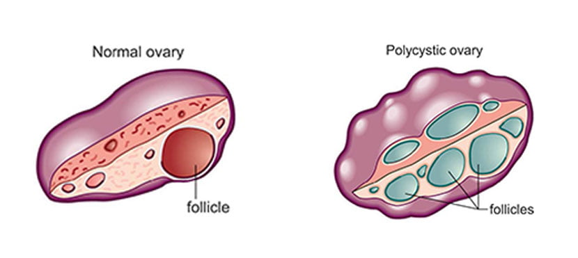

Polikistikover sendromu ya da kısa söylenişi ile **PCOS** temel olarak bakıldığında bir hormonal dengesizlik durumudur. Bu sendroma sahip olan kadınlar normalden daha yüksek androjenlere yani erkeklik hormonlarına sahiptirler. Polikistik over sendromu belirtileri çok değişken olabilmektedir.

PCOS çoğu zaman çocuk sahibi olma potansiyelini etkileyen bir durum olarak kabul edilir. Üreme çağındaki kadınların yaklaşık yüzde onunu etkileyen bu hastalık genellikle ergenlikle birlikte fark edilir ancak neden olduğu bazı yakınmaların üreme potansiyeli ile hiçbir ilgisi yoktur.

Polikistikover sendromu pek çok değişik bulgunun görülebileceği bir tablodur. Bazı bulgular bazı hastalarda görülürken diğerlerinde hiç olmayabilir. Bir başka deyişle polikistikover sendromunda çok geniş bir yelpaze de şikayetler ve bulgular olabilir ve her hasta birbirinden farklı bir tabloda karşımıza çıkabilir.

Hastalığın erken tanınması bazı potansiyel uzun dönem komplikasyonların engellenmesinde yardımcı olabilir. Kısırlık ya da çocuk sahibi olmada güçlük bizi endişelendiren tek durum değildir. Polikistikover hastaları Tip2 diabet, hipertansiyon, ve endometrial kanser açısından da artmış risk altındadır.

Polikistikover tanısı koymak için adet düzensizliği, kan androjen düzeylerinde yükseklik, ve ultrason bulgularından en az ikisinin olması gereklidir. Ancak bunlarla birlikte pek çok başka belirti de mevcuttur. Bunların gözden kaçırılması, tanıda gecikmeye ya da tamamıyla tanının atlanmasına neden olabilir.

Polikistik over sendromu belirtileri 8 ana başlık altında incelenebilir. :

**1.Adet düzensizliği**  
Adet düzensizliği polikistikover sendromu olan kadınların en sık yakındığı durumdur. Burada düzensizlikten kastedilen seyrek adet görme ya da iki adet arasındaki sürenin uzamasıdır.

Yetişkinlerde genelde yaklaşık 35 gün, ergenlik çağındakilerde ise 45 gün ya da daha uzun aralarla adet görülür. Ancak bireysel farklılıkların olabileceği akılda tutulmalıdır.

Bazı kadınlarda 2-3 bazılarında ise 6-7 ayda bir adet görme söz konusu olabilir. Çok nadiren hiç adet görmeme de olabilmektedir. Adet kanamalarının miktarı beklenenden daha az ya da daha fazla olabilmektedir.

Bu düzensizliklerin altında yatan temel sebep yumurtlamanın olmaması ya da düzensiz olmasıdır. Eğer kadın hamile kalmaya çalışmıyorsa bu durum önemsiz gibi algılanabilir. Ancak adet görmemek uzun dönemde rahim zarı kanseri riskini arttırmaktadır.

Bu riskin altında yatan temel sebep vücutta salgılanan östrojene karşılık yumurtlamadan sonra salgılanan progesteronun olmamasıdır. Progesteron ile dengelenmeyen östrojen rahimin iç tabakasını döşeyen zar tabakası üzerinde kanserojen etki yaratabilir.

Adet gecikmesi her zaman polikistikover sendromuna bağlı olmaz. Bazen değişik nedenlere bağlı olarak vücutta östrojen salgılanmadığı için de adet gecikebilir. Böyle bir durum söz konusu olduğunda rahim zarı kalınlaşmayacağı için adet söktürücüler işe yaramayacaktır.

Üreme çağındaki bir kadında adet gecikmesi olduğunda yapılacak ilk şey gebelik olup olmadığının saptanmasıdır.

**2\. Hormon dengesizliği**  
Polikistik over sendromu belirtileri arasında belki de en fazla karşımıza çıkan hormon bozukluklarıdır. Hormon dengesizligi olup olmadığını anlamanın tek yolu kan testleri yapmaktır. Bu testler aynı zamanda benzer şikayetlere neden olabilecek tiroit problemleri ya da tümörler gibi diğer durumların da ortaya konmasına yardımcı olur.

Tek bir hormon değerine bakılarak polikistik over tanısı konamaz. Vücutta salgılanan bazı hormonların birbirlerine olan oranları değerlendirilerek tanıya ulaşılır.

**3\. Polikistik over görüntüsü**  
Bunu anlamanın tek yolu ultrason ile bakarak yumurtalıkların nasıl göründüğünü değerlendirmektir.

Polikistik over sendromunda yumurtalıkların görüntüsü çok tipiktir. Ancak bu görüntü tek başına tanı koymakta yeterli değildir çünkü bazı kadınlarda görüntü böyle olmakla birlikte hiçbir klinik belirti ve bulgu saptanmadığı gibi bazı kadınlarda ise tüm bulgular ve yakınmalar olmasına rağmen yumurtalıklar ultrasonda normal görünebilir.

Polikistik over sendromu belirtileri

**4\. Çocuk sahibi olma da güçlük**  
**Kısırlık** genel olarak benim pek hoşlanmadığım bir kelime. Ancak ne yazıkki polikistik over sendromu üreme çağındaki kadınlarda yaşanan kısırlık sorununun önemli nedenlerinden birisi olarak karşımıza çıkmakta.

Polikistik over sendromu belirtileri arasında hastayı doktora gitmek durumunda bırakan temel yakınma çoğu zaman ya adet düzensizliği ya da gebe kalamamak olmakta.

Düzenli olarak yumurtlama olmayan kadınlarda gebe kalmada güçlük yaşanması beklenilen bir durum.

Ancak her polikistik over sendromu hastası bebek sahibi olmak için tedaviye ihtiyaç duyacak diye bir kural da söz konusu değil.

Aslına bakacak olursak polikistik over sendromu olan kadınların pek çoğu bazen çok kısa sürede bazen de ortalamanın biraz üzerinde beklediklerinde ve denemeye devam ettiklerinde kendiliğinden hamile kalabilmekte. Geri kalan çiftlerde ise yumurtlamanın uyarılması aşılama ya da tüp bebek gerekli olmakta.

Özellikle kilo fazlalığı olan polikistik over sendromlu kadınlarda bazen 5-6 kg verilmesi bile yumurtlamanın normale dönmesi için yeterli olabilmekte. Pek çok sağlık sorununda olduğu gibi sağlıklı bir beslenme ve düzenli egzersiz alışkanlığı ile biraz kilo verilmesi polikistik over sendromunın neden olduğu şikayetlerin çoğunun giderilmesinde yeterli olmakta.

**5\. Tüylenme**  
Polikistik over sendromlu kadınların yaklaşık %70’inde bir dereceye kadar tüylenme artışı şikayet konusu olmaktadır. Tüylenme genellikle dudak üstü çene altı, meme çevresi, göbek çevresi gibi bölgelerde ortaya çıkar.

Erkek tipi tüylenme denilen bu durum kandaki artmış erkeklik hormonları ile alakalıdır.

Ancak tüylenme şikayeti her zaman polikistik over sendromu ile ilişkili değildir. Kullanılan ilaçlardan etnik kökene kadar bazı diğer faktörler tüylenmede etkilidir.

Kollarda ve bacaklardaki tüylenmenin polikistik over ile bir ilgisi yoktur.

**6\. Saçlarda incelme ve dökülme**  
Erkek tipi tüylenme vücuttaki kullanmanın yanı sıra bazı kadınlar erkek tipi kellik benzeri sorun yaşayabilirler. Bu durum nadir olmakla birlikte orta yaşlarda ortaya çıkabilir.  
Eğer erken dönemde fark edilmez ve müdahale edilmezse kellik kalıcı olabilmektedir.

**7\. Sivilce**  
Bir çok kadın ve erkek farklı nedenlere bağlı olarak sivilce sorunu yaşarlar. Ancak polikistik over sendromuna bağlı sivilce tedavi edilmesi genelde çok kolay olmayan bir sorundur.

Sivilce polikistik over sendromu tanısı koymak için gerekli kriterlerden biri değildir çünkü çoğu insan bu problemden yakınmaktadır ve bunların pek çoğunda polikistik over sendromu söz konusu değildir.

**8\. Obezite**  
Polikistikover sendromlu kadınların yarısında obezite sorunu vardır. Vücuttaki fazla yağ genelde göbek çevresinde birikmiş durumdadır.

Obez ya da kilo fazlası olan kadınlarda tabloya çoğu zaman insülin direnci eşlik etmektedir.

Vücudun insülini etkili bir şekilde kullanamaması kilo artışına yol açar. Böyle bir durumda kilo vermek giderek güçleşir ve şeker hastalığına zemin hazırlanmış olur.

Kanda dolaşan yüksek düzeyde insülin daha fazla erkeklik hormonu salgılanması için de bir uyarı oluşturur.

Hayat tarzını değiştir ve kilo ver demek çok kolaydır ancak bunu uygulamak her zaman aynı kolaylıkda olmamaktadır. Ancak pekçok hastalığın temeli bu iki faktöre bağlanmaktadır.

Polikistik over tedavisinde her zaman için ilk adım hayat tarzı değişikliği ve eğer varsa fazla kilolardan kurtulmaktır. Sadece bu yaklaşımla bile pek çok hastada şikayetler ortadan kalkmaktadır.

**Diğer bulgular**  
Her zaman polikistikover sendromu ile bağlantılı olmamakla birlikte bazı farklı yakınmalar görülebilir.

Örneğin bazı kadınlarda boyun çevresinde, meme çevresinde ya da kasıklarda ciltte renk koyulaşması şikyeti olabilir. Bu duruma acanthosis nigricans adı verilir.

Yine bazı kadınlarda uyku sırasında solunumun durması yani uyku apnesi görülmektedir.

Polikistikover metabolik sendromun bir komponenti olabilir. Bu kadınlarda kandaki kötü kolestrol ve trigliseritler yükselirken iyi kolestrol azalır.

Zaman zaman halk arasında et beni adı verilen deri lezyonları görülebilir.

Hormonlardaki değişkenliğe bağlı olarak kişide duygu durum değişiklikleri zaman zaman göze çarpabilir. Anksiyete ve depresyon polikistik over sendromu olan kadınlarda daha sık karşımıza çıkmaktadır.

Netice olarak polikistik over sendromu belirtileri arasında  en sık karşılaşılan yakınma olan adet düzensizliği asla ihmal edilmemesi gereken ve mutlaka jinekolog tarafından değerlendirilmesi gereken bir durumdur.İlgili makaleler[Polikistik over sendromu](?p=1586)
