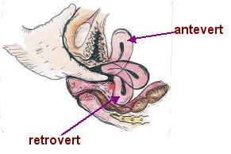

Herhangi bir neden ile yapılan jinekolojik muayene sonrası doktor tarafından rahmin ters durduğunun söylemesi kadınlarda büyük şaşkınlık yaratır. Kısa bir süre sonra ise şaşkınlık yerini endişe ve korkuya bırakır. Acaba bu durum ileride sorun yaratacak mıdır ya da rahim tersken hamile kalınabilir mi?

**RAHİMİN TERS OLMASI NEDİR?**  
Halk arasında rahimin ters olması olarak bilinen durum tıp dilinde retrovert uterus olarak tanımlanır. Bir kız bebek doğduğunda uterusu (rahim) belirli bir pozisyondadır ve normalde bu pozisyon ölene dek değişmez. Rahim öne doğru (antevert) ya da arkaya doğru (retrovert) olabilir. Antevert uteruslara daha sık rastlanmaktadır. Kadınların %70-85’inde rahim öne doğru dururken geri kalanlarda arkaya doğrudur. Uterusun öne ya da arkaya doğru olması patolojik bir bulgu değil normal anatominin bir varyasyonudur. Tıpkı sağ eli ya da sol eli kullanmak gibi veya saç, göz rengindeki farklılıklar gibi bu anatomik duruş da normaldir.

**NEDENLERİ**  
Rahimin retrovert olması normal bir anatomik durum olmakla birlikte bazı durumlarda öne doğru duran uterus arkaya dönebilir . Örneğin yapılan doğumlara bağlı olarak uterusu yerinde tutan bağlarda gevşeme olabilir ve uterus arkaya doğru dönebilir.Yine menopoz sonrası aynı nedenle benzer bir durum ortaya çıkabilir.

Bunlardan daha önemlisi pelvis içindeki anatomiyi bozan bazı hastalıklar rahimi geriye doğru çekebilir. Bu hastalıklardan en önemlisi endometriozistir. Tüplerin enfeksiyonları, pelvik iltihabi hastalık nedeni ile ya da ameliyatlar sonrası oluşan yapışıklıklar da rahimin ters dönmesine neden olabilir. Çok nadiren pelvis içinde yer kaplayan kitleler de rahimi arkaya doğru itebilir.

**BELİRTİLERİ**  
Tek başına olan retrovert uterus durumu olguların çoğunda herhangi bir belirti vermez. Nadiren kişide cinsel ilişki sırasında ağrı ya da rahatsızlık hissi olabilir. Bazı hastalarda ise adet sancılarının altında yatan neden retrovert uterus olabilir. Altta yatan endometriozis gibi bir patoloji varsa buna bağlı yakınma ve bulgular görülebilir.

**TANI**  
Retrovert uterusun tanısı herhangi bir nedenle yapılan jinekolojik muayenede tesadüfen konur

**TEDAVİ**  
Retrovert uterus varlığında herhangi bir tedavi gerekmez. Bazı hekimler kronik kasık ağrısı nedeni ile vajinal pesser uygulamayı tercih etseler de bu kalıcı bir çözüm sağlamaz. **Ters duran rahim muayenede herhangi bir şekilde öne doğru döndürülemez**. Bu amaçla yapılabilecek ameliyatlar olmakla birlikte modern jinekolojide hiçbir kullanım alanı yoktur ve hastaya zarar veren girişimlerdir. Ameliyat sonrası oluşacak yapışıklıklar hem kısırlığa neden olabilir hem de kasık ağrısının artmasına yol açabilir.

Muayenede retrovert uterus saptanması durumunda altta yatan bir patoloji saptandığında bunun tedavisine yönelik girişimlerde bulunulması gerekir.

**RAHMİN TERS OLMASI KISIRLIĞA NEDEN OLUR MU?**  
Tüm dünyada pekçok kadın retrovert uterusun çocuk sahibi olmada güçlüğe neden olacağını düşünür. Bu yanlış inancın kaynağının ne olduğu meçhuldür. Altta yatan endometriozis gibi başka bir durum varsa buna bağlı olarak kısırlık söz konusu olabilir. Ancak tek başına rahmin ters durması gebeliğe engel bir durum değildir.

Çeşitli nedenlerle tüp bebek tedavisine giren 807 kadının incelendiği bir araştırmada rahimin ters olmasının gebelik sonuçları üzerinde olumlu ya da olumsuz herhangi bir etkisinin olmadığı gösterilmiştir.

**HAMİLELİKTE DURUM?**  
Retrovert uterusa sahip olan kadınlar hamile kaldıklarında gebeliğin ilerlemesi ve rahimin büyümesi ile birlikte uterus hamilelikteki normal pozisyonunu alır ve bebek vajinal doğum ya da sezaryen ile sorunsuz doğurtulur. Gebelik öncesi rahmin ters olması normal doğuma engel değildir. Doğumdan sonra ise rahim küçülür ve lohusalık döneminin sonunda yine eski halini alır ve retrovert olarak kalır.

Çok nadiren binde 3-14 olguda rahim büyürken öne doğru dönüp normal pozisyonunu alamaz ve pelvis boşluğu içinde sıkışır. Uterus inkarserasyonu olarak adlandırılan bu durum anne ve bebek hayatını tehdit edebilir.

İnkarsere uterus varlığında şart olmamakla birlikte gebeliğin 12-20. haftaları arasında şu belirtiler ortaya çıkabilir:

*   Sık idrara çıkma
*   Mesanenin tam boşalmadığı hissi
*   İdrar yaptıktan sonra mesanede idrar kalması
*   Şiddetli kabızlık
*   Alt karın ağrısı
*   Vajinal kanama

Çok nadiren ise herhangi bir bulgu olmaz ve termde doğum başlayana kadar herhangi bir yakınma ortaya çıkmaz.

Tedavi edilmeyen olgularda fetal kayıp oranı %33’e kadar çıkabilmektedir. Tedavi değişik yöntemler ile uterusun normal pozisyone gelmesini sağlamaktır.

**KAYNAKLAR**

*   Dallay D, Chabrand S, Soumireu-Mourat J, Dubecq JP. Anterior sacculation of the pregnant uterus persisting until the 34th week. J Gynecol Obstet Biol Reprod (Paris) 1985 14:747-50

*   Egbase PE, Al-Sharhan M, Grudzinskas JG. Influence of position and length of uterus on implantation and clinical pregnancy rates in IVF and embryo transfer treatment cycles. Hum Reprod 2000 15: 1943-1946
*   Jackson D, Elliott JP, Pearson M. Asymptomatic uterine retroversion at 36 weeks’ gestation. Obstet Gynecol 1988 Mar 71:466-8
*   Lettieri L, Rodis JF, McLean DA, Campbell WA, Vintzileos AM. Incarceration of the gravid uterus. Obstet Gynecol Surv 1994 Sep 49:642-6
