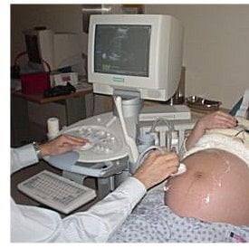

Gebeliğin ilk trimesterında yani ilk 13 haftasında vajinal yoldan yapılan ultrasonografik incelemelerin amacı hem gebeliğin varlığını saptamak hem de erken dönemde görülebilecek düşük gibi komplikasyonların tanısını koymaktır.

Hamilelik takipleri boyunca doktorunuz sizden 32. haftaya kadar her 4 haftada bir, bu haftadan sonra ise daha sık aralıklarla gelmenizi isteyecektir. Bu ziyaretlerinizde hem doktorunuzla akılınıza takılan soru ya da konuları tartışacaksınız, hem bebeğin ve sizin durumunuzu değerlendiren bazı tetkikler yapılacak hem de bebeğinizin gelişimi ultrason ile incelenecektir.

İkinci trimesterdan sonra yapılan rutin ultrason incelemeleri her hangi bir gereklilik ortaya çıkmadığı hallerde karından yani abdominal yoldan yapılır. Karından yapılan jinekolojik ultrason incelemelerinin aksine hamilelik takiplerinde idrar kesenizin dolu olması gerekmez. Doktorunuzun gerekli görmesi durumunda 23. hafta civarında rahim ağzı uzunluğunu değerlendirmek için abdominal ultrasonografinin yanısıra vajinal inceleme de yapılabilir.

Gebeliğin başından sonuna kadar herhangi bir döneminde, kanama olsa dahi vajinal ultrasonografi yapılmasında hiçbir sakınca yoktur.

Rutin ultrason incelemelerinde ilk planda bebeğin genel görünümü, kalp atımları, duruş pozisyonu, amniyon sıvısının miktarı ve plasentanın durumu değerlendirilir. Daha sonra kafadan başlayarak ölçümler alınır. Bu ölçümlerin amacı bebeğin gelişiminin normal sınırlar içinde olup olmadığı ve kabaca bir organ anomalisi bulunup bulunmadığının anlaşılmasıdır. bebeğin tüm organlarının değerlendirildiği detaylı ya da ikinci düzey ultrason ise 20 hafta civarında yapılır.

Plasenta ve amniyon sıvısı özellikle önemli oluşumlardır. Gebeliğin erken dönemlerinde rahim ağzına yakın olan plasenta gebelik yaşı ilerledikçe yukarıya doğru çekilir. Plasentanın rahim ağzına yakın olduğu ya da kapattığı durumlarda plasenta previadan söz edilir ve bu durum hem normal doğumun önünde bir engeldir hem de son dönem kanamalara neden olabileceğinden çok önemlidir.

Ayrıca her ultrason incelemesinde plasentada aşırı bir kireçlenme olup olmadığı değerlendirilir. Plasentadaki kireçlenme grade olarak ifade edilir. Grade 3 plasenta artık terme yaklaşmış ve kireçlenme gözlenen plasentayı anlatmak için kullanılır. Gerekli olan durumlarda eğer kullanılan ultrason cihazında doppler özelliği varsa göbek kordonundan olan kan akımları izlenerek bebekte bir beslenme bozukluğu olup olmadığı anlaşılmaya çalışılır.

Amniyon sıvı miktarıda hem bebeğin boşaltım ve sindirim sistemlerinin durumu hem de bebeğin anne karnındaki sağlığı hakkında bilgi verir. Sıvının normalden az olması oldukça önemli bir bulgudur.

Rutin gebelik incelemesinde değerlendirilen ve ölçülen oluşumlar şunlardır.

**1\. BPD (Bipariyetal çap, biparietal diameter)  
**Bebeğin kafasının her iki yanında yer alan pariyetal kemik adı verilen şakak kemikleri arasındaki mesafenin ölçülmesidir. Tarihsel açıdan gebelik yaşının hesaplanmasında ilk kullanılan parametredir. gebeliğin 13. haftasında yaklaşık 2.4 santimetre iken termde 9.5 santimetreye ulaşır. Gebelik yaşını hesaplamada 12-28 haftalar arasında en doğru sonucu verir. Daha büyük gebeliklerde ise aynı kiloya sahip bebeklerin kafa yapıları birbirinden farklı olabileceğinden güvenilirliği azalır.

Ölçümün doğru kesitte yapılması güveniliriliği açısından son derece önemlidir. Öte yandan özellikle makat geliş gibi bazı durumlarda bebeğin kafası hafif yanlardan basık olabilir. Bebeğin sağlığı açısından herhangi bir olumsuzluk yaratmayan bu durum BPD ölçümünün dolayısı ile bebeğin gelişimi ve gebelik yaşı ile uyumunun hatalı olarak yorumlanmasına neden olabilir. Bu nedenle böyle durumlarda sadece BPD değil diğer kafa ölçümleri de yapılmalıdır.

**2\. Occipitofrontal çap (OFD):** BPD ölçülen kesitte bebeğin kafasının ön arka uzunluğudur. BPD ile gebelik yaşı arasında uyumsuzluk olan hallerde OFD ölçülmesi daha doğru sonuç verir.

**3\. Sefalik indeks (CI):** BPD’nin OFD’ye olan oranıdır. Normal değer aralığı 0.75-0.85’dir. Kafanın her iki yandan basık olması durumunda CI en doğru bilgiyi verir.

**4\. Kafa çevresi (Head circumference, HC):** BPD ölçülen kesitte kafa çevresinin ölçülmesi fetal gelişim hakkında BPD’ye göre zaman zaman daha iyi netice verir çünkü kafa çevresi gelişme geriliğinden BPD’ye göre daha az etkilenir. Kafa çevresi ya direkt olarak ölçülür ya da kullanılan ultrasondaki yazılıma bağlı olarak BPD ve OFD değerleri kullanılarak otomatik olarak hesaplanır. Hesaplamada (BPD+OFD) x 1.62 formülü kullanılır.

İnceleme sırasında kafa içi oluşumlar kabaca değerlendirilir, herhangi bir kist ya da anormal oluşum olup olmadığı gözlenir.

Bundan sonraki aşama bebeğin boyun bölgesinin ve göğsünün izlenmesidir. Kalp atımları yeniden izlenerek herhangi bir aritmi olup olmadığı araştırılır. Kalbin 4 odacığı gözlenmeye çalışılır. Ardından diyafram ve mide gözlenir. Her iki kol ve eller görülmeye çalışılır. Takiben böbrekler ve karaciğer kabaca değerlendirilir. Ancak tüm bu organların ayrıntılı incelemesi 20 hafta civarında yapılan detaylı ultrasonografide yapılır.

Daha sonra karın çevresi ölçülür.

**5\. Karın çevresi (Abdominal circumference,AC):** Karın çevresi ölçümü gebeliği son dönemlerinde en önemli ölçümlerden birisidir ve çok değerli bilgiler verir. Gebelik yaşından ziyade bebeğin büyüklüğü ve ağırlığı hakkında fikir edinmeyi sağlar. Rahim içi gelişme geriliğinde ilk etkilenen parametrelerden birisidir. Diğer ölçümler ile uyumsuzluk göstermesi uyarıcı olmaldır ve seri ultrason incelemeleri ile durum değerlendirmesi yapılmalıdır.

**6\. Femur uzunluğu (FL)**  
İnsan vücudundaki en uzun kemik kalça eklemi ile diz eklemi arasında yer alan ve femur adı verilen kemiktir. Gebeliğin 10. haftasından itibaren ultrasonda ölçülebilir. Gebeliğin 14. haftasında yaklaşık 1.5 santimetre uzunluğunda olan femur termde 7.8 santimetreye ulaşır. Son dönemlerde gebelik yaşını hesaplamada BPD’ye göre daha üstündür. Femur kısalığı cücelik ve Down sendromu gibi bazı doğumsal anomaliler için şüphe uyandıran bir bulgudur.

Gebelik takiplerinde yapılan rutin ultrasonografik inceleme bebeğin durumu ve gelişiminin yanısıra olası bir patolojik durum varlığında anne adayının ve bebeğin hayatını kurtarmak ve doğum kararı vermek konusunda çok değerli bilgiler veren önemli bir incelemedir.
