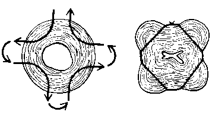

**Servikal yetmezlik nedir?**  
Rahim ağzı ya da tıbbi adıyla serviks rahimin dış dünya ile bağlantısını sağlayan ve vajinaya açılan en alt noktasıdır. Normal bir hamilelikte serviks kapalıdır.

Serviksin ilerleyen bir gebeliği taşıyamayacak kadar güçsüz olması ve doğum sancıları başlamadan açılması ise servikal yetmezlik olarak adlandırılır.

**Servikal yetmezlik tanısı nasıl konur?**  
Servikal yetezlik tanısı genelde geriye yönelik olarak konan bir tanıdır. Altta yatan herhangi bir neden bulunmaksızın gebeliğin 2. trimesterda (genelde 18-22 haftalar arası) sonlanması genelde servikal yetmezlik tanısı koydurur. Tipik olarak su kesesinin aniden açılmasını takiben bebek ve diğer gebelik ürünleri ağrısız bir şekilde rahim dışına atılır. Fonkisyonel olarak yetersiz bir serviks varlığında ise anatomik olarak bir anormallik saptanmazken gebelik varlığında yukarıdaki durum ortaya çıkar. Anatomik yetersizlik varlığında ise var olan şekil bozukluğu söz konusudur.

Geç düşük ya da erken doğuma göre servikal yetmezlik tanısı koymak zor bir olaydır. Çünkü olayın gerçekten rahim ağzında bir yetmezliğe mi yoksa başka bir nedenle doğum sancılarının başlamasına mı bağlı olduğunu ayırdetmek son derece güçtür.Genelde yetmezliğe bağlı doğumlar 18-22 haftada olurken erken doğumlar 26. haftadan sonra görülür.

Tanıda bir başka kriter ise kramp ve ağrı varlığıdır. Ağrı olmaması servikal yetmezlik için tanı koydurucu olmasına karşın özellikle rahim ağzının iyice açıldığı durumlarda hafif hatta bazen şiddetli ağrılar olabilir. Benzer şekilde ağrı eşiği yüksek kişilerde erken doğumlarda ağrı hissedilemeyebilir.

Geçmişte tanıda gebelik olmayan dönemde rahim ağzındaki açıklığın ölçülmesi ile tanı konabileceği düşünülürken günümüzde bu yaklaşım yerini ultrason incelemesine bırakmıştır. Gebelik seyri sırasında belirli dönemlerde yapılan vajinal ultrason incelemelerinde serviks uzunluğunun ölçülmesi ve amniyon kesesinin serviks içindeki kanalda oluşturduğu hunileşme ile tanı konmaktadır.

**Servikal yetmezlik neden olur?**  
Çoğu zaman altta yatan bir neden bulunamaz. Ancak geçirilmiş cerrahi ya da obstetrik travma önemli bir risk faktörüdür. Önceki doğumlar ya da geç düşükler ile 10 haftadan sonra yapılan kürtajlar servikste travmaya neden olabilmektedir. Nadiren doğumsal anomaliler de servikal yetmezliğin altında yatan neden olabilir.

**TEDAVİ**

**SERKLAJ  
**Servikal yetmezliğin tedavisi cerrahidir. Serklaj (cerclage) adı verilen bir işlem ile rahim ağzı gebelik sonuna kadar kapalı tutulabilir. Burada rahim ağzını çevreleyen bir dikiş geçilerek bağlanır ve serviks torba ağzı gibi büzülür.

**Serklaj kimlere yapılır?**  
Bilinen ve tanısı konmuş sevikal yetmezlik varlığında ya da rutin incelemelerde servikal yetmezliği düşündüren bulgular saptandığında serklaj konması planlanır.

Serklaj acil ya da profilaktik (koruyucu) olarak 2 grupta incelenebilir.

Acil serklaj uygulanmasını gerektiren durumlar şunlardır:

*   Gebeliğin 28. haftasından önce ve doğum eyleminin başlamadığı durumlarda yapılan pelvik muayenede rahim ağzında açılma ve incelme saptanması
*   Daha önceden erken doğum öyküsü olan gebelerde vajinal utrasonografide serviks uzunluğunun 2 santimetre ya da daha kısa olarak saptanması ya da hunileşme izlenmesi (amniyon kesesinin serviks içindeki kanala doğru uzanması)

Aşağıdaki durumlarda ise herhangi bir bulgu olmasa da önlem olarak serklaj yapılmalıdır.

*   Daha önceki gebeliği ya da gebelikleri servikal yetmezlik nedeni ile düşük ya da erken doğum ile sonuçlananlar
*   Çekilen rahim filminde servikal yetmezliği düşündüren bulgular saptananlar
*   Servikste cerrahi ya da obsterik travma öyküsü olması (örneğin geçirilmiş konizasyon)
*   12\. haftada yapılan vajinal ultrasonografide serviksin 2 santimetreden kısa olarak bulunması

**Serklaj ne zaman yapılır?**  
Acil serklaj durum saptandığı anda yapılmalıdır. Profilaktik serjklaj ise genelde gebeliğin 13-14. haftalarında yapılır.

İşlemden önce gebelik yaşı, bebeğin canlı olduğu ve herhangi bir anomalisinin olmadığının ultrason ile tespiti şarttır. Yine işlem öncesi var olanvajinal enfeksiyonlar ile idrar yolları enfeksyonları mutlaka tedavi edilmelidir.

**Serklajın sakıncalı olduğu durumlar var mıdır?**  
Aşağıdaki durumların varlığında serklaj yapılamaz. Benzer şekilde daha önceden serklaj sütürü konmuş kişilerde bu durumlar ortaya çıkar ise dikiş alınmalı ve doğum kendi seyrine bırakılmalıdır.

*   Aktif doğum eylemi varlığı
*   Rahim içinden aktif kanama olması
*   Amniyon kesesinde ya da rahim içinde iltihap olaması
*   Su kesesinin açılmış olması
*   Yaşamla bağdaşmayan fetal anomali saptanması
*   Fetusun canlılığını yitirmiş olması

**İşlem nasıl yapılır?**  
Rahim ağzına serklaj dikişi konulması genel anestezi altında yapılan bir işlemdir. Operasyon sırasında alacağınız genel anestezi bebek açısından yüksek risk taşımaz. İşlem genelde 3-4 dakika kadar sürer. Ortamın bakteri ve diğer mikroorganizmalardan arındırılması amacıyla gerekli temizlik işlemi yapıldıktan sonra bant şeklindeki özel dikiş ipliği rahim ağzının rahim ile birleştiği en yakın noktadan çepeçevre geçirilerek sıkıca bağlanır. Bu şekilde rahim ağzı torba şeklinde büzülmüş olur.

Serklajın bir kaç değişik türü olmakla birlikte en sık kullanılan teknik yukarıda anlatılandır ve McDonald usülü serklaj olarak adlandırılır.

Operasyon genel anestezi altında olduğu için bir gece öncesinde akşam yemeğinde çorba, salata gibi hafif şeyler yemeniz, gece yarısı saat 12:00’den sonra ise su da dahil olmak üzere hiçbir şey yiyip içmemeniz gereklidir.

Ameliyat sonrasında bir süre hastanede gözlem altında kalmanız gerekebilir. Bu süre içinde kanama ya da doğum kasılmaları gibi probemlerin ortaya çıkıp çıkmadığı izlenir. Bazı doktorlar bir gece süreyle hastanede izlemeyi tercih edebilirler. Bu süre içinde rahim kasılmalarını önlemek amacıyla bazı rektal fitiller ya da damardan verilen ilaçlar uygulanabilir.

İşlem sonrası erken dönemde hafif bir kanama olması normaldir.

Serklaj sütürü konulduğunda doktorunuz onay verene kadar cinsel ilişkide bulunmak sakıncalıdır.

**Etkinliği ne kadardır?**  
Servikal yetmezlik tanısı kesin ise serkaj konan hastaların %90-95’i gebeliği miada kadar taşıyabilirler.

**Dikiş alınır mı?**  
Eğer normal vajinal doğum planlanıyorsa dikiş 37. gebelik haftasında alınır. Genelde dikişin alınmasını takiben çok kısa bir sürede doğum gerçekleşir.

Sezaryen planlanan doğumlarda ise dikiş sezaryen sonrasında alınır.

Bazen daha sonraki hamilelikler düşünülerek dikiş yerinde bırakılabilir ancak uygun olan her gebelik için yeniden dikiş atılmasıdır.

**Riskleri nelerdir?**  
Her cerrahi işlemde olduğu gibi serklaj operasyonlarında da bazı riskler vardır. Bunlar:

*   Genel anesteziye bağlı riskler
*   Doğum eyleminin başlaması. Bazen işlemin kendisi doğum eylemini başlatabilir.
*   Su kesesinin yırtılması
*   Servikal enfeksiyon
*   Servikste yırtılma. Eğer dikiş yerindeyken kasılmalar başlar ve fark edilmez ise serviskte yırtılma görülebilir.

Bu komplikasyonların hemen hepsi son derece nadir görülen durumlardır.

**Acil durumlar**

*   İşlem sonrası düzenli kasılmalarınız olursa
*   Vajinal kanamanız doktorunuzun belirttiğinden daha fazla ise
*   Ateşiniz 38 derecenin üzerine çıkarsa
*   Kötü kokulu bir vajinal akıntı olursa
*   Suyunuz gelirse

mutlaka zaman kaybetmeden doktorunuzu aramalısınız
