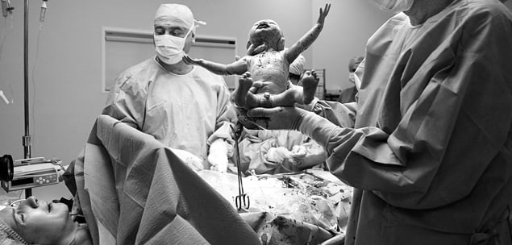
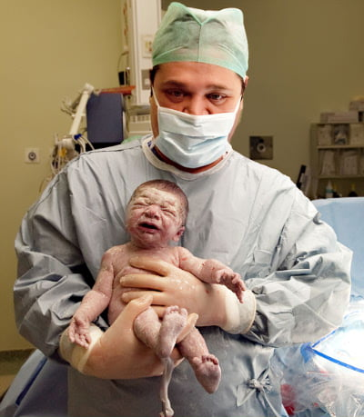

Herkesin bildiği gibi hamile bir kadında bebeğin vajinal yoldan değil de karın boşluğunun cerrahi olarak açılarak doğurtulması işlemi sezaryen olarak adlandırılır. Sezaryen son zamanlarda tüm dünyada en çok gerçekleştirilen operasyonların başında gelmektedir ve sezaryen ile doğum oranları giderek artmaktadır.

Özellikle ülkemizde her hamile kadının ilk aklına gelen doğumun ne şekilde olması gerektiği, sezaryen’in mi yoksa normal doğumun mu daha iyi olduğu sorusudur. Bu sorunun cevabı bu yazının konusu değildir. Ancak burada kısaca **sezaryen’in son ana kadar her zaman bir alternatif** olarak yerini koruduğunu belirtmek isterim.

**Tarihçe**  
Sezaryen teriminin gerçek kaynağı ve ilk kez ne zaman ve nerede yapıldıığı konusu açık değildir. Sezaryen kelimesinin orta çağda Latince kesmek anlamına gelen _caedare_‘den geldiği ve bu şekilde doğan bebeklerin _caesones_ olarak adlandırıldığı tahmin edilmektedir. Bir başka iddia da kelimenin kökeninin milattan önce 8. yüzyıla kadar uzandığıdır. Bu yıllarda Roma’da geçerlil olan _lex regis_ adı verilen yasanın zamanla _lex cesarea_ olarak değiştiği rivayet edilir. Yasa hamile bir kadın öldüğünde karnının açılarak bebeğin çıkartılmasını ve bu sayede anne ve bebeğin ayrı ayrı gömülmesini emretmekteydi.

> Bebegin anne karnından doğurtulması işlemini tanımlamak için kullanılan sözcük karmaşa yaratmakta, bu işlemi herkes farklı şekilde telaffuz etmektedir. En sık **sezeryen** şeklinde kullanılmakta, bunu takiben **sezeryan** olarak isimlendirilmektedir. İngilizcesi cesarean olan bu kelime Türk Dil Kurumu imla kılavuzunda **SEZARYEN** olarak geçmektedir. Yani kelimenn doğru söylenişi SEZARYEN’dir. (Bkz: [TDK imla kılavuzu](http://www.tdk.gov.tr/))

Konu ile ilgili pekçok spekülasyon yapılmasına rağmen Galen, Hipokrat ve Soranus gibi antik dönem hekimleri karın yolu ile doğum konusunda günümüze herhangi bir bilgi ulaştırmamışlar ve bu tür bir işlem tarif etmemişleridir.

1581 yılında François Rousset ilk kez sezaryen doğumlar ile ilgili yazılar yazmış ve kendisine ulaşan mektupların ışığında 14 tane sezaryen tanımlamıştır.Bununla birlikte kendisi ne bir sezaryen gerçekleştirmiş ne de buna tanıklık etmiştir.17. yüzyılın ortalarından başlayarak doğum hekimleri tarafından abdominal doğumlar daha sık bildirilmeye başlanmıştır.

O dönemlerde hekimlerin abdominal doğum yaptırmalarının karşısındaki en büyük engel anestezi ve enfeksiyonlardı. 1846’da dietil eter adı verilen anestezik maddenin kullanıma girmesi dönüm noktalarından biri olarak kabul edilebilir. Kraliçe Viktorya’nın 1853 ve 1857’de iki çocuğunu bu şekilde dünyaya getirdiği bilinmektedir. Anestezi alanındaki bu devrime rağmen enfeksiyon kontrolünün sağlanamaması ve işlem sonrası anne ölüm oranlarının çok yüskek seyretmesi sezaryenin sadece çok özel durumlarda yapılması gereken bir ameliyat konumundan kurtulmasına engel olmuştur.

Sezaryenin kısıtlayıcı faktörlerinden biri de cerrahi teknik yetersizliklerdi. İlk başlarda cerrahlar kestikleri rahimi tekrar dikmekten çekindikleri için fazla miktarda kanama olmakta ve bu kan kaybı nedeniyle anne ölümleri sıkça görülmekteydi. Hatta bazı cerrahlar sezaryen sonrasında kanama ve enfeksiyonu kontrol altına alabilmek için rahimin tümüyle alınmasını önermekteydiler. 1882 yılında Max Sanger sezaryende kesilen rahimin gümüş ya da ipek ipliklerle dikilmesinin başarılı olabileceğini ileri sürdü ve kendisinin 17 hastasından 8’inin bu şekilde hayatta kaldığını bildirdi.

Rahim duvarlarının dikilmesi ile kanamaya bağlı ölümler azaltılmasına rağmen karın zarı iltihabının önüne geçmekte çok büyük güçlükler vardı. 1907’de karın zarını açmadan sezaryen yapılabileceği fikri ileri atıldı. Bu yaklaşım karın zarı iltihabı riskini daha azaltmaktaydı. 1912 yılında König rahimi diklemesine kestiği klasik insizyonunu tanımladı. Bu sayede uterusun alt kısımları karın zarı ile örtülebiliyordu. 1926’de Kerr uterusun alt kısmından enlemesine kesilmesinin daha az risk taşıdığını ileri sürdü Günümüzde yapılan hemen hemen tüm sezaryen amaliyatlarında Kerr’in 1926 yılında tanımladığı ve kendi adı ile anılan kesi kullanılmaktadır.

1928’de Alexander Fleming’in penisilini keşfetmesi ile enfeksiyonlar ile mücadelede de önemli aşamalar kaydedildi ve sezaryen operasyonları daha güvenli hale geldi.

Küçük bir not; ülkemizde anne ve bebeğin her ikisinin de yaşamını devam ettirdiği ilk başarılı sezaryen amaliyatı 1900’lü yılların başında saray cerrahı olan Cemil Topuzlu tarafından İstanbul Nişantaşında bir konakta gerçekleştirilmiştir.

Zaman içerisinde hem cerrahi hem de anestezi tekniklerindeki değişimler, ilaç sektöründeki buluşlar ve dikiş malzemeleri gibi pekçok faktörün etkisi ile sezaryen günümüzde son derece güvenli ve kolay bir ameliyat haline gelmiştir.

**Hangi durumlarda sezaryen gereklidir?**  
Pekçok durumda doğumun sezaryen ile yapılması gerekli olabilir. Genel olarak normal doğumun olanaksız ya da çok tehlikeli olduğu durumlarda anne adayı ve/veya bebeğin hayatını kurtarmak, ya da normal doğum eyleminin güvenli olmadığı hallerde sezaryen önerilir. Bazı endikasyonlar sadece anne adayının bazıları da sadece bebeğin iyiliği için, diğerleri ise hem anne adayı hem de bebeğin iyiliği içindir.

Bazı durumlarda doğumun normal yollardan olması olanaksızdır. Bu gibi hallerde doğum eylemi başlamadan önce sezaryen kararı verilir ve 38. haftadan sonra gebelik sezaryen ile sonlandırılır. Zaman zaman da eylem başladıktan sonra ortaya çıkan nedenler ile sezaryene karar vermek gerekebilir. Sezaryen endikasyonları gruplar halinde incelenebilir.

**Normal doğumun olanaksız ya da riskli olduğu, sezaryene önceden karar verilen durumlar**  
**Yan geliş (transvers duruş):** Bebeğin rahim içerisinde yan durması. Bu durumda bebeğin vajinal yoldan doğması olanaksızdır. Hem anne hem de bebek hayatını yitirebilir. Bebekler gebeliğin erken dönemlerinde yan (transvers), baş aşağıda ya da popo aşağıda durabilirler. Gebelik sonlara yaklaştıkça yan duran bebeklerde baş ya da popo aşağıya dönerek son pozisyonunu alır. Bu dönüşün yaşanmaması durumunda önde gelen kısım bebeğin omuzu olacaktır. Bu oldukça riskli bir durumdur.

**Makat geliş:** Bebeğin önde gelen kısmının poposu olması kesin bir sezaryen gerekliliği değildir. Ancak eğer önde gelen kısım ayak ise sezaryen dışında bir alternatif yoktur. Tam ya da saf makat gelişlerde ise anne ve bebeğin durumu dikkate alınarak normal doğuma karar verilebilir. Ancak günümüzde pek çok doktor bu riski göze almaz ve sezaryen önerir. (makat gelişler hakkında bilgi için tıkla yın)

**Pasenta previa totalis:** Bebeğin eşinin (plasenta) rahim ağzını tamamen kapatması durumuna plasenta previa adı verilir. Bu durumda normal doğum olanaksızdır ve önceden karar verilerek sezaryen yapılır.Bu durumda bebek doğum kanalına giremez. Gebeliğin erken dönemlerinde plasenta alt kısımda yerleşmiş olabilir. Ancak gebelik ilerledikçe rahimin büyümesi ile birlikte plasenta da yukarıya doğru çekilir. Son aya girildiğinde eğer buyukarı çekilme gerçekleşmemiş ise plasenta previadan söz edilir. Plasentanın rahim ağzını kısmen kapatması ya da hemen kenarında bulunması durumunda da rahim ağzının açılması sırasında aşırı kanama olabileceğinden sezaryen yapılmalıdır.

**Çok iri ya da çok küçük bebek:** Bebeğin tahmini doğum ağırlığının 4500 gramdan fazla ya da 1500 gramdan az olması durumda doğum travması ve buna bağlı bebekte hasar meydana gelmesi olasılığı yüksektir. Bu tür durumların varlığında normal doğum mümkün olmakla birlikte riski en aza indirmek amacıyla sezaryen önerilir. 4500 gramın üzerinde olan bebeklerde yaşanabilecek en büyük risk omuz takılmasıdır. Bebeğin başı doğduktan sonra omuzları doğum kanalında takılıp kalır. Omuz takılması son derece talihsizbir durumdur. Küçük bebeklerde ise doğum travmasına bağlı kafa içi kanamalar normal doğum sonrası daha sık görülür. Küçük bebeklerde aynı zamanda fetal duruş bozukluğu olma olasılığı yüksektir.

**Baş-pelvis uygunsuzluğu:** Bebeğin kilosundan bağımsız olarak bebeğin en geniş çapı olan kafası ile anne adayının kemik yapıları arasında uyumsuzluk olabilir. Bu durum eskiden dar pelvis ya da halk arasında çatı darlığı olarak adlandırılmaktaydı. Dar pelvis yanlış bir tanımlamadır. Doğru olan annenin pelvisi ile bebek arasındaki ilişkinin saptanmasıdır. Örneğin pelvisi normal olan bir kadında bebek iri ise baş-pelvis uygunsuzluğu olabilir oysa aynı kadın minyon bir bebeği rahatlıkla vajinal yoldan doğurabilir. Bu durumda pelvis darlığından söz edilemez. Ancak raşitizm gibi bazı hastalıklarda annenin kemik yapılarında şekil bozuklukları olabilir. Bu gibi durumlarda vajinal doğum mümkün değildir.

**Çoğul gebelikler:** Şart olmamakla birlikte çoğul gebeliklerde sezaryen tercih edilir.Özellikle üç ya da daha fazla sayıda bebek varsa vajinal doğumdan kaçınılır. İkiz gebeliklerde ise önde gelen bebeğin makat geliş arkadakinin ise baş geliş olması durumunda ilk bebeğin gövdesi doğduktan sonra arkadki bebek ile kafaları kilitlenebileceğinden bu durum mutlak bir sezaryen gerekliliğidir.

**Doğumsal anomaliler:** Bebeğin doğum kanalından geçmesini olanaksız kılan yapısal anomalilerin varlığında da sezaryen gerekliliği vardır. Bu durumun en önemli örneği bebeğin karın duvarının kapanmadığı ve iç orgalarının dışarıda olduğu gastroşizis ve omfalosel durumlarıdır. Vajinal doğum olduğunda bu organlarda ciddi zedelenmeler meydana gelir. Bazı iskelet sistemi hastalıkları ile nöral tüp defekti gibi durumlarda da sezaryen gereklidir. Yapışık ikiz varlığında da sezaryen uygulanır.

**Doğum kanalını tıkayan kitleler:** Başta myomlar olmak üzere bazı kitleler doğum kanalını daraltarak vajinal doğumu olanaksız hale getirebilirler. Dev kondilom (genital siğil) varlığında da vajinal doğumdan kaçınılır.

**Anne adayıdaki sistemik hastalıklar:** Bazı durumlarda anne adayının doğumun ikinci evresinde ıkınması sağlığını tehlikeye atabilir. İleri derecede kalp hastalıkları bu durumun en güzel örneğidir. Benzer şekilde anevrizma gibi beyin hastalıklarında da anne adayının ıkınması sakıncalı olabilir. Ikınma sırasındaki kafa ve karın içi basınç artışı riskli olduğunda sezaryen tercih edilir.

**Annede herpes enfekiyonu:** Anne adayında aktif genital herpes enfeksiyonu varlığında bebek doğum kanalından geçerken enfeksiyonu kapabilir. Bu oldukça riskli bir durumdur. Aktif genital herpes varlığında vajinal doğum asla yaptırılmaz.

**Geçirilmiş sezaryen:** Daha önceki hamileliklerin sezaryen ile sonlandırılmış olması mutlak bir sezaryen gerekliliği değildir. Bunun tek istisnası uterusun yukarıdan aşağıya doğru kesildiği klasik sezaryendir. Bu durumda eylem sırasında rahim kasının yırtılma olasılığı çok yüksek olduğundan asla denenemez. Alt kısıma yatay bir kesi yapılarak gerçekleştirilen sezaryenlerden sonra ise normal doğum denenebilir. Ancak pekçok doktor bu gibi durumlarda yine sezaryeni tercih etmektedir.

**Geçirilmiş myomektomi:** Önceden yapılan bir myom çıkartma ameliyatında rahim boşluğuna girilmiş ve kavite dikilmiş ise çoğu doktor sezaryeni tercih eder.

**Geçirilmiş vajinal oprerasyon:** Vajinada uygulanmış bazı operasyonlardan sonra normal doğum önerilmez.

**Vajinismus ve/veya korku:** Anne adayının normal doğumdan aşırı korktuğu ya da muayeneyi tolere edemediği durumlarda hiçbir tıbbi gereklilik olmaksızın sezaryen önerilebilir.

**Fetal distress bulguları:** Yapılan rutin NST incelemelerinde fetusun sıkıntıda olduğunu düşündüren bulguların varlığında sezaryen gerekli olabilir.

**İsteğe bağlı sezaryen:** Günümüzde ülkemizde özel hastanelerde en sık yapılan sezaryen isteğe bağlı sezaryenlerdir. Burada herhangi bir tıbbi gereklilik olmaksızın anne adayının tercihi ile bebek miadını doldurduktan sonra (38. haftadan sonra) kararlaştırılan bir günde sezaryen ile doğurtulur. İsteğe bağlı sezaryenlerde en sık karşılaşılan neden anne adayının normal doğumdan korkması, uzun sürebilecek olan eylemi çekmek istememesi, bebeğini en ufak bir risk altına sokmak istememesi, normal doğumun uzun dönem etkilerinden çekinmes, çift için özel bir günde (evlilik yıl dönümü, ebeveynlerden birinin doğum günü, 02.02.02 gibi kolay hatırda kalacak günlerin tercih edilmesi gibi) doğumun gerçekleştirilmesi ve hatta bebeğin burcunun ayarlanmasıdır!… Bu durumun en uç örneği bebeğin burcu ile birlikte yükselen burcunun da ayarlanması için belirli bir saatte sezaryen yapılmasının istenmesidir (başımıza geldi 🙂 )  
Bazı durumlarda ise doktor anne adayını sezaryene teşvik eder. Gebeliğin çok zor elde edildiği ya da ikinci bir gebelik şansının düşük olduğu ileri anne yaşı,tüp bebek sonrası gebelik gibi durumlarda normal doğumun bebeğe yüklediği risklerden kaçınmak ve bebeğin sağ olarak dünyaya gelmesini garanti altına almak için sezaryen tercih edilir. Eskiden Türk tıp literatüründe “kıymetli bebek” olarak geçen bu endikasyon, daha sonra terimin anlamsızlığı nedeniyle terk edilmiştir. Her ne olursa olsun tüm bebekler kıymetlidir kıymetsiz tek bir bebek bile yoktur.

**Vajinal doğum planlanırken eylemin herhangi bir anında sezaryen gerekliliği doğuran durumlar**  
Zaman zaman vajinal doğum için her türlü şart uygunken ve elem devam ederken ortaya çıkan durumlar sezaryen gerekliliği doğurabilir.

**İlerlemeyen eylem:** Anne adayının kasılmaları düzenli ve güçlü olmasına rağmen rahim ağzının açılmması ya da bebeğin kafasının aşağıya inmemesi durumunda sezaryen gereklilği ortaya çıkar. Eylemin ilerlememesinde en önemli neden bebeğin kafasının doğum kanalına uygun şekilde girmemesidir.Daha önceden fark edilemeyen başpelvis uygunsuzluğu ya da kafanın kanala eğri girmesi durumunda yeterli kasılmalara rağmen eylem ilerlemez.

**Fetal kalp atımlarının bozulması:** Doğum eylemi sırasında kasılma ile birlikte rahime giden kan ve oksijen miktarında azalma olur. Bu azalma aynı şekilde plasentaya ve bebeğe giden miktarlara da yansır. Normalde bebek kasılmalar sırasında görülen bu azalmayı rahatlıkla tolere eder.Tolere edemediği durumlarda ise ilk önce kalp atım hızında bir yavaşlama izlenir. Fetal kalp atımları bozulduğunda anne adayını sol yanına yatırmak ve oksijen vermek gibi temel önlemler ile durum düzelmiyor ise sezaryen kararı verilir. Bu duruma **akut fetal distres** adı verilir.

**Plasentanın erken ayrılması:** Plasentanın bebek tamamen doğup ilk nefesini almadan önce rahim duvarından ayrılmasına ablasyo plasenta ya da plasental dekolman adı verilir. Böyle bir durumda bebeğin oksijen ve besin kaynakları azalır. Plasentanın hepsinin ayrılması durumunda ise tamemen kesilir. Tam dekolman son derece acil bir durumdur. Anne ve bebeğin hayatı tehlikededir. Zaman kaybetmeden acil şartlarda sezaryene alınır.

**Kordon sarkması:** Amniyon kesesi açıldığında bebeğin göbek kordonu rahim ağzından dışarıya sarkabilir. Son derece acil bir durum olan kordon sarkması varlığında kordon sıkışarak bebeğe giden tüm kaynakların kesilmesine ve bebeğin ölmesine neden olabilir. Kordon sarkması varlığında bir kişi elini annenin vajenine sokarak kordonu rahim içine iter. Bu vaziyette ameliyat odasına gidilir. Bebek tamemen doğana kadar kişi elini vajinadan çıkarmaz. Kordon sarkması durumunda sezaryen zamana karşı yapılan bir yarıştır.

**Amniyon sıvısının mekonyumlu olması :** Bebeğin barsak içeriğinin (mekonyum) amniyon sıvısında olması bebeğin sıkıntıda olduğunun belirtisidir. Mekonyum bebeğin akciğerlerine kaçarsa kimyasal akciğer enfeksiyonuna neden olabilir. Bu nedenle amniyon sıvısında mekonyum saptandığında şart olmamakla birlikte sezaryen tercih edilebilir.

**Bebeğin kafasının sıkışması:** Zaman zaman eylem normal olması gereken şekliyle ilerlerken bebeğin kafası doğum kanalının ortasında takılabilir. Bu durumda sezaryen gerekir.
