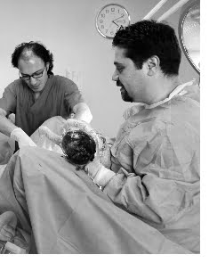
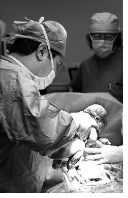

Anne ve baba adaylarını 40 hafta boyunca en çok düşündüren konuların başında doğum şeklinin nasıl olacağı gelmektedir. Özellikle ilk gebelik tecrübesini yaşayan çiftler etrafında tecrübeli saydıkları kişiler tarafından yöneltilmekte ve çoğu kez yanlış bilgilendirilmektedirler.

Normal doğum ya da sezaryen; her ikisi de masum değildir. Her iki yöntemin de avantaj ve dezavantajları vardır.

**Normal Doğum**   
Normal doğum milyonlarca yıldır bütün memeli varlıkların soylarını devam ettirmekte kullandıkları yöntemdir. En önemli avantajı normal ve fizyolojik olmasıdır.Doğum sonrası anne birkaç saat içinde normal aktivitesine dönebilmekte çok kısa sürede bebeğini emzirmeye başlayabilmektedir. Normal doğumu takiben gebelik öncesi yaşantısına hemen dönebilmekte ve hastanede kalış süresi son derece kısa olmaktadır.

Bebek açısından ise avantajı doğum esnasında sıkışıp büzüşen bebeğin akciğerlerinin soluk alıp vermeye daha hazırlıklı olmasıdır. Ayrıca anne ve bebek arasında duygusal temas daha kısa sürede ve güçlü başlamaktadır.

Bu avantajlarının yanı sıra normal doğum bazı riskleri de beraberinde taşımaktadır. Bunların en başında tamamen normal seyreden bir doğumun bile her an problem geliştirmeye müsait olmasıdır.Herşey yolunda giderken birden bebek strese girebilir, kalp atımları yavaşlayabilir, hatta kaybedilebilir. Bu nedenle normal doğum mutlaka hastane koşullarında ve en kısa sürede sezaryene gecilebilecek bir ortamda yapılmalıdır. Özellikle ülkemizde her yıl binlerce kadın evde doğum yapmakta ve pek çoğunda sorun yaşanmamaktadır. Ancak topluma günümüzde pek yansımayan doğum sırasında anne ve bebek ölümleri hala daha büyük bir sorun olarak karşımızda durmaktadır.

Bunun dışında normal doğumda en çok korkulan komplikasyonlardan biri de bebeğin omuzunun taklılmasıdır. Burada bebeğin başı doğduktan sonra, omuzları annenin kemiklerine takılmakta ve büyük olasılıkla bebek kaybedilmektedir. Son derece nadir görülen bu komplikasyon son derece üzücü bir durumdur.

Ayrıca doğum esnasında eylemin fazla uzaması bebeğin oksijensiz kalmasına ve daha sonra gerek zeka gerekse motor fonkisyonlarında geriliğe neden olabilmektedir.

Anne açısından önemli bir risk ise doğum esnasında oluşabilen yırtıklardır. Bu yırtıklar dikişli tabir edilen doğumlarda bile nadiren de olsa görülebilmekte ve ileride dışkı tutmada sorunlara yol açabilmektedir. Annenin barsakları ile vajinası arasında açılabilecek milimetrik pencereler bile vajinadan dışkı gelmesine neden olabilmekte ve bu durumun tedavisi aylarca sürebilecek uzunlukta ve birden fazla sayıda ameliyat ile mümkün olabilmektedir.

Normal doğuma bağlı olarak gelişebilecek mesane sarkması ileride ancak bir ameliyat ile düzeltilebilecek idrar kaçırma şikayetlerine yol açabilir. Oldukça ürkütücü görünen bu komplikasyonlar son derece nadir ortaya çıkmaktadır.

Anneleri normal doğumdan uzaklaşmaya iten diğer nedenlerden bazıları da psikolojik kökenlidir. Özellikle ilk defa bebek dünyaya getirecek anne adaylarında zaman zaman 12 saate kadar sürebilen doğum sancıları büyük korku yaratmaktadır. Ancak günümüzde oldukça popülerite kazanan ağrısız doğum bu korkuları ortadan kaldırmaktadır.

Anne adaylarını endişelendiren başka bir durumda doğum eyleminin ne zaman başlayacağının önceden bilinememesidir. Doğumun uygunsuz zaman ve ortamlarda başlayacağı ve dolayısı ile hastaneye yetişememe veya doktoruna ulaşamama korkusu anne adaylarını sezaryene yöneltmektedir. Ancak bu korkular anne adayının doktoru ile önceden her türlü olasılığı tartışması ile ortadan kaldırılabilir.

**Sezaryen**   
Sezaryen anne karın boşluğuna girilerek rahimin açılması ve bebeğin bu şekilde doğurtulmasıdır. Son yıllarda sezaryen doğumlarda çok büyük bir artış göze çarpmaktadır. Bu artışta en önemli faktör anne adaylarının normal doğumdan korkması ve kendilerinin sezaryen olmayı istemeleridir.

Sezaryenin en önemli avantajı bebek açısından riskleri en aza indirmesidir. Sezaryen doğumda yukarıda normal doğumda bahsedilen risklerin hemen hemen hepsi bertaraf edilmektedir. Ancak sezaryen ile doğan bebeklerde doğum sonrası ilk birkaç günde solunum sıkıntısı gelişme olasılığı biraz daha fazladır. Buna karşılık sezaryen ile doğum anne açısından normal doğuma kıyasla daha problemlidir.

Genel anestezi riski çok düşük de olsa bulunmaktadır. Bu risk epidural anestezi ile ortadan kaldırılabilir. Ameliyat sonrası hastanın kendine gelmesi ve bebeğini emzirmeye başlaması 2-3 saati almakta, annenin ağzıdan beslenmeye başlaması ise ortalama 6-8 saat sonra olmaktadır. Genelde ameliyat sonrası 2 ya da 3 gün hastanede yatması gereken annenin ameliyattan 6-8 saat sonra ayağa kalkıp dolaşmaya başlaması normal doğuma göre biraz daha problemli olmaktadır.

Hastanın normal hayatına dönmesi genelde 3-4 gün kadar sürmektedir. Ameliyat sonrası PCA kullanılmadığında ilk birkaç saat oldukça ağrılı geçmektedir. Ayrıca yine ameliyattan sonra kişinin en az 6 hafta ağır işlerden kaçınması uygun olur.

Uzun dönemde ise dikiş yerlerinde zaman zaman ağrılar olması ve karın içinde ameliyat bağlı yapışıklıklar sezaryenin diğer komplikasyonlarıdır.

Her iki doğum şeklinde ortak olan komplikasyon ise enfeksiyon riskidir. Normal doğum ya da sezaryen olsun dikiş bulunan yerlerde enfeksiyon riski her zaman mevcuttur. Bazı durumlarda sezaryen kaçınılmaz olmakla birlikte doğum şeklinin ne olacağına karar verirken çok katı olunmamalı hasta ile doktor karşılıklı görüşerek avantaj ve dezavantajları birarada değerlendirmeli ve her hasta için ayrı ayrı karar vermelidirler.Örneğin daha önceden doğum yapmış ve fazla iri olmayan bir bebeği olan anne adayında herşey yolunda giderken sezaryen için ısrarcı olmak ne kadar yanlış ise iri bir bebeği olan ya da kemik yapısı dar olan bir anne adayının normal doğumda ısrarcı olması da o derece yanlıştır.
