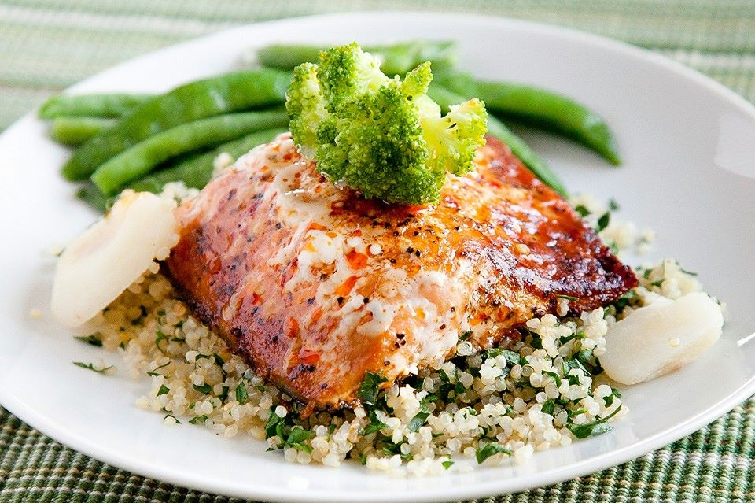

İngiltere’deki Southhampton Üniversitesinde yapılan yeni bir araştırmanın sonuçları gebelik sırasında somon gibi yağlı balık tüketen annelerin bebeklerinde astım hastalığına daha az rastlandığını ortaya koydu.

Profesör Philip Calder ve arkadaşlarının San Diego’da yapılan deneysel bioloji kongresinde sunduları çalışmaları oldukça dikkat çekici

Gebelikte somon çalışması adını verdikleri araştırmalarında bilim insanları gebeliğin 19. haftasından başlayarak haftada iki defa somon tüketmenin doğumdan sonraki ilk üç yılda çocuğun solunum sistemini nasıl etkilediğini incelemişler.

Bunun için anne adaylarının rasgele olarak iki ayrı gruba ayırmışlar ve deney grubundaki kadınlara gebliklerinin 19. haftasından başlayarak haftada 2 kere somon yedirmişler. Doğum olduktan sonra bebeklerde 6. ayda ve 2-3 yaşında alerji testleri uygulanmış.

Araştırmanın ilk sonuçları doğumdan sonraki ilk 6 ayda annenin gebeligi sirasinda somon ya da diğer yağlı balıkları düzenli şekilde tüketip tüketmemesinin herhangi olumlu ya da olumsuz etkisinin olmadığını ortaya koymuş.

Ancak çocuklar iki ya da iki buçuk yaşına ulaştığında anneleri gebelik sırasında somon tüketenlerde istatistiksel olarak anlamlı oranda daha az astıma rastlanmış.

[https://www.sciencedaily.com/releases/2016/04/160406074751.htm](https://www.sciencedaily.com/releases/2016/04/160406074751.htm)
