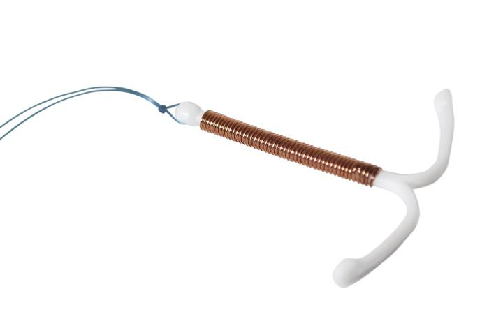

Dünyada istenmeyen gebeliklerin engellenmesi amacıyla en fazla kullanılan yöntemlerden biri olan rahim içi araç yani Türkçede kullandığımız şekliyle “spiral” doğum kontrolü dışında bir başka olumlu etkisi ile son dönemlerde gündemde.

Alanındaki en prestijli dergilerden biri olan Obstetrics and Gynecology dergisinin 7 Kasım 2017 tarihli sayısında yayınlanan bir araştırmada spiral kullanan kadınlarda rahim ağzı kanserine daha az rastlandığı iddia ediliyor.

Spiral birkaç farklı etkiyle istenmeyen gebeliklere engel oluyor.

Bu yollardan birinin spiralin vücudun bağışıklık sisteminde bir uyarıya neden olarak spermleri yavaşça öldürmesi olduğu düşünülüyor.

Araştırmacılar spiral kullanan kadınlarda rahim ağzı kanserinin neredeyse üçte bir oranında daha az görülmesinin altında yatan sebeplerden birinin spiralin yarattığı bağışıklık sistemi değişikliğinin rahim ağzı kanserine neden olan virüsü etkisiz hale getirmesi olduğunu düşünüyorlar.

Rahim ağzı kanseri için kullanılan aşılar en çok bu virüsle hiç karşılaşmamış insanlarda yani cinsel yaşantısı henüz başlamamış genç kız ve çocuklarda öneriliyor.

Araştırmacılara göre eğer spiralin rahim ağzı kanserini azaltıcı bir etkisi varsa bu durum en çok bu hastalığa neden olan virüs ile karşılaşmış 30 ve kırklı yaşlardaki kadınlar için avantaj sağlayacaktır.

Çalışmayı yürüten Güney Kaliforniya Üniversitesi Keck Tıp Fakültesi araştırmacılarından Victoria Cortessis elde ettikleri sonuçların kadınlara rahim ağzı kanserinden korunmak için spiral taktırmalarını önermek için yeterli olmadığını, bu konu ile ilgili karşılaştırmalı çalışmalar yapılmasına ihtiyaç duyulduğunu belirtiyor.

Cortessis ve ekibinin araştırmalarında dünyanın çeşitli ülkelerinde yapılmış 16 değişik çalışmadaki 12.000 kadından elde edilen sonuçlar değerlendirilmiş. Bu kadınlarda rahim içi araç kullanımı ile rahim ağzı kanseri görülme sıklığı karşılaştırmış ve spiral kullananlarda bu ölümcül hastalığın daha az görüldüğü ortaya konmuş.

Cortessis’in hipotezine göre rahim içi araç takıldığında kadının bağışıklık sisteminde bir uyarıya neden oluyor, bu uyarı neticesinde salgılanan bazı maddeler, rahim ağzı kanserine neden olan ve HPV adı verilen virüs ile savaşarak vücuttan atılmasına yardımcı oluyor.

**Kaynak:**  
[Intrauterine Device Use and Cervical Cancer Risk: A Systematic Review and Meta-analysis](http://journals.lww.com/greenjournal/Abstract/publishahead/Intrauterine_Device_Use_and_Cervical_Cancer_Risk_.98222.aspx)  
Cortessis, Victoria K. PhD; Barrett, Malcolm MPH; Brown Wade, Niquelle MS; Enebish, Temuulen MBBS, MPH; Perrigo, Judith L. MSW, LCSW; Tobin, Jessica MS; Zhong, Charlie MS, MPH; Zink, Jennifer BA; Isiaka, Vanessa MD; Muderspach, Laila I. MD; Natavio, Melissa MD, MPH; McKean-Cowdin, Roberta PhD. Obstetrics & Gynecology:
