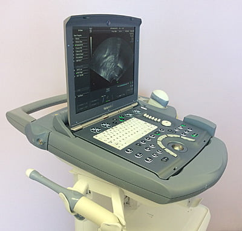

Ultrason ya da ultrasonografi modern tıbbın vazgeçemediği görüntüleme yöntemlerinden birisidir. Ultrasonun insan vücudunun içinde olup bitenleri anlamaya yarayan diğer görüntüleme yöntemlerden en önemli farkı bu amaca ulaşmak için X- ışınlarını kullanmaması yani radyasyon içermemesi, bunun yerine insan kulağının duyamayacağı frekansta ses dalgalarından yararlanmasıdır. Bir başka olumlu özelliği de elde edilen görüntünün gerçek zamanlı olması yani işlem yapıldığı sırada görüntünün monitör ekranında izlenebilmesidir.

40 yıldan fazla zamandır tıp alanında kullanılan ultrason günümüzde kadın doğum pratiğinde rutin uygulamaya girmiş, jinekolojik muayene ve gebelik takiplerinin olmazsa olmaz bileşeni haline gelmiştir.

**Ultrasonun çalışma prensibi**  
Ultrason cihazı ses dalgalarının değişik yoğunlukta dokular içinde farklı hızlarda ilerlemesi ve yansıması prensibine dayanan bir mekanizma ile çalışır. Bu mekanizma aslında doğaya yabancı bir mekanizma değildir. Yarasaların uçarken, balinaların ise denizlerde yüzerken kullandıkları sistem de benzer bir prensibe dayanmaktadır. Öte yandan denizaltıların seyir sırasında ya da balıkçıların balık sürülerini ararken kullandıkları sonar cihazları da aynı mekanizma ile çalışırlar.

**Ultrason cihazının bölümleri**  
Ultrason cihazları tıpkı bilgisayarlarda olduğu gibi farklı parçalardan oluşur.

**Prob:** Ultrason cihazının inceleme sırasında vücüt ile temas eden en önemli kısmıdır. Prob ses dalgalarını üretir ve yansımalarını algılar. Basit bir benzetme yapacak olursak ultrason cihazının ağzı ve kulağı gibi görev yapar.

Ultrason probları ses dalgalarını 1880 yılında Pierre ve Jacques Curie tarafından keşfedilen ve piezoelektrik etkisi adı verilen bir sistemle üretirler ve algılarlar. Probların içinde çok sayıda piezoelektrik kristali adı verilen quartz kristal bulunur. Elektrik akımı uygulandığında kristaller hızla şekil değiştirirler. Bu şekil değişikliği titreşime ve sonuçta ses dalgası oluşmasına yol açar. Tam tersi olarak kristallere herhangi bir ses dalgası ya da basınç ulaştığında bu kez elektrik akımı üretirler. Bu sayede aynı kristaller hem ses üretmek hem de sesi algılamak amacıyla kullanılırlar. Probun içinde ayrıca kendi ürettiği sesin oluşturduğu yansımaları ayıran bir bölüm ve üretilen ses dalgalarını odaklamaya yarayan bir de akustik lens bulunur.

Tipik olarak bir ultrason probunda yaklaşık 300 kristal bulunur. Bu kristaller birbirlerinden bağımsız olarak ses dalgası üretir ve kendilerine ulaşan yansımaları elektrik akımına çevirirler. Sonuçta saniyede yaklaşık 30 görüntü elde edilir ve bu 30 görüntü monitörde hareketli film gibi izlenir. Bu olaya gerçek zamanlı ultrason adı verilir. Diğer görüntüleme yöntemlerinde ise sadace tek bir kare görüntü elde edilmektedir.

Ultrason probları çok değişik boyutta ve şekilde olabilir. Probun türü elde edilecek görüntü alanını, üretilen ses dalgalarının frekansını, doku içerisinde ilerleyeceği mesafeyi ve elde edilen görüntünün çözünürlüğünü belirler. Kadın doğumda en çok frekansı 1-10 MHz aralığında ses dalgası üretebilen vajinal ve konveks abdominal problar kullanılır. Probun açısı inceleme amacıyla taranan alanın da genişliğini belirler.

Üretilen ses dalgalarının doku içinde ilerleme hızı saniyede yaklaşık 1540 metredir ancak aynı dalgaların gücü dokunun direncine göre değişir. Probu terk eden ses dalgası vücut içinde yansıyacağı, kırılacağı ya da emilip ısıya dönüşeceği bir yere ulaşana kadar ilerler. Kırılan ses dalgası yönünü değiştirerek ilerlemeye devam eder ve sonuçta ya bir dokuya ulaşıp yansır ya da emilir.Yansıyan ses dalgası proba geri döndüğünde kristallerde oluşan elektrik akımı merkez üniteye iletilir ve görüntü olarak işlenir.

Ses dalgasının frekansı ne kadar yüksek ise elde edilen görüntünün çözünürlüğü yani kalitesi de o derece yüksektir. Buna karşılık yüksek frekanslı ses dalgaları dokular içinde çok fazla ilerleyemez. Vajinal prob ile abdominal prob arasındaki farkın temeli bu özellikte yatar. Abdominal prob ile inceleme yaparken ses dalgaları üreme organlarına ulaşana kadar uzun bir mesafe katetmek durumundadırlar ancak vajinal incelemede prob incelenmesi amaçlanan dokulara çok yakın olduğundan ses dalgasının uzun bir mesafe katetmesine gerek yoktur. Bu nedenle vajinal incelemelerde daha yüksek frekanslı problar kullanılabilir ve abdominal proba göre çok daha kaliteli görüntü elde edilebilir.

**Merkezi işleme ünitesi (Central processing unit, CPU):** Prob bir ses dalgası üretip doku içine gönderdikten sonra buradan geri yansıyan ve elektrik akımına dönüştürülen sinyaller merkezi bir işleme ünitesi tarafından değerlendirilir. Dokuların yoğunluğu ve uzaklığına göre bu işlem ünitesi sinyalleri yükseltir filtre eder ve sonuçta görüntüye dönüştürür. Filtre işlemi sinyali görüntüyü bozabilecek dış seslerden arındırmak için gereklidir.Bu olaylar tıpkı şu anda kullandığınız bilgisayar işlemsinde olduğu gibi gerçekleşir. CPU aynı zamanda ultrason cihazının ve probun gereksinim duyduğu elektrik enerjisini de sağlayan kaynaktır.

CPU’nun bir diğer işlevi de elde edilen görünütünün kalitesini sağlamak ve bu görüntüyü çıktı ünitelerine iletmektir. Genelde CPU ünitelerinde cihazın kontrolünü sağlayan bir panel ve mouse ya da trackball da bulunur. Bunların görevi hem görüntü üzerinde işaretleme hem de ölçüm yapabilmektir.

Elde edilen görüntünün kalitesi probun frekansına ve kalitesine bağlı olduğu kadar aynı zamanda CPU kapasitesi ile kullanılan yazılıma da bağlıdır. Yazılım aynı zamanda verilerin işlenmesi ve ölçüm sonucunda özellikle gebelik ultrasonografisinde bebeğin büyüme ve gelişiminin değerlendirilmesi ile ağırlığının tahmin edilmesinde de kullanılır.

**Çıktı üniteleri:** Ultrtasonik dalgaların CPU’da işlennmesi ve görüntüye dönüştürülmesi ile elde edilen veriler çıktı ünitelerine aktarılır. Bu ünitelerin en çok kullanılanı monitördür. Bu monitör bilgisayar monitörü ile benzerdir. Pek çok ultrasonda renkli monitör de olsa ekrana yansıyan görüntü siyahtan beyaza dek uzanan gri tonlardan oluşmuştur. Ekrandaki koyu renk alanlar ses dalgasını kıran ya da emen oluşumları temsil ederken daha açık renkli alanlar sesi yansıtan ya da proba çok yakın olan dokuları gösterir. Örneğin sıvı ses dalgasını absorbe ettiği için içi idrarla dolu bir mesane ya da basit bir yumurtalık kisti ultrasonda siyah olarak görülür. Doppler etkisi ile çalışan ultrasonlar ise hareketleri de gösterebilir ve bu hareketler ekranda renkli olarak görülebilir. Bu etki en çok kan akımlarını izlemek için kullanılır. Probdan uzaklaşan cisimler ekranda mavi, yaklaşanlar ise kırmızı renkte görünür.

CPU’dan çıkan ve monitörde yansıtılan görüntü disket ya da CD gibi depolama aygıtlarında saklanabilir, bağlı olan bir video ile kasede kaydedilebilir ya da termal bir yazıcı ile kağıda aktarılabilir.

Özetleyecek olursak ultrason cihazı aslinda bir bilgisayar ve probdan gelen veriyi işleyen bir yazılım programıdır, dolayısı ile bilgisayar teknolojilerinde yaşanan gelişmeler direkt olarak ultrason cihazlarına da yansımaktadır. 2010 yılında kullandığımız  3 boyutlu ultason cihazları büyük ve hacimli iken 2014 yılında Montreal\`de kullandığımız hem vajinal ham de abdominal probu 3 boyutlu olan cihazlar fotograftan da gorulebilecegi gibi neredeyse bir laptop bilgisayar boyutundadır ve bu cihazlar ile hem 3 boyutlu görüntü alınabilmekte hem de doppler incelemeleri yapılabilmektedir. Üstelik bu cihazlar dizüstü bilgıyasayar gibi tasarlandığından prizden çıkartılıp istenilen yere rahatça götürülüp kullanılabilmektedir. Hastanın gelemediği durumlarda cihaz kolaylıkla hasta yanına götürülüp inceleme yapılabilir. Örneğin gerek duyulmasi halinde kesin yatak istirahati verilen bir gebenin evinde bile ultrason yapılabilir.

**Özet**  
Bir ultrason incelemesini özetleyecek olursak:

1.  Ultrason cihazı prob yardımı ile yüksek frekanslı ses dalgalarını vücudunuza gönderir.
2.  Ses dalgaları vücudunuz içinde ilerlerken farklı yoğunluktaki dokulara çarparak ya emilir ve ısıya dönüşür, ya geri yansır ya da kırılıp yön değiştirirdikten sonra yansıyacağı başka bir dokuya kadar ilerlemeye devam eder.
3.  Geri yansıyan dalgalar prob tarafından yakalanarak elektrik uyarısına dönüştürülür ve CPU’ya aktarılır.
4.  CPU sesin doku içindeki ilerleme hızına göre dalgayı yansıtan oluşumun probdan olan uzaklığını hesaplar ve bu işlem saniyenin milyonda biri gibi kısa bir sürede gerçekleşir.
5.  CPU yansıyan ekoların uzaklığını ve yoğunluğunu işleyerek bunu ekranda görülebilen iki boyutlu bir görüntü haline dönüştürerek monitöre yansıtır.
