Bu bölümdeki ultrason fotoğrafları değişik zamanlarda ve farklı hastalarda Dr. Alper Mumcu tarafından çekilmiştir.

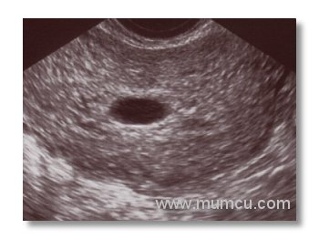

5 haftalık gebelikte gestasyonel kese  
Vajinal ultrasonografi

* * *

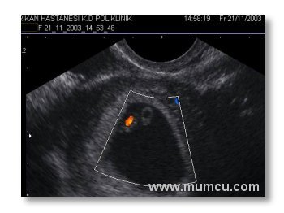

5 hafta 6 günlük gebelikte kalp atımlarının renkli doppler ile izlenmesi  
Vajinal ultrasonografi

* * *

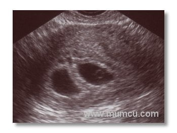

6 haftalık ikiz gebelik  
Vajinal ultrasonografi

* * *

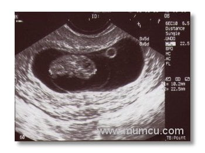

8 haftalık gebelikte amniyon kesesi, yolk kesesi ve embryo  
Vajinal ultrasonografi

* * *

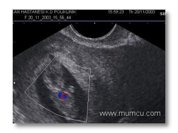

9 hafta 6 günlük gebelikte bebeğin kalp atımlarının renkli doppler ile izlenmesi  
Abdominal ultrasonografi

* * *

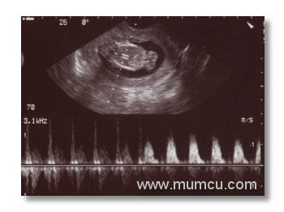

12 haftalık gebelikte bebeğin kalp atımlarının M Mode ve Doppler ile izlenmesi  
Vajinal ultrasonografi

* * *

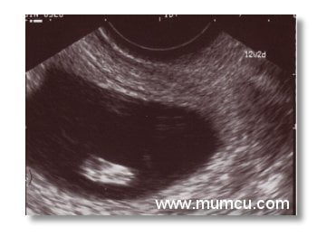

12 2/7 haftalık gebelikte bebeğin ayak tabanı  
Vajinal ultrasonografi

* * *

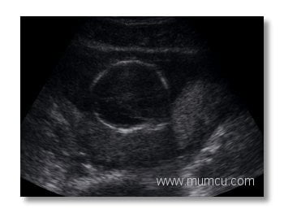

16 haftalık gebelik biparietal çap (BPD)ı  
Abdominal ultrasonografi

* * *

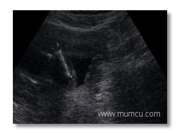

16 haftalık gebelik femur uzunluğu (FL)  
Abdominal ultrasonografi

* * *

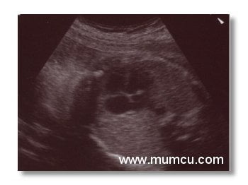

24 haftalık gebelikte kalbin 4 odacık halinde görünümü  
Abdominal ultrasonografi

* * *

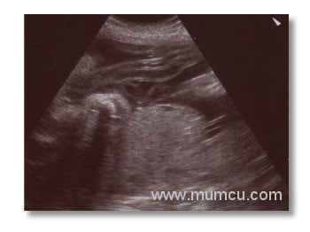

24 haftalık gebelikte göbek kordonu  
Abdominal ultrasonografi

* * *

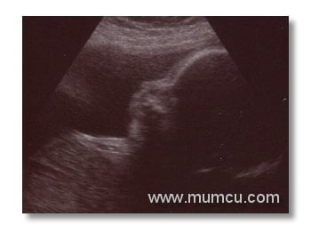

24 haftalık gebelikte bebeğin yüzünün yandan görünüşü  
Abdominal ultrasonografi

* * *

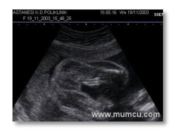

24 Haftalık gebelik kız bebek  
Abdominal Ultrasonografi

* * *

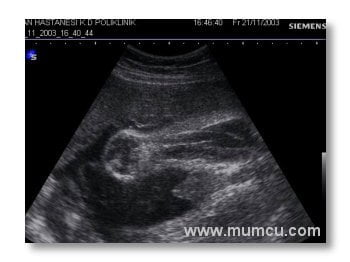

24 Haftalık gebelik erkek bebek  
Abdominal Ultrasonografi

* * *

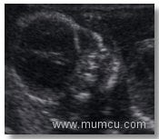  
16 Haftatık gebelik  
Fetal yüz (abdominal)

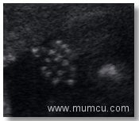  
16 Haftatık gebelik  
Fetal el (abdominal)

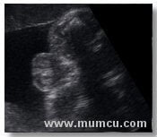  
23 Haftatık gebelik  
Testis (abdominal)

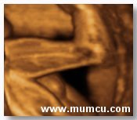  
32 haftalık gebelik bacak ve ayak  
4 Boyutlu ultrason
