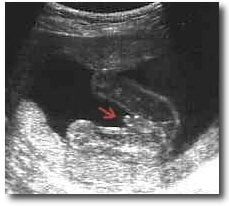
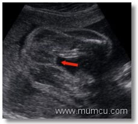

Yumurta sperm tarafından döllendiği anda doğacak bebeğin cinsiyeti de bellidir. Bunu belirlemede yumurtanın yani annenin hiçbir rolü yoktur.

Cinsiyeti belirleyen erkekden gelen spermin taşıdığı kromozomdur.Cunku anne, yani dişi, XX kromozom yapısına, baba ise XY kromozom yapısına sahiptir. Bu durumda anneden her zaman X kromozomu gelecektir. Eğer babadan gelen sperm X kromozomlu ise doğacak bebek XX yani kız olacak, eğer sperm Y kromozomu taşıyor ise doğacak bebek XY yani erkek olacaktır.

Döllenmenin gerçekleştiği anda aslında belli olan cinsiyet ancak 11. hafta civarında penisin gelişmesi ile dışarıdan bakıldığında anlaşılabilecek hale gelir. Buna paralel olarak doğacak olan bebeğin cinsiyeti kullanılan ultrason cihazının kalitesine ve çözünürlüğüne bağlı olarak bu haftadan itibaren teorik olarak görülebilir. Ancak pratikte bu her zaman mümkün olmamaktadır. Cinsiyet tespiti için en uygun dönem 16-20 haftalar civarıdır.

Bununla birlikte yapılan bir araştırmada gebeliklerinin 11-14 haftalarında olan 148 hastada bebeğin cinsiyeti görülmeye çalışılmış ve bunların 132 tanesinde bir tahminde bulunulabilmiştir. Ancak daha sonra yapılan takiplerde yapılan tahminlerin 106 hastada doğru olduğu geri kalanlarında ise yanılma söz konusu olduğu saptanmıştır. Bir başka deyişle cinsiyeti tahmin edilen bebeklerde yanılma oranı bu haftalar için %19.7’dir.

İlk trimesterda üç boyutlu ultrason ile incelenen 200 kadının bebeklerinde ise cinsiyet %85.3 oranında doğru olarak tahmin edilmiştir.

Bebeğin duruşunun uygun olmadığı zamanlarda gebeliğin sonuna kadar cinsiyet görülemeyebilir. Zaman zaman cinsiyet tayininde hatalar olabilmektedir. Kız denen bebeklerin doğduğunda aslında erkek olduğu ya da tam tersi durumlar söz konusu olabilmekte bu durum da bazı ailelerde yersiz endişeler yaratabilmektedir. Ultrason ile cinsiyet tayininin %100 olmadığı bilinmeli ve hata olabileceği her zaman hatırda tutulmalıdır.

  
Erkek Bebek

  
Kiz bebek

KAYNAKLAR

*   Cha, Sang Choon, Yamasaki, A. A. & Braia, G. (2001) Determination of fetal gender by first trimester ultrasonography. _Ultrasound in Obstetrics & Gynecology_ **18:** (s1); F47
*   Michailidis GD, Papageorgiou P, Morris RW, Economides DL. The use of three-dimensional ultrasound for fetal gender determination in the first trimester.Br J Radiol. 2003 Jul;76(907):448-51.
