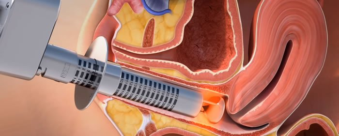

Vajinal kuruluk tedavisinde lazer uygulaması son dönemlerde giderek popülerlik kazanan oldukça etkili bir yaklaşımıdır. Tüm lazer uygulamaları açısından bakıldığında en yüzgüdürücü sonuçlar vajinal kuruluk tedavilerinde alınmaktadır.

Vajinal kuruluk ve bunun neden olduğu rahatsızlıklar özellikle menopoz sonrası dönemde sıkça karşılaştığımız durumlardır. Sadece menopoz sonrasında değil jinekolojik ameliyatlardan ya da kanser tedavilerinden sonra da pek çok kadın kuruluk ve ilişki sırasında ağrı nedeniyle jinekoloğa başvurmaktadır.

Eskiden lokal östrojen Uygulamaları ile tedavi edilmeye çalışılan bu rahatsızlık verici tablo Vajinal kuruluk durumunda kullanılan lazer uygulamaları ile çok büyük bir etkinlikle giderilebilmekte ve kadının yaşam kalitesi gözle görülür düzeyde arttırılmakta.

**Vajinal kuruluğun nedeni nedir?**  
Östrojen adı verilen kadınlık hormonu yumurtalıklarıdan salgılanır. Östrojen kadın üreme sistemi üzerinde pek çok noktada farklı etkilere sahiptir.Bu hormon aynı zamanda vajinanın nemli kaygan ve elastik olmasından da sorumludur.

Özellikle menepoz sonrasında, meme kanseri tedavilerini takiben ya da rahimin alındığı durumlarda östrojen düzeyleri düşer. Hormon düzeyindeki bu değişimler vajinanın derisi diyebileceğimiz mukozada rahatsızlık verici kuruluk ile sonuçlanır.

Dünya üzerinde milyonlarca kadın vajinal atrofi adı verilen düşük östrojen düzeyine bağlı bu problemden yakınır. Bu değişimler günlük yaşantınız ve seks yaşamınız üzerinde olumsuz etkiler yaratabilir.

Yeterli miktarda kayganlık olmayan durumlarda seks ağrılı olmaktadır. Hatta çok ileri durumlarda kanama ve vajina duvarında yırtılmalar bile görülebilir.

Kaşıntı ve irritasyon sık karşılaşılan yakınmalardandır. Bu durum mukoza bütünlüğünü bozduğu için Vajinal enfeksiyonlar açısından da artmış riski beraberinde getirir.

**Vajinal kuruluk varlığında geleneksel tedavi opsiyonları nelerdir?**  
Vajinal kuruluk şikayeti yaşayan Kadınların sahip olduğu tedavi opsiyonları sınırlıdır.

Östrojen replasman tedavileri ya da lokal uygulanan kremler genelde ilk akla gelen tedavi seçenekleridir. Ancak bazı meme kanseri hastaları gibi östrojen kullanılmasının uygun olmadığı durumlarda, ya da kişinin haklı nedenlerle hormon kullanmak istemediği hallerde ne yazıkki yakın geçmişe kadar kayganlaştırıcı kullanmak dışında başka bir opsiyon yok idi.

Günümüzde ise vajinal kuruluk tedavisinde lazer son derece etkili, yan etkisi neredeyse olmayan, güvenli bir tedavi alternatifidir.

**Vajinal lazer terapisi nasıl işe yarar?**  
Vajinal kuruluk tedavisinde lazer özellikle vajina dokusuna yönelik enerji miktarı ile çalışır. Ciltte uygulanan diğer lazer tedavileri gibi mikroskobik düzeyde doku uyarılmasını sağlayan enerji modalitesi kullanır.

Bu enerji, dokuda yeni kan damarlarının oluşumunu uyarır. Bu sayede vücudun iyileştirici ve mukus zarlar üzerinde denge sağlayıcı etkisi yeniden tetiklenmiş olur.

Vajina dokusu içerisindeki hücresel değişimler ile kolajen ve elastin yapımı neredeyse hemen başlar ve tek bir seansta bile pek çok kadın şikayetlerde gerileme bildirmektedir.

**Vajinal kuruluk için lazer tedavisi nasıl yapılır?**  
Tedavi son derece hızlı ve yaklaşık 10-15 dakika süren bir girişimdir. Anestezi ihtiyacı olmamakla birlikte yine de ağrı olmaması için işlemden yaklaşık 20 dakika önce vajina içerisine ağrı kesici krem uygulanır.

Özel silindir şeklinde spekulum vajina içerisine yerleştirilir ve bunun içerisinden yerleştirilen lazer 360 derecelik bir alana uygulama yapar.

****

*   Ofis şartlarında yapılır hastaneye gitmeyi gerektirmez
*   Lokal ya da genel anestezi gerektirmez
*   Yan etki riski minimaldir
*   Gündelik hayata ara vermeyi gerektirmez
*   Tek bir seansta bile şikayetlerde belirgin düzelme görülür.

**Vajinal kuruluk için lazer tedavisi ne sıklıkta yapılmalıdır?**  
İlk başlangıçta bir ay ara ile 2 seans yapılır. Takip eden dönemde iki-üç yılda bir tedavinin tekrarlanması gerekebilir.

**Vajinal kuruluk için lazer tedavisi sonrası herhangi bir kısıtlama var mıdır?**  
Kadınların neredeyse tamamı tedaviden hemen sonra normal gündelik yaşantısına geri dönebilirler. Ancak en az üç gün süreyle cinsel ilişki olmaması önerilir.

**Vajinal kuruluk için lazer tedavisi her yaşta yapılabilir mi?**  
Vajinal kuruluk şikayeti yaşayan menopoz öncesi ve menopoz sonrası her yaştaki kadın bu tedaviden yarar görür. Lazer tedavisi için bir üst yaş sınırı yoktur.

En çok faydayı östrojen düzeyleri artık son derece düşük olan menepozdaki kadınlar görür. Vajinal atrofi kronik bir rahatsızlık olduğu için tedavisiz gerilemesi pek mümkün değildir.

**Vajinal kuruluk tedavisinde lazer ne kadar etkilidir?**  
Menopause dergisinin 2020 Ocak sayısında yayınlanan bir çalışmada menopozdaki kadındar iki gruba ayrılmış. Bir gruba geleneksel şekilde ostrojenli krem verilirken diğer gruba lazer tadavisi uygulanmış. 6 ayın sonunda yapılan değerlendirmede idrar yolu şikayetleri ve cinsel fonksiyon açısından hastaların %70-80’inin sonuçları tatmin edici ya da çok tatmin edici bulduğu görülmüş.

Yine aynı derginin Temmuz 2017 sayısında yayınlanan bir başka çalışmada ise 1 yılın sonunda hastaların %92’sinin sonuçlardan memnun ya da çok memnun olduğu görülmüş.

Vajinal atrofi ve buna bağlı vajinal kuruluk nedeniyle özellikle cinsel hayatında sorun yaşayan kadınlar için vajinal lazer tedavileri hayat kalitesini belirgin derecede yükselten, herhangi bir yan etkisi olmayan son derece etkili tedavilerdir. **İlgili yazılar** [Vajinal kuruluk ve kayganlaştırıcılar](?p=1487)

Referanslar

1.  A randomized clinical trial comparing vaginal laser therapy to vaginal estrogen therapy in women with genitourinary syndrome of menopause: The VeLVET Trial Marie Fidela R Paraiso, Cecile A Ferrando, Eric R Sokol, Charles R Rardin, Catherine A Matthews, Mickey M Karram, Cheryl B İglesia. Menopause 2020 Jan;27(1):50-56. [https://pubmed.ncbi.nlm.nih.gov/31574047/](https://pubmed.ncbi.nlm.nih.gov/31574047/)
2.  Use of a novel fractional CO2 laser for the treatment of genitourinary syndrome of menopause: 1-year outcomes Menopause 2017 Jul;24(7):810-814. Eric R Sokol 1 , Mickey M Karram. [https://pubmed.ncbi.nlm.nih.gov/28169913/](https://pubmed.ncbi.nlm.nih.gov/28169913/)
3.  Vaginal erbium laser as second-generation thermotherapy for the genitourinary syndrome of menopause: a pilot study in breast cancer survivors. Marco Gambacciani, Marco Levancini. Menopause 2017 Mar;24(3):316-319. [https://pubmed.ncbi.nlm.nih.gov/28231079/](https://pubmed.ncbi.nlm.nih.gov/28231079/)
4.  Long-term effects of vaginal erbium laser in the treatment of genitourinary syndrome of menopause. M Gambacciani, M Levancini, E Russo, L Vacca, T Simoncini, M Cervigni Climacteric 201 Apr;21(2):148-152. [https://pubmed.ncbi.nlm.nih.gov/29436235/](https://pubmed.ncbi.nlm.nih.gov/29436235/)
