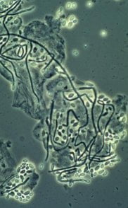

(Mikotik vajinit) Vajinal mantar enfeksiyonları ilk kez 1849 yılında gebe bir kadında tanımlanmıştır. Erişkin kadınların yaklaşık %75’i yaşamlarının herhangi bir döneminde en az bir kez mantar enfeksiyonu geçirirler

Çoğu kez gebelik, antibiyotik kullanımı gibi nedenlerle ortaya çıkan bu durum tedaviye kolay cevap verir. Ancak kronik vajinal mantar enfeksiyonu hem cinsel hem de psikolojik sorunlara yol açabilir. Vajinal mantar enfeksiyonlarına yol açan mikroorganizmalardan en sık görüleni Candida Albikans adı verilen bir maya hücresidir. Vakaların %67-95’inde bu mantar hücresi sorumlu olarak bulunduğundan, vajinal mantar enfeksiyonları genelde vajinal kandidiyazis şeklinde tanımlanır.

Candida Albikansın vajinada zaten normalde bulunan bir organizma mı olduğu yoksa belirti vermeyen kadınlarda saptandığında mutlaka tedavi edilmesi gereken bir patojen mi olduğu günümüzde dahi açıklığa kavuşturulamamış bir sorudur. Erkek semeninde üretilemediği için cinsel yolla bulaşan bir hastalık olarak kabul edilemez.Ancak yapılan araştırmalarda eşlerin benzer tipte mantar hücresi taşıdıkları saptandığı için pekçok hekim tedavide eş tedavisi de uygulamayı uygun görmektedir.

Vajinal mantar enfeksiyonuna neden olan candida albikans hifleri

**NASIL BULAŞIR**  
Vajinal mantar enfeksiyonunda üreyen mikroorganizmalar genellikle başkasından bulaşmaz. Kişinin zaten kendi vajinasında bulunan maya hücreleri çeşitli nedenler ile aktif hale gelip enfeksiyon yaratmaktadırlar. Dolayısı ile havuzdan vb. bulaşma söz konusu değildir. Çok nadiren cinsel ilişki ile bulaşabilir. Ancak bir kadında mantar enfeksiyonu olması mutlaka cinsel ilişki ile bulaştığı anlamına gelmez. Hayatında hiç cinsel ilişkide bulunmamış bakire kızlarda hatta küçük çocuklarda bile mantar enfeksiyonu olabilir.

**RİSK FAKTÖRLERİ**  
Vajinada belirti vermeden bulunan kandidalar çeşitli faktörlerin etkisi ile aktif hale geçerler ve klasik belirtiler ortaya çıkar. Ancak önemli bir gerçek de vakaların %50’sinde bu tür bir faktör olmadan hastalığın ortaya çıktığıdır.Vajinal mantar enfeksiyonlarını tetikleyen faktörler şunlardır:

*   **Antibiyotikler:** Geniş spekrtumlu olarak tabir edilen güçlü antibiyotikler vajinanın normal pH dengesini bozarak mantar enfeksiyonu için uygun ortam hazırlarlar. Vajinitte en sık etkili olan antibiyotikler tetrasiklin ve penisilin grubu ilaçlardır.
*   **Gebelik:** Özellikle gbeliğin son 3 ayında hücresel bağışıklığın azalması ile kandida gelişimi kolaylaşır. Yine gebelikte vajinada glikojen adı verilen maddenin artışı da bu olayı hızlandır. Vajinada glikojenin artmasına ise kanda östrojen ve progesteron miktarının yükselmesi neden olur.
*   Ş**eker Hastalığı:** Kan şeker düzeylerinin dengesiz seyrettiği kontrolsüz diabette idrar ve vajinal salgılarda şeker düzeyleri artar, bu da mantar için uygun bir ortam hazırlar.
*   **İmmunosupresyon:** Bağışıklık sisteminin baskılanması demektir. İlaçlar ya da sistemik hastalıklar sonucu hücresel bağışıklık sisteminin baskılanması kandidiazisi hızlandırır.
*   **Doğum Kontrol hapları:** Eski tipte yüksek doz oral kontraseptiflerin vajinal kandidiasiz için uygun zemin hazırladığı ileri sürülse de günümüzdeki düşük doz ilaçlar ile bu görüş geçerliliğini yitirmiştir.
*   **Rahim içi araç (spiral):** Etkisi tam olarak bilinmemektedir. Ancak kandidiazis için predispozan faktör olduğu ileri sürülmektedir.
*   **Hormon kullanımı:** Östrojen ve progesteron içeren ilaçların alımı kandidiazis görülme oranını arttırır.
*   **Naylon giysiler:** Özellikle kilolu kadınlarda giyilen naylon giysiler ve çamaşırlar bölgede sıcaklık ve nem artışına neden olurlar. Bu durum mantar hücreleri için altın değerinde bir fırsattır. Gelişen enfeksiyon tekrarlama ve kronikleşme eğilimindedir.
*   **Lokal allerjenler:** Renkli tuvalet kağıtları, parfümler, yüzme havuzundaki ilaçlar, tampon ve pedler alerjiye neden olabilirler. Alerjik zemin üzerinde ise daha sonra mantar enfeksiyonu gelişebilir.
*   **Metabolik hastalıklar:** Tiroid hormonu bozukluğu gibi hastalıklar kandidiazis için uygun zemin hazırlar
*   **Şişmanlık**
*   **Kronik servisit**
*   **Radyasyon**

**BELİRTİLERİ**  
Vajinal mantar enfeksiyonunun en önemli ve en sık görülen belirtisi kaşıntıdır. Bu kaşıntı geceleri şiddetlenir ve sıcak etkisi ile artar.

Hastaların çoğunda dış genital organlarda yanma vardır. Özellikle idrar yaparken, idrarın değdiği bölgelerde şiddetli yanma hissi olur.

Bazı hastalarda cinsel ilişki esnasında ağrı olabilir.

Vajinal kandidiazisde akıntı her zaman olmaz. Eğer mevcut ise bu akıntı beyaz renkli ve içerisinde süt ya da peynir kesiği şeklinde tanımlanan ya da kireç benzeri olarak nitelendirilen parçacıklar bulunur.

Akıntıda kötü koku görülmez. Kokunun olması kandidiazise eşlik eden ikinci bir enfeksiyonun varlığını akla getirmelidir.

Vulva ve vajinada kızarıklık ve şişlik olabilir. Vajina duvarında mantar plakları bulunabilir.Bunların görülmesi kandidiazis için tipiktir. Kaşımaya bağlı olarak vulva derisinde soyulmalar ve küçük kanamalar olabilir.

**TANI**  
Vajinal mantar enfeksiyonlarının tanısı güç değildir. Genelde muayene esnasında hastanın şikayetleri ve muayene bulgularının birarada değerlendirilmesi ilave bir laboratuvar tetkikine gerek kalmadan tanı koydurur. Vajinal kandidiazisde kültür almanın rolü yoktur. Bunun yerine alınan akıntı örneğinin potasyum hidroksil ile muamele edildikten sonra mikroskop altında incelenmesi ve tipik mantar psödohiflerinin görülmesi tanıyı kesinleştirir.

**TEDAVİ**   
Vajinal mantar enfeksiyonlarının tedavisi hem çok kolay hem de zordur. Tedavi ile akut şikayetler büyük ölçüde giderilir. Ancak hastaların %5-25’inde hastalık daha sonra tekrarlar. 1 yıl içinde en az 4 defa kandidazis atağı geçirilir ise bu durumda tekrarlayan enfeksiyonladan söz edilmektedir. Bu yeniden atakların nedeni mantar mayalarının vajinadaki sağlam dokuların içine girerek derinlere kadar ilerlemesi ve burada sessiz kalmaları ve ilaçlardan da etkilenmemesi olarak açıklanmaktadır.

Vajina hücreleri sürekli bir yenilenme içinde bulunduğundan üstteki hücreler dökülüp alttaki hücreler yüzeye çıktıkça bu mayalarda yüzeye yaklaşmakta ve uygun ortam bulduğunda yeniden enfeksiyona neden olmaktadır. Bu duruma invazif kandidiyazis adı verilir. İnvazif kandidiazisin önlenmesinde predispozan faktörlerin ortadan kaldırılması şarttır.

Tedavide hem sistemik hem de lokal ilaçların kullanılması gereklidir. Lokal ilaçlar hem vajinal ovül (fitil) hem de krem şeklinde olabilir. Tekrarlayan enfeksiyonlarda ise bazı yazarlar eş tedavisi gerektiğini düşünmektedirler. Kronik bir enfeksiyon yoksa eş tedavisi gerekli değildir.

Ağızdan alınan sistemik tedavide tek günlükten 1 haftalığa kadar tedavi protokolleri ve ilaçlar mevcuttur. Aynı durum vajinal ovüller için de geçerlidir.

Tedavi esnasında naylon giysiler giyilmemesi, çamaşırların pamuklu olması, kaynatarak yıkanması ve buharlı ütü ile ütülenmesi, dar giysilerden kaçınılması, vajinanın su ile yıkanmaması bunun yerine nötr pH derecelerine sahip ve bu amaçla üretilmiş sıvı sabunların kullanılması tedaviyi kolaylaştırır.İlgili makaleler[Kronik vajinal mantar enfeksiyonu](?p=4219)
