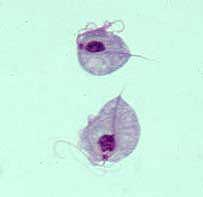
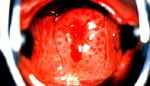

Kadınlardaki patolojik vajinal akıntıların en önemli sebeplerinden birisi de trikomoniazis adı verilen hastalıktır. Bu hastalığın etkeni olan “Trikomonas vajinalis” mikroskopik bir canlı olup bakteri ya da virüs değildir. İlk kez 1836 yılında tanımlanan organizma ovoid şekilde bir protozoon’dur.

Tirkomoniazis dolayısı ile paraziter bir enfeksiyon olarak nitelendirilir. Bu nedenle genel kanının aksine antibiyotiklerin tedavide yeri yoktur.

Trikomonas cinsel ilişki ile bulaşabilen hastalıklar grubuna girmektedir. Herhangi bir yakınması olmayan asemptomatik hastalarda %5-15 oranında vajinada T.vajinalis bulunur. Enfekte hastaların %37’sinde trikomonas ile birlikte gonore’de bulunur. Hasta kadınların ise yaklaşık yarısının eşinde hastalık etkeni izole edilebilir. Kadınların %25’i hayatlarının herhangi bir döneminde bu enfeksiyona yakalanırlar.

Trikomonas vajinalis

Trikomonas sadece cinsel temas ile geçmez. Örneğin tuvalet klozetlerinde 45 saat kadar canlı kalabildiği gösterilmiştir. Benzer şekilde ıslak çamaşırda 24, semende ise 6 saat canlılığını korur. Gebeliğinde enfekte olan annelerden doğan bebeklerden %5’i doğum esnasında paraziti kapar fakat bir süre sonra yenidoğanda östrojen bulunmadığı için kendiliğinden enfekte olmadan geçer.

T.vajinalis enfeksiyonu çoğu kez anaerob adı verilen ve oksijensiz ortamda üreyebilen bakterilerle birlikte bulunur. Bu durum vajinanın pH değerini değiştirerek trikomonas için ugun zemini hazırlar.

**Belirtiler**  
Trikomonas enfeksiyonu %80 oranda belirti vermez.Belirti varlığında hemen hemen bütün vajinal enfeksiyonlarda olduğu gibi en sık görülen bulgu akıntıdır. Tipik akıntı sarı-yeşil renkli, köpüklü bir tiptedir.Ancak hastaların bir kısmında akıntı farklı şekillerde olabilir.%10 vakada ise bu akıntıya kötü bir koku eşlik eder. Nadiren kaşıntı ve idrar yaparken yanma olabilir. Vulvada şişlik ve kızarıklık olabilir. Muayenede ise rahim ağzında çilek görünümü olarak adlandırılan küçük kanama odaklarının olması trikomonas için tanısal değer taşır. Cinsel ilişki sonrasında vajinal kanama görülebilir. Bazı durumlarda ise enfeksiyon aktif halde değildir. Kişi sadece taşıyıcıdır.

Trikomonas enfeksiyonunda görülen vajinal akıntı

**Tanı**  
Trikomonas teşhisi, jinekolojik muayene ve alınan akıntı örneğinin direk mikroskop altında incelenmesi ile konur. Mikroskop altında hareketli trikomonasların görülmesi tanı için gereklidir. Ayrıca bazen başka bir nedenle alınan servikal smearda da da trikomonaslar saptanabilir.

Trikomonas enfeksiyonunda  
servikste çilek görüntüsü

**Tedavi**  
Tedavide hem sistemik ilaçlar hem de lokal ovüller kullanılır. Trikomonasda eş tedavisinin de yapılması iyileşme oranlarını arttırır. Tedavi süresince kondom kullanılması oldukça faydalı olur.
