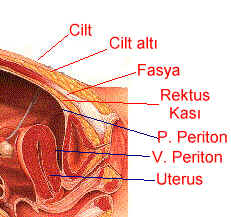
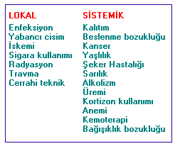

Ameliyat olan ya da olacak olan hastaların ilk sordukları soruların başında “ne zaman iyileşirim” sorusu gelir. Gerçekten de hastayı ilgilendiren en önemli konu hastalığın giderilmesinden sonra normal yaşantıya dönüş süresidir. Oysa yara iyileşmesi basit bir işlem değildir. Ameliyat esnasında sadece dıştan görülen kesi yapılmaz, o dış kesinin altında tabakalar halinde kesilen ve yeniden dikilen dokular mevcuttur. Her dokunun cerrahi kesiye verdiği cevap ve iyileşme süresi farklıdır. Bu nedenle hem dikiş esnasında kullanılan metaryelin yapısı, hem dokunun yapısı hem de çevresel faktörler yara iyileşmesini etkiler.

Örnek olarak vermek gerekirse sezaryen esnasında kesilen katlar şunlardır. İlk önce cilde bir kesi yapılır. Daha sonra cilt altındaki yağlı doku kesilir ve karnın ön duvarını kaplayan rektus fasyası adı verilen güçlü dokuya ulaşılır. Bu dokuda uygun şekilde kesildikten sonra her iki yandan gelip ortada birleşen rektus kasları ayrılır ve karın boşluğunu çevreleyen ince zar tabakasına ulaşılır. Pariyetal periton adı verilen bu tabaka dkkatli bir şekilde açılır. Artıkkarın boşluğuna girilmiştir. Bundan sonra ilk önce uterusu çevreleyen ve visseral periton adı verilen zar tabakası kesilirek açılır ve mesane zedelenmemesi için itilir. En son olarak uterus açılır, kaviteye girilir ve bebek çıkartılır. Plasenta ve ekleri çıkartılıp temizlik yapıldktan sonra sıra kapatma işlemine gelir. Açılan her tabaka tek tek ve özenle yeniden dikilir. En son cilt dikişi atılır. Hastanın ve ameliyatın durumuna göre ya estatik (yani dıştan görülmeyen ve alınması gerekmeyen dikiş konur ya da tek tek ipek dikiş ipliği ile daha sonra alınması gereken dikişler konur. Yeni bir teknik de dikiş yerine tıpkı tel zımba gibi cilt kenarlarını yaklaştıran stapler uygulamasıdır. Bu materyalinde daha sonra alınması gerekir.

Görüldüğü gibi dıştan sadece ince bir çizgi olarak görülen dikiş, altında en az 6 tabaka daha dikiş saklamaktadır. Her dokunun iyileşmeye olan meyili farklıdır ve bu nedenle farklı dikiş malzemeleri kullanılır. Örneğin fasya çok güçlü bir doku olmasına rağmen iyileşme potansiyeli düşüktür ve bu nedenle çabuk erimeyen, uzun süreli materyel kullanılmalıdır. Ciltte ise iyileşme çok hızlı olduğundan çabuk eriyen ancak allerji geliştirmeyen malzeme tercih edilmelidir.

Bir çeşit yaralanma olan cerrahi kesi sonrası birbiri içine geçmiş bir dizi reaksiyon başlar. Bunlar inflamasyon, epitelizasyon, neovaskülerizasyon, fibroblast proliferasyonu ve destek doku sentezidir.

**İnflamasyon** İnflamasyon iltihap anlamına gelir. Cilt bütünlüğü bozulunca ince damarlarda kısa süreli olarak daralma daha sonra ise genişleme meydana gelir. Birkaç saat içinde doku ödemlenir ve sıvı birikir.O bölgede asidite artar ve bu da yara iyileşmesini sağlayan kollajen sentezini uyarır  
**Epithelizasyon** Tüm cilt epitel adı verilen bir çeşit hücreden oluşmuştur. Biriken sıvı su kaybederek kabukhaline gelir. 24-48 saat içinde tüm kesi yeni epitel ile kaplanır ve su geçirmez hale gelir.  
**Neovaskülerizasyon** Yeni damar oluşumu demektir. Lokal etkiler ile hücreler yeni damar oluşturmak için çalışmaya başlar  
**Fibroblast proliferasyonu** Damar duvarında buluna hücreler kollajen sentezleyen fibroblast adı verilen hücrelere dönüşürler.  
**Destek doku sentezi** Çoğalan (prolifere olan) fibroblastlar kollajen adı verilen maddeyi sentezlemeye başlarlar.

Yara iyileşmesi primer ya da sekonder olabilir. Primer iyileşmede açılmış olan cerrahi kesi dikilerek kapatılır. Sekonder iyileşmede ise yara dikilmez ve aöık bırakılır. Günlük pansumalarla yaranın kendi kendine kapanması sağlanır. Bazı enfekte yaralarda sekonder iyileşme tercih edilir.

Primer olarak kapatılmış sorunsuz bir yarada eğer alınacak türde dikiş melzemesi kullanılmış ise 6-8 gün sonra dikişler alınabilir. Bu süreden sonra yara artık açılmaz ve kendi kendine iyileşmesine devam eder.

Tüm katların tamamen iyileşmesi 6 ay kadar sürebilir ancak bu dönem zarfında hasta tamamen normal aktivitelerinde bulunabilir. 6-8 gün sonra yara gücünü kazandığından aktivite kısıtlaması gerekmez. 6-8 günden tamamen iyileşmenin gerçekleştiği 6. aya kadar yaranın şekillenmesi süreci devam ettiğinden açılma olasılığı yoktur.

**Yara iyileşmesini etkileyen faktörler.  
****Lokal Faktörler  
Kanlanma**  
Yeterince kan akımı olamayn bir yara uygun şekilde beslenemediğinden enfeksiyon ve nekroza (doku ölümü) adaydır. Yaşlı kişilerde lokal kan akımları azaldığından yara iyileşmesi gecikir. Cerrahi uygulama esnasında lokal damarlara zarar verilmemesi iyileşmeyi hızlandırır. Bu tamemen cerrahın yeteneği ve dokuya olan saygısına bağlıdır.**  
Kontaminasyon & enfeksiyon**  
Ameliyathane şartlarında dahi bütün yaralar bir derceye kadar kontaminedir, yani bazı mikroorganizmalarla temas etmiş durumdadır. Sağlıklı bir kişide bu kadar az bir kontaminasyon kişinin bağışıklık sistemi tarafından elimine edilir ve yara iyileşmesi etkilenmez. Cerrahın antisepsi kurallarına riayet etmesi ve ameliyat yapılan ortamın genelde hijyen şartlarına uygunluğu kontaminasyon oranları üzerinde direk etkilidir. Dokuya ve işleme saygısı olmayan dikkatsiz bir cerrah kolaylıkla yaranın enfekte olmasına neden olabilir.**  
Doku tipi**  
Deri, barsak, mesane, vajina gibi dokuların iyileşme potansiyeli çok yüksekken, sinir, fasya gibi dokular çok geç iyileşir.**  
Travma**  
Yara yeri üzerine travma iyileşmeyi olumsuz etkiler. Bu nedenle yara yeri yeterli süre kapalı tutularak olası travmaların etkisi azaltılmalıdır.**  
Çevre ısısı**  
Lokal olarak artmış ısı kan dolaşımını hızlandıracağından iyileşmeyi çabukaştırabilir.**  
Sigara**  
Sigara kanlanmayı bozarak yara iyileşmesini geciktirir.**  
Yabancı cisim**  
Yabancı cisimler dokuda reaksiyona yol açarak iyileşmeyi geciktirirler. Bu nedenle allerjik olamayan yapay dikiş materyalleri kullanılmaldır.**  
Radyasyon**  
Maruz kalınan radyoaktivite hücrelerin çoğalma ve sentez kabiliyetini bozarak iyileşmeyi geciktirir.

**Sistemik faktörler  
Vitaminler ve mineraller**  
A ve C vitaminleri ile çinko yara iyileşmesi üzerinde olumlu etkiye sahiptirler.  
**Kronik hastalıklar**  
Şeker hastalığı, dolaşım hastalıkları, anemi gibi sistemik hastalıklar yara iyileşmesini geciktirir.  
**İlaçlar**  
Kortizon, antimetabolit gibi ilaçlar iyileşme üzerinde olumsuz etkiye sahiptirler.

Bunlar dışında operasyonun süresi ve hastanede kalış zamanı da enfeksyon gelişmi ve dolayısı ile yara iyileşmesi üzerinde etkiye sahiptir. Batın katları kapatılırken, özelikle cilt altındaki kanamaların dikkate alınmaması, az ya da fazla sayıda dikiş atılması, ameliyatın gereksiz yere uzatılması hep olumsuz faktörlerdir. 13 günden daha fazla hastanede kalanlarda hastane enfeksiyonları çok daha sık görülür.

Yara bakımında dikkaet edilecek en önemli nokta temizliktir. Özellikle ilk 24 saatte yara steril ped ya da özel bantlar ile kapatılmalıdır. 24-48 saat sonra yaranın üzeri açılabilir. Pansumanlar esnasında steriliteye dikkat edilmelidir.
