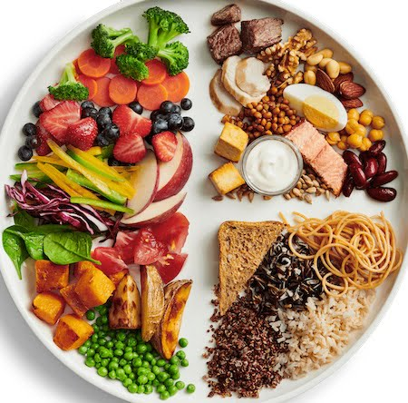

Artık bir bebek sahibi olmak istediğine karar veren ve bu nedenle kontrol için doktora giden çiftlerin her şeyin yolunda olduğunu öğrendikten sonra genelde ilk sordukları soru hamile kalmayı kolaylaştırmak ve sağlıklı bir şekilde hazırlanmak için neler yiyip içmeleri gereklidir.

Özellikle infertilite sorunu yaşayan ve bu nedenle doktora giden çiftlerde bu merak daha da belirgindir. Ancak her şeyden önce belirtmek gerekir ki ne yazıkki dünya üzerinde hiçbir doktorun elinde mucizevi bir diyet listesi yok.

Çocuk sahibi olmak için denemeye başlayan genç bir çiftin ilk ayda bu amacına ulaşma olasılığı %25 ila 30 civarındadır. İlk yılın sonunda çiftlerin yaklaşık %85’ı amacına ulaşırken geri kalan %15’ı infertilite tanısı alır.

İnfertilitenin yumurtlama bozukluğu, tüplerde tıkanıklık, sperm sayı ve hareketlerinde azalma gibi bilinen bazı nedenleri vardır. Bunun yanı sıra ileri kadın yaşı, yumurtalık rezervinde azalma ve endometriözış gibi bazı durumlar gebe kalmada güçlüğe ya da gecikmeye neden olabilir.

Chiu ve arkadaşları 2018 yılında, değişik diyetlerin ve besin desteklerinin gebe kalma potansiyeli üzerindeki etkilerini araştıran çalışmaların sonuçlarını değerlendiren bir derleme yayınladılar.

Bu değerlemeden elde edilen sonuçlar kabaca şu şekilde yorumlanabilir:

**Folik asit:** Folik Asit üremeden sorumlu hücrelerin üretimi ve gebelik için önemli bir vitamindir. Bebekte görülebilecek sinir sistemi ile ilgili problemleri engellemek için gereken doz günlük 400 ile 800 mikrogramdır. Folik asit alan kadınlarda yumurtlama bozukluklarına daha az rastlanır. Aşılama ya da tüp bebek tedavisine giren hastalarda günlük 800 µg folik asit kullanıldığında gebelik oranlarının bir miktar daha yüksek olduğunu düşündüren bulgular vardır. Ancak bu kanıtlanmış bir bilgi değildir.

**D vitamini:** D vitamini yumurtalıklar ve endometrium adı verilen rahim iç zarındaki reseptörler yardımıyla üremeyi etkiliyor olabilir. 20 ng/mL altındaki çok düşük D vitamini düzeylerinin erken gebelikte artmış düşük riski ile ilgili olabileceğini düşündüren bulgular vardır. Yapılan bazı çalışmalarda D vitamini seviyesi 30 ng/mL ve üzerinde olan kadınlarda tüp bebek tedavilerinde başarı oranlarının daha yüksek olduğu gösterilmiştir. Ancak bugüne kadarki çalışmalardan elde edilen sonuçlar kesin bir kanıya varmak için yeterli değildir.

**Magnezyum:** Günlük sehir hayatı oldukça stresli. Stresin vücutta yarattığı olumsuz etkilerden birisi de magnezyum eksikliği. Magnezyum eksikliği de önemli bir stres hormonu olan cortizol düzeylerinde artışa neden olabiliyor. Yani stres ve magnezyum eksikliği vücutta bir kısır döngüye neden olabilir. Stresin gebe kalma üzerideki olumsuz etkileri de uzun zamandır biliniyor. Gebe kalmak isteyenlerde birkaç ay öncesinden kanda magnezyum düzeylerine bakılması ve düşük olanlarda avokado, ceviz, fındık gibi kuruyemişler ile magnezyum açısından zengin ıspanak, karalahana gibi yeşil yapraklı sebzelerin tüketilmesi yararlı olabilir.

**Karbonhidratlar:** Diet ile alınan karbonhidratlar glikoz metabolizması ve insülin duyarlılığını değiştirerek üreme sağlığı üzerinde etkili olabilir. Bu durum özellikle polikistik over sendromu olan kadınlarda daha belirgindir. Herhangi bir işlemden geçmemiş tam tahıllar antioksidan etkilerinin yanısıra insülin duyarlılığını da olumlu etkileyerek gebe kalma potansiyelini arttırıyor olabilirler.

**Omega-3 destekleri:** Bu yağ asitleri endometriozis riskini azaltırlar. Literatürde kanda artmış omega üç yağ asitlerinin daha yüksek klinik gebelik ve canlı doğum oranları ile ilişkili olduğunu gösteren yayınlar mevcuttur. Omega-3 yağ asitleri antiinflamatuar etkiye sahiptir ve hem hormon yapımında rol alarak hem de rahime olan kan akımını arttırarak fertiliteyi desteklerler. Genel olarak besinler ile omega-6 alınıyor ama omega-3 çoğu zaman eksik kalıyor. Bu durum fertilite üzerinde de olumsuz etki yaratan kronik inflamasyona yol açıyor olabilir. Haftada en az iki kere somon gibi omega 3 içeriği yüksek balıkların tüketilmesi omega-3 yetmezliği ile mücadele açısından oldukça yararlı olacaktır. Vegan ya da vejeteryan beslenme tarzını benimseyen kişiler ise ceviz, chia, keten tohumu gibi bitkisel kaynaklardan omega-3 alabilirler.

**Protein ve süt ürünleri:** Yapılan bazı çalışmalarda süt ve süt proteinlerinin yumurtalık rezervini azalttığına yönelik veriler elde edilmiştir. Öte yandan diğer başka çalışmalarda süt tüketiminin tüp bebek tedavisine giren hastalarda sonuçları olumlu yönde etkilediğini düşündüren yayınlar da mevcuttur. Hayvansal gıdaların çevresel kirlilik nedenli ağır metallerin ve diğer kimyasal maddelerin taşıyıcıları olması nedeni ile üreme sağlığı üzerinde olumsuz etkileri olabileceği düşünülmektedir. Öte yandan balık tüketiminin olumlu etkileri olduğu bilinmektedir. 2019 yılının Ocak ayında yenilenen Kanada besin rehberinde süt ve süt ürünlerinin fazla miktarda tüketimi önerilmemektedir.

Genel olarak bakıldığında dengeli bir Akdeniz diyeti yani meyve, sebze, balık ve zeytinyağının bolca tüketildiği diyetler tüm insanlar için olduğu gibi gebe kalmak isteyen kadınlar için de en uygun beslenme şekli gibi görülmektedir.

En ideali gerekli olan besin maddelerini, vitamin ve mineralleri ilaç şeklinde değil, doğal besinler yoluyla almaktır.

Çünkü besinlerin içerisinde pek çok vitamin mineral ve benzeri madde bulunmaktadır. Bunların emilimi ve bio yararlanımı ilaç şeklinde alınan besin destekleri ile karşılaştırıldığında çok daha fazladır.

Gençler ve çocuklar arasında obezite giderek artan bir problem olarak karşımıza çıkmaktadır. Obezite hem bir kadının gebe kalma şansını azaltmakta, hem de gebelikte ortaya çıkabilecek olan problemlerin görülme sıklığını arttırmaktadır. Bu nedenle gebe kalmadan önce ideal kiloda olmak, ve dengeli bir beslenme alışkanlığı geliştirmek son derece önemlidir.

Son olarak kadınlar gebelik sırasında potansiyel olarak zararlı olabilecek tutun ve tütün ürünleri, elektronik sigara, alkol, legal ya da illegal uyuşturucu ilaçlar ve yüksek miktarda kafein tüketiminden mümkün olduğu kadar uzak durmalıdırlar.

Ne yazıkki gebe kalmak isteyen ya da tüp bebek tedavisine başlayan kadınlarda gebelik şansını arttırmak amaçlı beslenme önerileri ile alakalı elimizde yeteri kadar bilimsel veri mevcut değildir.

.  
**Kaynak**  
Diet and female fertility: doctor, what should I eat? Chiu, Yu-Han et al.Fertility and Sterility , Volume 110 , Issue 4 , 560 – 569
