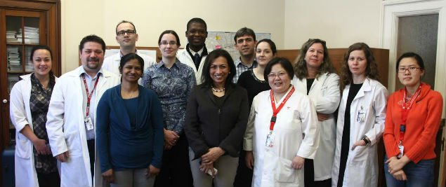

**Jinekolojik kanserler içinde en korkulanı yıllardır “sessiz katil” sloganı ile anılan yumurtalık kanseridir. Ancak son yıllarda bu slogan “Yumurtalık kanseri fısıldar, dinlemesini bilin” şeklinde değiştirilmiştir.**

Nadir görülen bir hastalık olarak tanımlansa da yine de sadece Amerika Birleşik Devletlerinde her 55 kadından biri bu hastalığın pençesine düşmektedir ve rahim kanserinden sonra ikinci en sık görülen jınekolojik kanserdir. Kansere bağlı kadın ölümleri arasında ise akciğer, meme, kolon kanserlerinden sonra dördüncü sırada gelmektedir. Yumurtalık kanseri jinekolojik kanserler içinde en ölümcül olanıdır.

Yumurtalık vücuttaki diğer bütün organlara kıyasla daha fazla çeşitte tümör üretme potansiyeline sahiptir. Bunun nedeni içinde çok farklı türde hücre barındırmasıdır, Buna bağlı olarak değişik yaş gruplarında değişik kanser türleri daha sık görülür, Örneğin üreme hücrelerinden köken alan tümörler 20-30 gibi genç yaşlarda ortaya çıkarken en sık görülen epiteliyel kanserler ise ortalama 60 yaş civarında teşhis edilir.

Güncel literatürde kadının hayatında hiç gebelik olmaması gibi bazı risk faktörlerinden söz edilse de bunların hiç birinin yumurtalık kanserine neden olduğu kanıtlanmamıştır. Meme kanseri gibi yumurtalık kanserinde de bazı genler sorumlu bulunmuştur ama bu olgular tüm yumurtalık kanserlerinin ancak %10’unu oluşturmaktadır. BRCA1 ve BRCA2 olarak adlandırılan genlerde görülen mutasyonlar meme ve yumurtalıkkanseri riskini arttırır ve bu gen mutasyonuna sahip kadınlarda koruyucu amaçlı meme ve yumurtalıkların alınması yoluna gidilebilir.

Ünlü film yıldızı Angelina Jölie’nin durumunu kendine saklamayıp BRCA gen mutasyonunu taşıdığını ve ameliyat olduğunu açıklaması medyanın dikkatini konuya çekmiştir.

Şubat 2014’de Journal of Clinical Oncology dergisinde yayınlanan çok geniş kapsamlı bir çalışmada bu gen mutasyonuna sahip kadınlarda 35 yasında yumurtalıkların alınmasının 70 yasından önce ölme olasılıklarını %77 oranında azalttığı ileri sürülmektedir.

Yine Mart 2014 yılında Nature Genetic dergisinde yayınlanan bir makalede nadir görülen ve genç yaştaki kadınları etkileyen bir tür yumurtalık kanseri neden olan bir genin tanımlandığı ileri sürülmüştür.

Ailede meme, kolon, rektum, endometrium, pankreas kanseri öyküsü olması kadının yumurtalık kanserine yakalanma riskini arttırır.

Genel olarak doğum yapmak ve doğum kontrol hapı kullanmış olmanın yumurtalık kanseri riskini azalttığı kabul edilir. Buna karşın obez ya da aşırı kilolu olmak riski arttırır. American Institute for Cançer Research tarafından 10 Mart 2014 tarihinde yayınlanan raporda vücut kitle indeksindeki her 5 puanlık artışın yumurtalık kanseri riskini %6 oranında arttırdığı belirtilmektedir.

Bu yazının yazıldığı 2014 yılı Mayıs ayı itibarı ile yumurtalık kanserinin taramasında kullanılacak bir tetkik yoktur. Ancak Cancer Epidemiology, Bıomarkers & Prevention. dergisinde Şubat 2014 tarihinde yayınlanan bir makalede Kaliforniya üniversitesinden araştırmacıların bir tarama testi ve marker bulmaya çok yaklaştıkları ileri sürülmektedir.

Hastalığa özgü bariz yakınmalar olmadığı, hastalığın erken dönemde neden olduğu yakınmalar çoğu zaman diğer basit nedenlere bağlı olarak görülebilecek ve ihmal edilebilecek türden yakınmalar olduğu için tanı genelde çok geç dönemde konabilmektedir.

Yumurtalık kanseriden kuşkulanılan durumlarda pelvik muayene, ultrason incelemesi ve kanda Ca-125 adı verilen bir tümör belirteçinin düzeyinin ölçülmesi fikir verir.

Kesin tanı ve hastalığın evrelemesi ancak cerrahi ile mümkündür. Yumurtalık kanseri hastalığın yumurtalıklarda sınırlı olup olmamasına göre evrelenir. Kabaca sadece yumurtalıkda ise Evre 1, rahim, fallop tüpleri ve pelvis içindeki diğer organlara sıçramış ise Evre 2, karın boşluğuna yayılmış ise evre 3 ve vücuttaki diğer uzak organlara kadar ulaşmış ise evre 4 olarak adlandırılır.

Literatürdeki son yayınlara göre evre 1 iken yakalanması ve tedavi edilmesi durumunda 5 yıllık yaşam şansı %93 civarındadır fakat ne yazık ki hastalık kendine özgü yakınmalara neden olmadığından hastaların %70’inde tanı konulduğunda kanser pelvis dışına yayılmış durumdadır. Yoğun cerrahi ve kemoterapiye rağmen Evre 3 hastalarda 5 yıllık yaşam şansı %23-41, Evre 4 kanser varlığında ise sadece %5-11 arasında değişmektedir. İşte bundan dolayı yumurtalık kanseri yıllardır sessiz katil olarak bilinmektedir ve son dönemlerde bu gerçeği kırmaya yönelik pekçok çalışma yapılmaktadır. Tüm kanserlerde erken tanı hayat kurtarır ancak yumurtalık kanserinde bu çok daha fazla önemlidir. İşte bu nedenle yapılan tüm araştırmalar bu sessiz katilin fısıltılarını duyup doğru şekilde yorumlamaya yöneliktir.

Montreal’deki McGıll üniversitesinde yürütülen ve benim de 2014 yılının başında dahil olduğum projenin amacı da İngiltere ve Amerika Birleşik Devletleri başta olmak üzere pekçok gelişmiş ülkede yurtülen çalışmalar gibi bu sinsi kanserin erken dönemde tanınmasına yardım edecek bir yöntem geliştirmektir.

2007 yılında Amerikan Kanser Cemiyeti bundan böyle yumurtalık kanseri için sessiz katil sloganını kullanmayacağını açıkladı. Bunu diğer ilgili kuruluşlar da izledi ve ortak bir karar ile hastalığın erken döneminde bile görülebilecek bazı belirtileri içeren bir liste ve rehber yayınlandı.

Bu rehberde şişkinlik, sık idrara çıkma, ağrı, yeme ve sindirim bozukluğu gibi aslında bu hastalığa özgü olmayan ve zaten yıllardır yumurtalık kanserinin belirtileri olarak ifade edilen yakınmaların yeni ortaya çıkması, kalıcı hale gelmesi ya da giderek şiddetlenmesi durumunda mutlaka zaman kaybetmeden jınekolojik muayene yapılması öneriliyor. Bir başka deyişle yumurtalık kanseri artık eskisi gibi sessiz katil olarak düşünülmüyor aksine kadınlara bu ölümcül hastalığın aslında fısırdar tarzda bile olsa belirti verdiği ve vücutlarını dikkatli bir şekilde dinlemeleri öneriliyor. Ayrıca sadece kendilerinin dinlemelerinin yeterli olmadığı doktorlarının da dinlediğinden emin olmaları gerektiği vurgulanıyor çünkü hastalığın erken dönemde yakalanamamasının önemli nedenlerinden biri de genelde hastalar gibi doktorarın da belirtileri ciddiye almaması.

Çoğu zaman karında ortaya çıkan sislikler menopoz öncesi kilo artışı olarak değerlendirilirken hazımsızlık, şişkinlik, bulantı gibi yakınmalar sindirim sistemi hastalıklarına bağlanıp antiasit gibi ilaçlarla tedavi edilmeye çalışılınıyor. Sık idrara çıkma yakınması olan hastalar idrar yolu enfeksiyonu olarak kabul edilip antibiyotiklere boğuluyor. Sindirim sistemi hastalıkları ise zaman zaman irritable barsak sendromu olarak tedavi edilmeye çalışılıyor. Oysa bu belirtiler bir arada değerlendirildiğinde yumurtalık kanserinin fısıltıları olabileceği pek akla gelmiyor.  
**Yeni ortaya çıkan, giderek şiddetlenen ya da kalıcı hale dönen**

*   Hazımsızlık
*   Gaz
*   Kabızlık
*   İshal
*   İştah kaybı
*   Kilo kaybı
*   Şişkinlik hissi
*   Çabuk doyma
*   Karnın alt kısmında ağrı ya da rahatsızlık
*   Halsizlik
*   Bel ağrısı
*   Bulantı
*   Kusma
*   Adet dışı kanama
*   Karında şişme
*   Ele gelen kitle

varlığında zaman kaybetmeden detaylı bir öykü, jinekolojik muayene, ultrason incelemesi ve kanda Ca12-5 düzeyi ölçümü yapılması önerilmektedir. Yaş 50 ve üzerinde olması durumunda durum daha da önem kazanmaktadır.

Son zamanlarda yumurtalık kanseri riski hesaplayan OVA1 gibi değişik testler geliştirilmiştir ve bu konuda yoğun çalışmalar devam etmektedir. Amaç erken dönemde yakalandığında büyük ölçüde tedavi edilebilen ama geç kalındığında oldukça ölümcül olan bu hastalığı mümkün olan en erken evrede tanıyabilmek ve başarılı bir şekilde tedavi edebilmekitir. Bu amaca ulaşmada kilit noktalardan birisi belki de en önemlisi kadınların kendi vücutlarının verdiği uyarıları dikkate alması ve doktorlarını bu uyarıları doğru şekilde değerlendirmeye zorlamalarıdır.

KAYNAKLAR

*   [http://jco.ascopubs.org/content/early/2014/02/24/JCO.2013.53.2820.abstract](http://jco.ascopubs.org/content/early/2014/02/24/JCO.2013.53.2820.abstract)
*   From the “Silent Killer” to the “Whispering Disease”: Ovarian Cancer and the Uses of Metaphor [http://www.ncbi.nlm.nih.gov/pmc/articles/PMC2766137/](http://www.ncbi.nlm.nih.gov/pmc/articles/PMC2766137/)
*   Ovarian Cancer Has Early Symptoms. [http://www.cancer.org/cancer/news/ovarian-cancer-has-early-symptoms](http://www.cancer.org/cancer/news/ovarian-cancer-has-early-symptoms)  (26 Mart 2014 tarihinde ziyaret edildi)
*   Goodrich ST1, Bristow RE2, Santoso JT3, Miller RW1, Smith A4, Zhang Z5, Ueland FR6.The effect of ovarian imaging on the clinical interpretation of a multivariate index assay. Am J Obstet Gynecol. 2014 Feb 12.
*   [http://www.ovariancanada.org/](http://www.ovariancanada.org/)
*   Small cell carcinoma of the ovary, hypercalcemic type, displays frequent inactivating germline and somatic mutations in SMARCA4; Pilar Ramos, Anthony N Karnezis, David W Craig, Aleksandar Sekulic, Megan L Russell, and others; Nature Genetics online 23 March 2014
*   Evaluation of Glycomic Profiling as a Diagnostic Biomarker for Epithelial Ovarian Cancer, Kyoungmi Kim, L. Renee Ruhaak, Uyen Thao Nguyen, Sandra L. Taylor, Lauren Dimapasoc, Cynthia Williams, Carol Stroble, Sureyya Ozcan, Suzanne Miyamoto, Carlito B. Lebrilla, and Gary S. Leiserowitz, Cancer Epidemiology, Biomarkers & Prevention
*   Ovarian Cancer 2014 Report: Food, Nutrition, Physical Activity and the Prevention of Ovarian Cancer, the Continuous Update Project, published online 11 March 2014.
