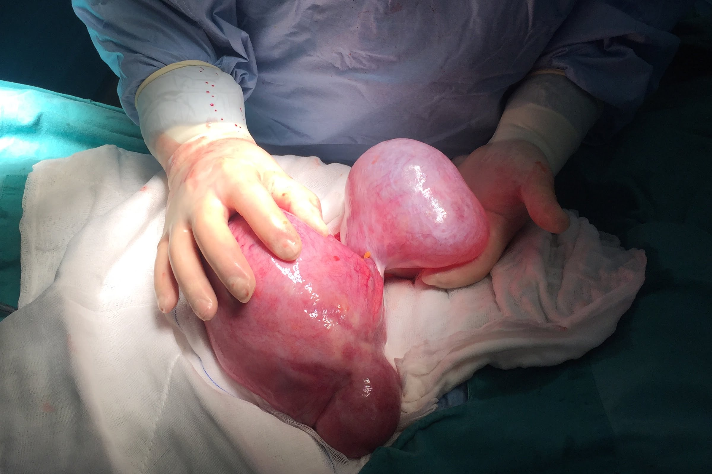
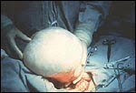
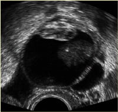

  
Genç olsun, yaşlı olsun pekçok kadının sıklıkla yaşadığı korkulardan birisi yumurtalıklarında kist olmasıdır.Gerçekten de düzenli kontrollere gidildiği taktirde hemen hemen her kadında hayatının bir döneminde yumurtalıklarında kist saptanabilir. Çoğu zaman herhangi bir tedavi dahi gerektirmeyen bu lezyonlar büyük olasılıkla hiçbir belirti de vermezler. Genelde masum olmalarına rağmen halk arasında çok korkulacak bir hastalık olarak bilinen over kistleri hep aynı türde değildir.  
Yumurtalık organı doku olarak çok değişik türde hücreleri bünyesinde barındırır. Kişinin embryonik döneminden başlayarak var olan ve değişim gösteren hücrelerde dahil olmak üzere birçok hormonun etkisi altında olan hücre türleri, yumurtalıkları diğer organlardan farklı kılar. Bu değişik türde hücreler çeşitli faktörlerin etkisi ile büyüyebilir ve kistleşebilirler. Kistler içerdikleri hücre türüne bağlı olarak hormon ya da benzeri maddeler salgılayabilirler.

**Kist Nedir ?**  
Kabaca ifade etmek gerekirse kist etrafı kist duvarı adı verilen ve etrafındaki dokulardan farklı bir doku ile çevrili, sıvı içeren kitlelerdir. İnsan vücüdunda hiçbir madde statik değildir. Bütün hücreler sürekli ölür ve yerlerine aynı türde yenileri yapılır. Yine bütün hücreler değişik miktar ve yapılarda sıvı salgılarlar. Hücreler arasında bulunan sıvıların bir kısmı kan dolaşımından gelirken bir kısmı da hücrelerin kendileri tarafından yapılır. Bu sıvılar sürekli absorbe edilir ve yeniden yapılır. Bu absorbsiyon ve üretim aşamalarındaki bir dengesizlik ya da başka bir nedenden dolayı sıvının aşırı birikmesine ödem denir. Eğer sıvılar farklı bir doku tarafından çevrelenir ve sıvı alışverişi engellenirse ortaya çıkan lezyonun adı kist olur. Vücutta bulunan hemen hemen bütün dokularda kist ortaya çıkabilir ancak yumurtalık dışındaki organların kistleri çok daha çabuk ve kolay belirti verebilir. Bunun nedeni diğer organlarda meydana gelen kistlerin bu organların fonksiyonlarını bozmalarıdır. Yumurtalık kistlerinin bir kısmı da bu şekilde fonksiyon bozukluğu yaratarak belirti verirken çok büyük bir bölümü de ne fonksiyonlarda bir kayba neden olur ne de uzunca bir süre belirti verir.

Over kistleri oluş biçimine göre de neoplastik yani tümorla ya da fonksiyonel olarak da iki bölümde incelenir.

**Belirtileri**  
Over yani yumurtalık kistleri kabaca habis ve selim basliklari altinda incelenebilirler. En sık görülen iyi huylu over kistleridir.Yumurtalıklar diğer organlara göre belirti verme açısından daha fakirdirler. Çoğu kez bir şikayet yaratmazlar ve rutin kontroller esnasında fark edilirler. En sık verdikleri belirti adet düzensizlikleri, karında şişlik, karın ağısı, sindirim sitemi bozuklukları, idrar yolu şikayetleri gibi özgün olmayan belirtilerdir. Over kisti dışında pekçok durum da benzeri şikayetler yarattığından, bu tür yakınmaları olan kişiler genelde durumlarını önemsemezler. Çok fazla büyümeyen bir over kisti karın boşluğu içerisinde kendine rahatlıkla yer bulabileceği için şişlik yapmaz. Benzer şekilde hormon salgısı yapmayan kistler de adet düzensizliği yaratmaz.

Ağrı over kistlerinde nadir olarak görülür. Eğer ağrı varsa bu kitlenin iltihaplandığını ya da endometriozis olabileceğini gösterir. Nadiren kistlerin kendi etrafında dönmesi (torsiyon) ya da patlaması (rüptür) şidetli ağrı ve akut karın tablosuna yol açabilir.Kistler mesaneye baskı yaparak sık idrara çıkma, rektuma bası yaparak da kabızlığa yada dışkı yaparken ağrıya neden olabilirler.Zaman zaman da iştahsızlık, kilo kaybı, hafifi bulantı gibi sindirim sistemi yakınmaları olabilir.

Akılda tutulması gereken nokta kistlerin çok farklı türlerinin olduğu ve yarattığı şikayetlerin kistin türüne bağlı olabileceğidir.

**Teşhis**  
Genelde rutin muayene ya da başka bir sebepten dolayı yapılan muayene ve ultrasonografide saptanırlar. Muayenede hastanın yaşı, kitlenin büyüklüğü, şekli, saf kist ya da solid yapıda oluşu, etrafa yapışık olup olmadığı, hassasiyet olup olmadığı, Önemlidir. Ultrasonografide saf kist görünümünde olan ve 5-6 santimden küçük çapta olan kistlerin iyi huylu ve fonksiyonel olma olasılığı yüksektir.Ayrıca tanıda hastanın ve kitlenin durumuna göre tomografi, manyetik rezonan hormon tetkikleri ve kanda tümör belirteçleri incelenir ve tedavi için bir karara varılır.

**Kistler  
İnklüzyon kisti**  
Sıklıkla rahim ameliyatı esnasında rastlanan fonksiyonel olmayan bir kisittir.Çoğu mikroskopik boyuttadır. Hiçbir belirti vermez ve ultrasonda da fark edilemez. Muhtemelen her yumurtlamadan sonra yumurtalık cidarının bütünlüğünün bozulmasını takiben iyileşme döneminde doku içerisinde germinal epitel adı verilen hücre türünün hapsolmasından kaynaklanmaktadır. Bazı araştırmacılar bu kistciklerin uzun dönemde habis değişime uğrayabileceğini ve over kanserinin öncülü olabileceğini iddia etmektedirler.

**Follikül kisti**  
Gençlerde en sık rastlanan kistlerin başında gelir. Gelişen yumurta hücresinin çatlamaması ve büyümeye devam etmesi nedeni ile olduğu düşünülmektedir.. Büyüklükleri genelde 2-3 santimetredir, nadiren 4 santimetreyi aşar. Oldukça gergin ve içinde berrak sıvı içeren kistlerdir. Herhangi bir komplikasyon yaratmazlar.

Nedeni tam bilinmektedir ancak kabul edilen bazı teoriler vardır. Kronik pelvik iltihabı gibi overlere giden kan miktarının arttığı durumlarda, buna bağlı olarak folliküllere ulaşan hormon miktarlarının normalden fazla olması nedeni ile gelişebileceği bilim çevrelerinde en fazla kabul gören oluş mekanizmasıdır. Yapılan deneylerde konjesyon olarak adlandırılan bu fazla kan akımının follükül aktivitesini arttırdığı gösterilmiştir.

Başka bir olası neden ise yüksek dozda gonadotropinlerin varlığında (beyinden salgılanan ve overlerde yumurta hücresi gelişimini uyaran hormonlar) overlerin olması gerekenden fazla uyarılması neticesinde ortaya çıktıklarıdır.Bu teorinin destekcisi kısırlık tedavisi esnasında yumurtlamayı teşvik edici ajan kullanan kadınlarda follikül kistlerinin normalden fazla görülmesidir.

Gonadotropin miktarı normal sınırlarda olsa dahi bunların salgılanış şekillerinde meydana gelen dengesizlikler de gelişmiş yumurta hücresinin çatlamasını engelleyebilir ve follikül kistine yol açabilir. Gonadotropinlerin salgılanış şeklini bozan pekçok etken olabilsede genelde altta yatan bir sebep bulunamaz.

Başka bir teoriye göre de yumurtalık etrafındaki yapışıklıklar ve herhangi bir nedenle yumurtalık duvarının kalınlaşması yumurtlamayı engelleyerek follikül kistine yol açmaktadır. Ancak bu görüş bilim çevrelerinde rağbet görmemektedir.

Follikül kistleri genelde belirti vermezler. Patlaması ya da kendi etrafında dönmesi ve akut batın tablosu yaratması yok denebilecek kadar azdır. Bazen östrojen hormonu salgılayarak adet düzensizliğine neden olabilir. Sıklıkla başka bir nedenle yapılan ultrason incelemesi esnasında fark edilen follükül kistleri, belirti verdiğinde en sık adet gecikmesine neden olur ve hastalar bu gecikme nedeni ile jinekoloğa müracaat ettiğinde fark edilirler.

Follikül kistleri genelde kendiliğinden kaybolur ve tedavi gerektirmez. Üreme çağındaki kadınlarda saptanan ve 5 santimetreden küçük kistler takibe alınır.Hasta bir ay sonra yeniden muayeneye çağırılır. Kistin 1-2 adet dönemi sonrasında kendiliğinden kaybolması beklenir. Bazı zamanlarda kistin küçülmesini kolaylaştırmak için doğum kontrol hapları verilebilir. Burada amaç beyinden salgılanan gonadotropinleri baskılayarak overler üzerindeki uyarıyı ortadan kaldırmaktır.

Tedaviye rağmen küçülmeyen ya da büyüme gösteren kistlerde ameliyat gerekli olabilir. Bu kistler genellikle üreme çağındaki genç kadınlarda görüldüğü için ameliyat esnasında yumurtalığa zarar vermeden sadece kist çıkartılır.

**Korpus luteum kisti**  
Normalde her yumurtlamadan sonra yumurta hücresinin atıldığı doku farklılaşır ve korpus luteum adı verilen dokuya dönüşür.Korpus luteumun görevi olası bir gebelikte düşük olmadan gebeliğin rahime yerleşmesini sağlayan progesteron adı verilen hormonun plasenta fonskiyonel hale gelene kadar üretilmesidir. Bu doku zaman zaman içinde sıvı birikmesi nedeni ile kistleşebilir. Genelde 3-4 cm büyüklüğündedir. Hormon salgılaması olduğu için adet rötarına yol açabilir. Kist içine kanama olursa kasıklarda ağrı görülebilir. Bazen patlayıp karın içine kanamaya yol açabilir. Bu durumda dış gebelik ile karıştırılabilir.

Herhangi bir komplikasyon gelişmediği durumlarda tedavi gerektirmez. Kendiliğinden kaybolur.

**Teka-lutein kisti**  
Aşırı hormon salgısına bağlı olarak ortaya çıkar. hemen hemen her zaman çift taraflıdır ve 20 cm kadar büyük olabilirler. Sıklıkla kısırlık tedavisi alanlarda görülür. Tedavide yaatak istirahati ve takip gerekir. Bazı zanamlara cerrahi tedevi gerekli olabilir.

**Gebelik Luteoması**  
Gebelik esnasınd görülen solid yapıda bir kitledir. Bazen 20 cm kadar büyüyebilir. Hastaların 4’te birinde fazla miktarda salınan erkeklik hormonuna bağlı olarak tüylenmede artış saptanbilir. Gebelik sona erdiğinde kendiliğinden geriler. Ancak diğer tümürlerden ayrımının yapılması gerekir.

**Tümörler**  
**Seröz Kistadenom**  
Yumurtalıkta en sık görülen tümörlerdir. En sık üreme çağındaki kadınlarda görülürler ve kendiliğinden kaybolmazlar. Çift taraflı olabilirler. %30 civarında habis bir hastalığa dönebilirler.

Yumurtalığın yüzeyini oluşturan epitel hücrelerinden köken alırlar.Tek veya birden fazla sayıda olabilirler. Berrak bir sıvı içerirler. Büyüklükleri 5-15 santimetre arasında değişir. Her iki overde de olması durumunda habislik potansiyeli yüksektir. İçerisinde sıvı dışında solid yapıların da olması habislik potansiyelini arttırır.

Oluş nedeni tam olarak bilinmeyen seröz kistadenomlara özgü bir bulgu yoktur. Genelde yakınma yaratmaz, belirti vermez. Jinekolojik muayene esnasında ya da ultrasonda tesadüfen teşhis edilir. İçerisinde kalsifikasyon olur ise röntgen filminde görülebilir. Nadiren hasta karnında yavaş gelişen bir şişlik nedeni ile jinekoloğa müracaat edebilir.

Tedavisi cerrahidir. Cerrahi esnasında eğer kist tek taraflı ise ve habis görüntüsü vermiyor ise yumurtalık bırakılıp tek taraflı alınabilir. Bizim tercihimiz operasyon esnasında alınan kistin o anda patolojik incelemeye tabi tutulması (buna frozen adı verilir) ve sonucuna göre operasyonun seyrine devam edilmesidir.

**Müsinöz Kistadenom**  
İyi huylu yumurtalık tümörlerinin %25 kadarı müsinöz kistadenomlardır. Çift taraflı olma olasılıkları seröz kistadenomlara göre daha düşüktür ve habaset olasılığı azdır. Oluş mekanizması tam olarak bilimemekle birlikte en çok kabul gören teori yumurtalıkların üzerini örten epitel hücrelerinin şekil değiştirerek rahim ağzının içini (serviks) döşeyen epitele dönmesi ve tıpkı rahim ağzında olduğu türde salgılamada bulunmasıdır. Başka bir teoriye göre de embryonik dönemde barsakları oluşturan hücrelerin kalıntılarından köken almaktadır.

İnsanda görülen en büyük kistik yapılardır. Genelde 15-30 santimetre boyutlarında olabilirler ancak 60 santimetreye kadar büyümüş olan müsinöz kistadenomlar literatürde mevcuttur. Kist genellikle içindeki ince zarlar ile pekçok odacığa bölünmüştür.Bu zarlara septa ismi verilir.Kistin içerisinde berrak ancak akışkan olmayan sümüğümsü bir sıvı bulunur.

Klinik olarak genelde belirti vermezler. Adet düzensizliği yaratmazlar, ancak boyutları çok büyük olduğu için karında şişlik ve bası bulguları olur. Sık idrara çıkma ya da kabızlık müsinöz kistadenomlarda sık rastlanılan yakınmalardır. Çok büyük oldukları için rüptüre olma olasılıkları (patlama) yüksektir. Böyle bir durum söz konusu olduğunda kist içinden yayılan sıvı karın boşluğuna yayılır ve hücreler burda da yaşamaya devam ederek salgılarını sürdürür. Karnın içi yavaş yavaş jel gibi bir sıvı ile dolar. Biolojik olarak habis olmamasına rağmen davranış olarak habis bir olay olan bu tabloya_pseudomiksoma peritonei_ adı verilir. Karın ağrısı, bulantı, kusma ve şiddetli karın şişliği olur. Sonuçta hastada beslenme bozukluğu ortaya çıkar. Kronik bir hastlıktır ve nihai tedavisi maalesef mevcut değildir.

Müsinöz kistadenomların tedavisinde tek yol cerrahidir. Üreme çağındaki kadınlarda nadiren görüldüğü için eğer tek taraflı ise sadece kistin ya da o taraftaki overin çıkartılması gerekli olurken ailesini tamamlamış ileri yaştaki kadınlarda rahim ve yumurtalıkların bir arada çıkartılması tercih ettiğimiz yöntemdir..

**Endometrioma**  
Rahimin içini döşeyen endometrium adı verilen zar tabakasının yumurtalıklarda bulunması ve her adet döneminde kanayarak kistleşmesi sonucu oluşur. Kist içi çukulata kıvamında bir sıvı ile doludur ve bu nedenle çukulata kisti de denir. Genelde etrafa yaışıklıklar gösterir. Hastalar doktora kısırlık, ağrılı adet görme, ilişki esnasında ağrı ve fazla miktarda adet görme şikayeti ile başvururlar. Tedavisi endometriozis bölümünde anlatılmıştır.

**Dermoid kist**

20 yaşından küçük bayanlarda en sık görülen tümördür. %10 vakada iki taraflı olabilir. Embryonel dönemde meydana gelen olaylardan kaynaklanır. Kitlenin içinde saç, deri, diş, kıkırdak parçaları, kemik, sinir hücreleri gibi her türlü doku görülebilir. Şikayet olarak karın ağrısı yapabilir. Kendi etrafında dönüp akut batın tablossuna neden olabilir. Bazen kısırlığa yol açabilir. Tedavisi cerrahidir.
