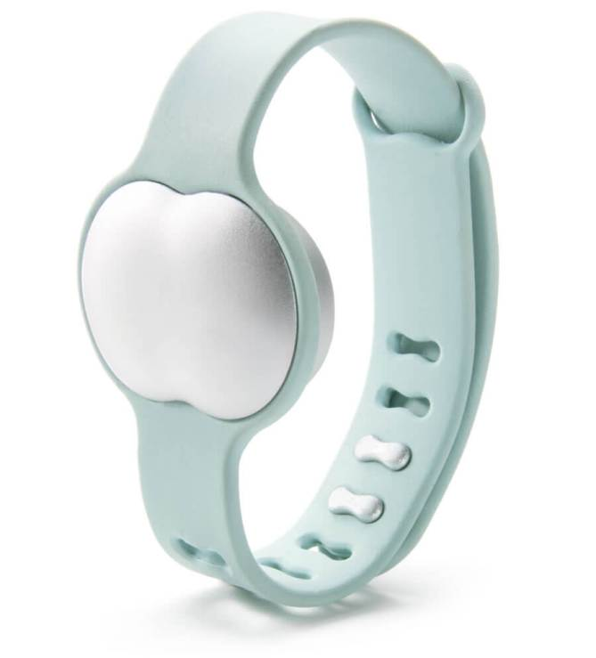

İçinde olduğumuz modern çağda insanların çoğu artık tesadüfi olarak değil önceden hazırlanarak ve planlayarak çocuk sahibi olma eğiliminde. Dünya üzerinde pek çok kadın bu hedefine sorunsuzca ulaşırken milyonlarcası da hamile kalmak için büyük çaba sarf etmek zorunda kalıyor. Bu sorunun üstesinden gelmek için fertilite yani Üreme sağlığı ile uğraşan hekimler ve firmalar değişik yöntemler öneriyorlar.

Bu yöntemler arasında en kolay uygulanabilen takvim yöntemi adı verileni .

Burada adet döngüsünün günleri takip edilerek yumurtlama olasılığının yüksek olduğu günlerde ilişkiye giriliyor.

Takvim üzerinden hesaplaması zor olanlarda ya da daha kesin sonuç isteyenlerde yumurtlama günlerini saptamak için tükürük ya da idrardaki hormon artışını takip eden cihazlar eczanelerde satılıyor.

Bilgisayar teknolojisi ve akıllı telefonlardaki gelişmeler üreme sağlığı konusunda da etkilerini göstermeye başladı. Geçtiğimiz günlerde amerikan ilaç ve gıda dairesinden onay alan yeni bir cihaz piyasaya sürüldü.

Ava adı verilen ve kola takılan bir bileklik olan bu cihaz tıpkı son yıllarda giderek popüler olan fitbit ve benzeri bileklikler gibi çalışıyor.

Sadece geceleri uyurken kola takılan bu bileklik gebe kalma şansının yüksek olduğu dönemde değişiklik gösteren nabız hızı solunum hızı uyku kalitesi hareket şekli vücut sıcaklığı gibi dokuz değişken hakkında veri topluyor ve yumurtama zamanını belirliyor.

Diğer yumurtlama takip eden yöntemlerden farklı olarak bu cihaz geçmişe dönük olarak değil gerçek zamanlı olarak yumurtlama zamanı hakkında bilgi verebiliyor.

Zürih Üniversitesi’nde yapılan klinik bir çalışmada Ava’nın yumurtlama zamanını tespit etmedeki başarısı %89 olarak bulunmuş.

Enteresan olarak Ava’nın üreticileri cihazın 35 yaş ve üzerindeki kadınlarda çok daha kullanışlı olduğunu iddia ediyorlar.

Şu an için sadece Amerika Birleşik Devletleri’nde piyasayasunulan cihaz 199 dolardan satılıyor.

Ava web sitesi [http://www.avawomen.com](http://www.avawomen.com)
