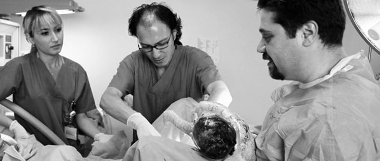

Son 20 yıl içerisinde hem ülkemizde hem de dünyada sezaryen oranlarında bir artış söz konusudur.Bu artışın altında yatan tek sebep kamuoyunda suçlandığı gibi doktorların kolaya kaçma isteği değildir. Tıp ve cerrahi alanındaki gelişmeler, anne karnında tanı ve ultrasonografideki ilerlemeler, anne olma yaşının geçmişe göre ilerilere kayması, çoğul gebelik sayılarındaki artış, infertilite tedavilerindeki artış, kişilerin etraflarından duydukları olumlu ya da olumsuz öyküler, medikolegal sorunlar gibi pekçok faktör bu artışı sağlamıştır. Ancak ne yazık ki her alanda olduğu gibi ülkemizde bu konuda da işin kontrolü kaçmış ve sezaryen oranları neredeyse %80’lere ulaşmıştır.

Ancak ne mutlu ki son zamanlarda gerek basında yer alan haberler gerekse insanların doğala olan yakınlaşması sayesinde normal doğum yapmak isteyen gebelerin sayısında gözle görülür bir artış vardır. Bu artışda internetin de rolü yadsınamaz. Internet üzerinde yer alan tartışma forumlarında güzel doğum öykülerinin artması gebeleri normal doğum için heveslendirmektedir.

Ancak bu forumlarda zaman zaman yanlış yönlendirmeler de olabilmektedir. Normal doğumu özendirmeye çalışan bir hekim olmama rağmen maalesef benim normal doğum yaptırmadığım yönünde bazı yazılara rastlıyorum. Bu tamamen yanlış bir bilgidir.  Takibim altındaki gebelerde ilk planda normal doğum yapmalarını empoze etmeye ve bununla ilgili korku ve endişelerini gidermeye çalışmaktayım.Ancak normal doğum yapmaktan isteyenler kadar hatta onlardan daha fazla sayıda gebe de bundan çekinmekte ve direkt sezaryen ile doğum yapmak istemektedir. Onların da bu isteklerine saygı duymaktayım.

Öte yandan son zamanlarda artan sayıda gebe hiçbir müdahale istememekte, suni sancı, epizyotomi ve hatta epidural anestezi uygulanmasını son ana kadar erteleme talebinde olmaktadır. Elbette ki bu isteklerine de saygı duyarak doğumlarını o şekilde yönetmeye dikkat etmekteyim

Bu duruma da açıklık getirmek ve yanlış bilgileri düzeltmek isterim.

Dr. Alper Mumcu
