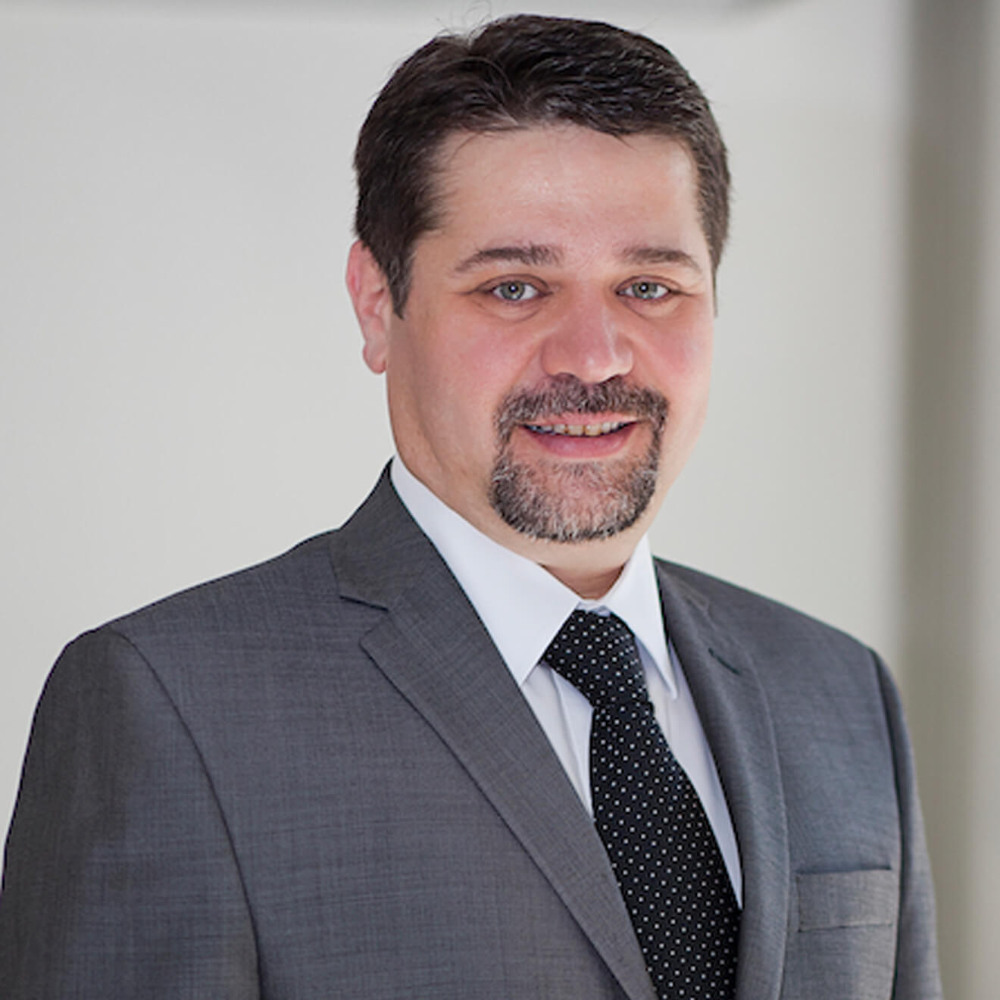

DR. ALPER MUMCU

Kadın hastalıkları ve doğum uzmanı



20 Ekim 1969 tarihinde Ankara’da doğdu.

1975-1986 yılları arasında ilk ve orta öğrenimini T.E.D. Ankara Koleji’nde tamamladıktan sonra, 1986 yılında girdiği Hacettepe Üniversitesi Tıp Fakültesi İngilizce bölümünden 1992 yılında mezun oldu.

1992-1997 yılları arasında Tıpta Uzmanlık Sınavındaki ilk tercihi olan İzmir, Dokuz Eylül Üniversitesi Tıp Fakültesi’nde Kadın Hastalıkları ve Doğum ihtisası yaptı.

1998-1999 yıllarında askerlik görevini Gülhane Askeri Tıp Akademisi, Haydarpaşa Eğitim Hastanesi’nde yerine getirdi.

Temmuz 2000-Ekim 2010 tarihleri arasında Amerikan Hastanesi Üreme Sağlığı Ünitesi’nde Kadın Hastalıkları ve Doğum uzmanı olarak görev yaptıktan  sonra Kanada’ya gitti.  Burada 3 yıl süre ile özel bir tüp bebek merkezinin kuruluşunda görev aldı.

Takip eden dönemde McGill Üniversitesi Tıp Fakültesi Araştırma Enstitüsünde yumurtalık kanserlerinin erken teşhisine yönelik bir araştırma projesindeki ekipte yer aldı. Ardından yine Montreal’de bulunan Clinique Gynesys bünyesinde görev yaptı.

Nisan 2015’de Türkiye’ye geri döndü.

Halen İstanbul Amerikan Hastanesi’nde ve Nişantaşı’nda özel muayenehanesinde hasta kabul etmektedir.

Alper Mumcu’nun yurtiçi ve yurtdışı dergilerde yayınlanmış bilimsel makaleleri ve ulusal/uluslararası kongrelerde tebliğ edilmiş bildirileri bulunmaktadır.

1 Haziran 1998 tarihinden beri Kadın Sağlığı ve Gebelik konularında ilk ve en geniş içerikli Türkçe içerikli web sitesini hazırlamakta ve yayınlamaktadır. Konu ile ilgili pekçok sektör dergisinde ve yazılı basında yazıları yayınlanmaktadır.

1993 yılından beri Diş Hekimi İpek Mumcu ile evlidir. Alp ve Arda adında ikiz erkek çocuk babasıdır.

2007 yılında fotoğraf sanatçısı Muammer Yanmaz’ın temel ve ileri düzey fotoğrafçılık kursunu tamamlamıştır. Özel olarak yemek fotoğrafçılığı  ve sokak fotoğrafçılığı ile ilgilenen Dr. Alper Mumcu’nun amatör çalışmaları https://www.flickr.com/photos/alpermumcu adresinde izlenebilir.

Yemek yapmaktan ve yaptığı yemekleri fotoğrafamaktan büyük keyif almaktadır.

Gizmo isminde erkek bir siyam kedisi sahibidir.

Alper Mumcu’nun tüm resmi sosyal medya üyeliklerine www.alpermumcu.net adresinden ulaşılabilir instagram hesabından takip edebilirsiniz.

**ÖZGEÇMİŞ**

 

KİŞİSEL BİLGİLER

 

Adı Soyadı

Alper Mumcu

Doğum yeri ve yılı

Ankara, 1969

Uzmanlık alanı

Kadın Hastalıkları ve Doğum

Ünvanı

Jinekolog, Operatör Doktor

Yabancı dil

İngilizce (Çok iyi)

 

Fransızca (Başlangıç)

EĞİTİM

 

1992-1997

Dokuz Eylül Üniversitesi

Tip Fakültesi Kadın Hastalıkları ve Doğum Uzmanlık Eğitimi

1986-1992

Hacettepe Üniversitesi

İngilizce Tip Fakültesi

1975-1986

T.E.D. Ankara Koleji

İlk ve Orta öğretim

DENEYİM

 

2015-

**Lotus Nişantaşı**  
Halaskargazi Cd. No:38-66  
Kat: 5 Daire: 93  
34371 Şişli/İstanbulve

Amerikan Hastanesi Üreme Sağlığı Ünitesi Kadın Hastalıkları ve Doğum Dept. & Tüp bebek ünitesi

2013-2015

Clinique.  Montreal, Kanada

2013

McGill University Health Centre Reseacrh Institute Dove Project. Montreal, Kanada

2010-2013

Montreal Reproductive Centre (Clinique Originelle from October 2013). Montreal, Kanada

2000-2010

Amerikan Hastanesi Üreme Sağlığı Ünitesi Kadın Hastalıkları ve Doğum Dept. & Tüp bebek ünitesi. Istanbul

1999-2000

Kadiköy Özel Çaginer Hastanesi. Istanbul

1998-1999

GATA Haydarpasa Egitim Hast. Kadin Hast. ve Dogum ABD

(Askerlik Görevi). Istanbul

##### **ÜYE OLDUĞU DERNEKLER**

*   The European Society of Human Reproduction and Embryology (ESHRE)
*   American Registry for Diagnostic Medical Sonography.
*   l’Ordre des technologues en imagerie médicale, en radio-oncologie et en électrophysiologie médicale du Québec
*   Istanbul Tabip Odasi
*   Türk Jinekoloji Dernegi
*   Ege Jinekoloji Dernegi
*   Jinekolojik Endoskopi Dernegi
*   Ankara Koleji Mezunlari Dernegi
*   Ankara Kolejliler Dernegi (Ist)

##### **MESLEKİ İLGİ ALANLARI**

*   Gebelik Takibi
*   Infertilite (Kısırlık)
*   Yardımcı Üreme Teknikleri (Tüp bebek)
*   Rutin Jinekoloji
*   Endoskopik cerrahi

BİLİMSEL ÇALIŞMALAR

*   Urman B, Balaban B, Alatas C, Aksoy S, Mumcu A, Isiklar A Zona-intact versus zona-free blastocyst transfer: a prospective, randomized study.Fertil Steril 2002 Aug 78:2 392-6
*   Balaban B, Urman B, Alatas C, Mercan R, Mumcu A, Isiklar A A comparison of four different techniques of assisted hatching. Hum Reprod 2002 May 17:5 1239-43
*   Urman B, Alatas C, Aksoy S, Mercan R, Nuhoglu A, Mumcu A, Isiklar A, Balaban B Transfer at the blastocyst stage of embryos derived from testicular round spermatid injection. Hum Reprod 2002 Mar 17:3 741-3
*   Balaban B, Urman B, Isiklar A, Alatas C, Aksoy S, Mercan R, Mumcu A, Nuhoglu A The effect of pronuclear morphology on embryo quality parameters and blastocyst transfer outcome. Hum Reprod 2001 Nov 16:11 2357-61
*   Acar B, Uslu T, Topuz A, Osma E, Ercal T, Posaci C, Erata Y, Mumcu A.Relation between bone mineral content and clinical, hormonal and biochemical parameters in postmenopausal women. Arch Gynecol Obstet 1998 261:3 121-8
*   Ercal T, Cinar O, Mumcu A, Lacin S, Ozer E Ovarian pregnancy; relationship to an intrauterine device. Aust N Z J Obstet Gynaecol 1997 Aug 37:3 362-4
*   Ercal T, Lacin S, Altunyurt S, Saygili U, Cinar O, Mumcu A Umbilical coiling index: is it a marker for the foetus at risk? Br J Clin Pract 1996 Jul-Aug 50:5 254-6

*   Mumcu A, Urman B. Infertilite araştırmasındada laparoskopinin yeri. Türk Jinekoloji Dernegi Uzmanlik Sonrasi Egitim Dergisi. 2000;3(2):27-33
*   Erata YE, Posaci C, Acar B, Mumcu A: Term Fetuslerde aldosteron ve elektrolitler. Jinekoloji ve Obstetrik 1996;10 (suppl 1):41-4
*   Erçal T, Çinar O, Mumcu A, Özer E: Primer ovaryal gebelik: Iki olgu sunumu.Jinekoloji ve Obstetrik 1996;10:251-3
*   Erata YE, Posaci C, Acar B, Mumcu A: Fetal gelisim ve prolaktin. Günes Kadin Dogum Dergisi. 1996;12:8-10
*   Erata YE, Mumcu A, Erten O, Çelik Ö, Koyuncuoglu M: Epitelyal over kanserlerinde evre, histoloji, tümör differensiasyonu ve lenf nodu tutulumu.GATA Bülteni 1996;38:87-91
*   Erata YE, Demir N, Celik O, Posaci C, Lacin S, Mumcu A. Mekonyumlu Yenidoganlarda Fetal Adrenal Fonksiyon. Perinatoloji Dergisi 1996; 4 (1): 13
*   Laçin S, Demir N, Uslu T, Yörükoglu K, Saygili U, Mumcu A, Erten O: Three cases of diffuse mullerian neoplasia. Acta Oncologica Turcica 1995;28(3-4):143-7
*   Erata YE, Güney M, Posaci C, Acar B, Dicle O, Mumcu A, Laçin S: Alt segment transvers sezaryen operasyonlarinda insizyon iyilesmesi: seri manyetik rezonans görüntüleme yöntemi ile degerlendirme. Kadin Dogum Dergisi. 1995;11(3):133-5
*   Posaci C, Mumcu A, Acar B: Ovarian Hiperstimulasyon Sendromu:Risk Faktörleri, Tani ve Tedavi. Türk Fertilite Dergisi. 1995;3(1):6-15
*   Erçal T, Posaci C, Topuz A, Yörükoglu K, Mumcu A, Acar B: Pipelle ile Endometrial Örnekleme: Yeterli Bir Teknik mi ? Kadin Dogum Dergisi. 1994; 9(4):247-9

*   Ramazan Mercan , Alper Mumcu.Infertilite. Eds. Berek JS. Çeviri Editörü: Erk A. Novak Jinekoloji. 13. Baski. Istanbul, Nobel Tip Kitapevleri Ltd. Sti. 2004, s 973-1066
*   Bülent Urman, Alper Mumcu.Ileri evre endometriozisin laparoskopik tedavisi. Eds. JED. Jinekolojide laparoskopik cerrahi. 1. Baski. Ankara, Atlas Kitapçilik Tic. Ltd. Sti. Mart 2004, s 195-207
*   Alper Mumcu, Bülent Urman. Yardimci üreme teknikleri. Eds. Cicek N, Akyurek C, Celik C, Haberal A. Kadin hastaliklari ve Dogum Bilgisi. Ankara, Günes Kitabevi, 2004, s1153-1163

*   Ercelen N, Urman B, Aksoy S, Alatas C, Isiklar A, Mumcu A, Mercan R.The outcome of PGD in couples with high order implantation failures. 20th Annual Meeting of the European Society of Human Reproduction and Embryology. 27-30th June 2004 Berlin Germany
*   Mercan R, Mumcu A, Isiklar A, Balaban B, Alatas C, Urman B. The Impact of Seasonal Variations on Fertilization Rate, Embryo Quality and Pregnancy Rates during Intracytoplasmic Sperm Injection. 59th Annual Meeting of the American Society for Reproductive Medicine October 11-15, 2003 San Antonio, Texas
*   Isiklar A, Mercan R, Balaban B, Mumcu A, Alatas C, Urman B. Semen Sample Collection in Medium Has No Beneficial Effect on Fertilization and Pregnancy Rates. 59th Annual Meeting of the American Society for Reproductive Medicine October 11-15, 2003 San Antonio, Texas
*   Ercelen N,Balaban B, Mumcu A, Tutar E, Mercan R, Urman B. Embryo Morphology Grading and Preimplantation Genetic Diagnosis to Improve the Predictive Accuracy of Embryo Transfer in Couples with Advanced Age and/or Repeated Implantation Failures. 58th Annual Meeting of the American Society for Reproductive Medicine October 12-17, 2002 Seattle, Washington USA
*   Balaban B, Isiklar A, Alatas C, Aksoy S, Mumcu A, Urman B. Comparison of Two Different Blastocyst Grading Systems and Their Impact on Pregnancy, Implantation, and Multiple Pregnancy Rates: A Randomized Study 58th Annual Meeting of the American Society for Reproductive Medicine October 12-17, 2002 Seattle, Washington USA
*   Ercelen N,Balaban B, Mumcu A, Isiklar A, Guler E, Mercan R, Alatas C, Urman B. Overall data for preimplantation genetic diagnosis of aneuploidy. Fourth International Symposium on Preimplantation Genetics 10-13 April 2002, Limassol, Cyprus
*   Balaban B, Urman B, Isiklar A, Aksoy S, Mumcu A, Nuhoglu A. Embryo Characteristics and the Outcome of Day 3 Embryo Transfer Related to Pronuclear Morphology (PNM) in Ejaculate ICSI Cycles. 57th Annual Meeting of the American Society for Reproductive Medicine October 20–25, 2001 Orlando, Florida USA
*   Urman B, Balaban B , Alatas C, Isiklar A, Mercan R, Mumcu A. A Prospective Randomized Trial of Zona Intact (ZI) Versus Zona Free (ZF) Blastocyst Transfer After ICSI. .57th Annual Meeting of the American Society for Reproductive Medicine October 20–25, 2001 Orlando, Florida USA
*   Alatas C, Aksoy S, Mercan R, Mumcu A, Urman B.In Vitro Fertilization and Embryo Transfer for the Treatment of Couples With Secondary Infertility and a History of Recurrent Abortion. 57th Annual Meeting of the American Society for Reproductive Medicine October 20–25, 2001 Orlando, Florida USA
*   Saygili U, Onvural A, Guney M, Mumcu A, Lacin S, Dogan E: Effect of estrogen therapy on bone mineral density in natural and surgical menopause. 11th. International Congress of Psychosomatic Obstetrics and Gynecology May 21-24 1995 Basel Switzerland

*   Mumcu A, Urman B., Yakin K, Aksoy S, Alatas C, Mercan R. Wallace ve Frydman embryo transfer kateterlerinin kullanimi ile 3. ve 5. günde gerçeklestirilen embryo transferlerinin karsilastirmali degerlendirilmesi. V. Türk Alman Jinekoloji Dernegi ve II. Reproductive Medicine Tartismali Konular ve Çözümler Ortak Kongresi. 16-20 Mayis 2003 Antalya
*   Balaban B, Isiklar A, Yakin Y, Urman B, Alatas C, Mumcu A. Transfer edilmeyen embriyolardan hatching veya kollabe blastokist gelisiminin klinik sonuçlarla iliskisi. Güncel infertilite ve yardimci üreme teknikleri sempozyumu. 24-27 Nisan 2003 Izmir
*   Erçelen N., Balaban B., Isiklar A., Tutar E., Alatas C., Mumcu A., Aksoy S., Mercan R., Nuhoglu A., Urman B. Results and Clinical Outcome of Pregnancies After Preconception Diagnosis in 108 IVF Cycles of American Hospital. 2nd World Congress of Perinatal Medicine for Developing Countries ve 8.Ulusal Perinatoloji Kongresi 1-5 Ekim 2002 Antalya-Belek
*   Erata YE, Demir N, Çelik Ö, Posaci C, Laçin S, Mumcu A: Mekonyumlu doganlarda fetal adrenal fonksiyon. 5. Ulusal Perinatoloji Kongresi 16-19 Nisan 1996 Ankara
*   Erata YE, Demir N, Posaci C, Laçin S, Mumcu A, Acar B. Fetal gelisim ve prolaktin. 5. Ulusal Perinatoloji Kongresi 16-19 Nisan 1996 Ankara
*   Saygili U, Önvural A, Güney M, Mumcu A, Laçin S, Dogan E: Effect of estrogen therapy on bone mineral density in natural and surgical menopause. 1. Uluslararasi Jinekoloji ve Obstetri Kongresi 2-6 Haziran 1995 Belek Antalya

*   69th Annual Meeting of the American Society for Reproductive Medicine Boston, Massachusetts USA 2013
*   68th Annual Meeting of the American Society for Reproductive Medicine San Diego, California USA 2012
*   IVF worldwide live Congress, In-Vitro fertilization Clinics embracing the digital age, Berlin Germany 2012
*   15th McGill symposium on reproductive endocrinology, infertility, and women’s health, 5th world congress on IVM, 1st international consensus conference on IVM. Montreal Canada Scientific Commitee, chairman 2011
*   66th Annual Meeting of the American Society for Reproductive Medicine Denver, Colarado USA 2010
*   Assisted reproductive Techniques: A journey to the future symposium. Istanbul 2010
*   Biostatistics and epidemiology symposium, Istanbul 2010
*   Yardimci üreme teknikleri: gelecege yolculuk sempozyumu Ocak 2010 Istanbul
*   Örnek problem ve çözüm odakli biyoistatistik ve epidemiyoloji sempozyumu Aralik 2009 Istanbul
*   64th Annual Meeting of the American Society for Reproductive Medicine November 8-12, 2008 San Francisco, California USA
*   3\. Ulusal Üreme Endokrinolojisi ve Infertilite Kongresi (TSRM 2008) 15-19 Ekim 2008 Antalya Türkiye
*   62nd Annual Meeting of the American Society for Reproductive Medicine October 21-25, 2006 New Orleans, Louisiana USA
*   1\. Çukurova Bölgesi Üreme Endokrinolojisi, Endoskopi ve Adölesan Kongresi. 18-20 Kasim 2005 Adana
*   Conjoint Meeting of the American Society for Reproductive Medicine 61st Annual Meeting and the Canadian Fertility and Andrology Society 51st Annual Meeting October 15-19, 2005 Palais de Congrès Montreal, Quebec, Canada
*   13th World Congress on In Vitro Fertilization, Assisted Reproduction & Genetics. May 26 – 29, 2005. Istanbul, Turkey
*   II. Ege Jinekolojik Endoskopi Sempozyumu ve Workshop 10-12 Mart 2005 Izmir.
*   1st International Congress of The Turkish Society of Reproductive Medicine 22-25th September 2004 Istanbul Turkey
*   20th Annual Meeting of the European Society of Human Reproduction and Embryology. 27-30th June 2004 Berlin Germany
*   In vitro seminerleri-2. 16-18 Nisan 2004 Abant- Bolu
*   59th Annual Meeting of the American Society for Reproductive Medicine October 11-15, 2003 San Antonio, Texas USA
*   Fetal Tip-Prenatal tani 2003.17-19 Nisan 2003 Antalya
*   6.Uludag Jinekolojik ve Obstetrik Kis Kongresi 15 – 19 Ocak 2003 Uludag
*   I. Ege Jinekolojik Endoskopik Cerrahi Sempozyumu 13-14 Aralik 2002 Izmir
*   58th Annual Meeting of the American Society for Reproductive Medicine October 12-17, 2002 Seattle, Washington USA
*   Yardimla Üreme Tekniklerinde Son Gelismeler 1-2 Ekim 2002 Istanbul
*   3rd Ultrasound Congress in Obstetrics and Gynecology & Ian Donald Ultrasound Course 19-22 May 2002 Antalya Turkey
*   3\. Ulusal Menopoz-Osteoporoz Reprodüktif Tip Kongresi 24-28 Eylül 1997 Antalya
*   4\. Uluslararasi Jinekoloji ve Obstetrik Kongresi 1-5 Eylül 1997 Izmir
*   5\. Ulusal Perinatoloji Kongresi 16-19 Nisan 1996 Ankara
*   2\. Izmir Güncel Tip Günleri 1-4 Nisan 1996 Izmir
*   Jinekolojide Operatif Laparoskopi Sempozyumu 3-4 Subat 1996 Izmir
*   Ulusal Menopoz ve Osteoporoz Simpozyumu 27-30 Eylül 1995 Istanbul
*   1\. Uluslararasi Jinekoloji ve Obstetrik Kongresi 2-6 Haziran 1995 Belek Antalya
*   2\. Jinekolojik Endoskopik Cerrahi Kongresi 15-18 Eylül 1994 Ankara

İletişim bilgileri

Adres (Muayenehane):  
Abdi İpekçi Caddesi No:61 Kat 5, Reassurans Han 2, 34267 Nişantaşı/İstanbul

Telefon:  
+90 212 219 1202

E-Posta:  
[randevu@mumcu.com](mailto:randevu@mumcu.com)

ÇALIŞMA SAATLERİ

Pazartesi – Cuma

10:00 – 18:30

Cumartesi

10:00 – 14:00

randevu almak için

Paylaşmış olduğum verilerin, 6698 sayılı KVKK'ye uygun olarak işlenebilmesini onaylıyorum.  

Δdocument.getElementById( "ak\_js\_3" ).setAttribute( "value", ( new Date() ).getTime() );
