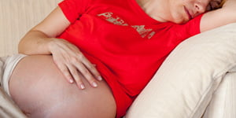

> ##### **Hamile kalmaya karar verdiğinizde…**
> 
> [Sağlıklı bir hamilelik dönemi geçirmek, sağlıklı ve rahat bir doğum yapmak ve sağlıklı bir bebeğe sahip olmak için hamile kalmaya karar verdiğinizde doktorunuzla görüşmeniz önemlidir.](/blog/hamile-kalmaya-karar-verdiginizde/)

> ##### **Hamile Kalmak İsteyenler İçin Cinsellik**
> 
> [İstemelerine rağmen gebelik elde edemeyen çiftlerden bazılarında altta yatan problem uygun zamanda ve yeterli sıklıkta ilişkinin olmaması, ya da uygulanan yanlış yöntemler gibi çok basit nedenler olabilir.](/blog/gebelik-isteyenler-icin-uygun-seks/)

> [Anne ve Yenidoğan Hakları](/blog/anne-ve-yenidogan-haklari/)
> 
> [Sorunsuz hamileliğe hazırlanmak](/blog/sorunsuz-hamilelige-hazirlanmak/)
> 
> [Fertiliteyi koruma ve arttırma önerileri](/blog/fertiliteyi-koruma-ve-arttirma-onerileri/)
> 
> [Yumurta Dondurma-Çocuk sahibi olma patansiyelini korumak](/blog/yumurta-dondurma-cocuk-sahibi-olma-patansiyelini-korumak/) 
> 
> [Doğum öncesi izni](/blog/dogum-oncesi-izni/)
> 
> [İleri yaşta gebelik](/blog/ileri-yasta-gebelik/)
> 
> [Folik asit](/blog/folik-asit/)
> 
> [Hamilelikte karın büyümesi](/blog/hamilelikte-karin-buyumesi/)
> 
> [Bebeğin zekasını annenin genleri belirliyor](/blog/bebegin-zekasini-annenin-genleri-belirliyor/) 
> 
> [Endometrial scratch (rahim zarının çizilmesi) gebelik oranlarını arttırabilir](/hamilelik/?p=2566)
> 
> [Gebe kalmak isteyenler için beslenme önerileri](/blog/gebe-kalmak-isteyenler-icin-beslenme-onerileri/) 
> 
> [Yiyecekler ve üreme potansiyeli. Gebe kalmak isteyen kadınlar neler yemeli?](/yiyecekler-ve-ureme-potansiyeli-gebe-kalmak-isteyen-kadinlar-neler-yemeli/)
> 
> [Bebek planlayanların işine yarayabilecek 7 öneri](/blog/bebek-planlayanlarin-isine-yarayabilecek-7-oneri/)
> 
> [Çocuk sahibi olmak isteyenler yaşam tarzlarını gözden geçirmeli](/blog/cocuk-sahibi-olmak-isteyenler-yasam-tarzlarini-gozden-gecirmeli/)
> 
> [Hamile kalma şansınızı arttıracak 11 küçük hatırlatma](/blog/hamile-kalma-sansinizi-arttiracak-11-kucuk-hatirlatma/)
> 
> [Yumurtalık rezervi testleri gebe kalma şansını yansıtmıyor](/hamilelik/?p=2987)
> 
> [İnfertilite ve depresyon](/blog/infertilite-ve-depresyon/)

> [İdrarda yapılan gebelik testleri](/blog/idrarda-yapilan-gebelik-testleri/)
> 
> [Hamileliğin belirtileri](/blog/hamileligin-belirtileri/)
> 
> [Gebelikte doktor takipleri](/blog/gebelikte-doktor-takipleri/)
> 
> [Gebelik takiplerinde yapılan incelemeler (Prenatal testler)](/blog/gebelik-takiplerinde-yapilan-incelemeler-prenatal-testler/)
> 
> [Hamilelikte anne adayında görülen değişiklikler](/blog/hamilelikte-anne-adayinda-gorulen-degisiklikler/)
> 
> [Erken gebelikte sık karşılaşılan sorunlar](/blog/erken-gebelikte-sik-karsilasilan-sorunlar/)
> 
> [Hamilelikte bulantı ve kusma (hiperemesis gravidarum)](/blog/hamilelikte-bulanti-ve-kusma-hiperemesis-gravidarum/)
> 
> [Gebelikte bulantı ve kusma ile başa çıkma önerileri](/blog/gebelikte-bulanti-ve-kusma-ile-basa-cikma-onerileri/)
> 
> [Bulantı ve kusma iyi giden gebeliğin habercisi](/blog/bulanti-ve-kusma-iyi-giden-gebeligin-habercisi/)
> 
> [Hamilelikte aşırı tükürük salgısı](/blog/hamilelikte-asiri-tukuruk-salgisi/)
> 
> [Gebelikte cilt değişiklikleri](/blog/gebelikte-cilt-degisiklikleri/)
> 
> [Bebeğin ilk hareketi](/blog/bebegin-ilk-hareketi/)
> 
> [Bebeğin Hareketleri](/blog/bebegin-hareketleri/)
> 
> [Gebeliğin son dönemleri](/blog/gebeligin-son-donemleri/)
> 
> [Anne karnında bebeğin duyularının gelişimi](/blog/anne-karninda-bebegin-duyularinin-gelisimi/)
> 
> [Emzirirken yeniden gebe kalmak](/blog/emzirirken-yeniden-gebe-kalmak/)

> [Düşük (Abortus)](/blog/dusuk-abortus/)
> 
> [Boş gebelik](/blog/bos-gebelik/)
> 
> [Düşük tehdidi](/blog/dusuk-tehdidi/)
> 
> [Tekrarlayan Düşükler (Habitüel Abortus)](/blog/tekrarlayan-dusukler-habituel-abortus/)
> 
> [Septik Abortus – Anne ölümlerinin önemli bir nedeni](/blog/anne-olumleri/)
> 
> [Kürtaj](/blog/kurtaj/)
> 
> [Düşük Hapı (RU486)](/blog/dusuk-hapi-ru486-2/)
> 
> [Hamilelikte aspirin ve progesteron kullanımı](/blog/hamilelikte-aspirin-ve-progesteron-kullanimi/)
> 
> [Progesteron tekrarlayan gebelik kayıplarında yarar sağlamıyor](/blog/progesteron-tekrarlayan-gebelik-kayiplarinda-yarar-saglamiyor/)
> 
> [Anti fosfolipid sendrom](/blog/anti-fosfolipid-sendrom/)
> 
> [Düşükten sonra hemen gebe kalmak sağlıklı bebek şansını arttırıyor](/blog/dusukten-sonra-hemen-gebe-kalmak-saglikli-bebek-sansini-arttiriyor/)

> [Dış gebelik](/blog/dis-gebelik/)
> 
> [Mol gebelik](/blog/mol-gebelik/)
> 
> [Yeri bilinmeyen gebelik](/blog/yeri-bilinmeyen-gebelik/)

> [Plasenta Previa](/blog/plasenta-previa/)
> 
> [Placenta accreata](/blog/placenta-accreata/)
> 
> [Abruptio placenta (plasentanın erken ayrılması, dekolman)](/blog/abruptio-placenta-plasentanin-erken-ayrilmasi-dekolman/)
> 
> [Gebelikte vajinal kanama](/blog/gebelikte-vajinal-kanama/)
> 
> [Subkoriyonik hematom](/blog/aspirin-subkoriyonik-hematom-riskini-arttiriyor/)

> [Amniyon sıvısının fazla olması](/blog/amniyon-sivisinin-fazla-olmasi/)
> 
> [Amniyon sıvısının azalması](/blog/amniyon-sivisinin-azalmasi/)
> 
> [Oligihidramniyos](/hamilelik/?p=2501)
> 
> [Rahim içi gelişme geriliği](/blog/rahim-ici-gelisme-geriligi/)
> 
> [Fetal gelişme kısıtlılığı](/blog/fetal-gelisme-kisitliligi/)
> 
> [Zarların erken açılması](/blog/zarlarin-erken-acilmasi/)
> 
> [Erken Doğum](/blog/erken-dogum/)
> 
> [Gün aşımı](/blog/gun-asimi/)

> [Amniyosentez](/blog/amniyosentez/)
> 
> [Koryon villus biopsisi](/blog/non-invazif-prenatal-testler/)
> 
> [Alfa feto protein (AFP)](/blog/alfa-feto-protein-afp/)
> 
> [Non invazif prenatal testler (cffDNA testi, cell free fetal DNA testi)](/hamilelik/?p=2349)
> 
> [İkili test (11-14 testi) ve fetal ense kalınlığı (NT)](/blog/ikili-test-11-14-testi-ve-fetal-ense-kalinligi/)
> 
> [Üçlü test](/blog/uclu-test-triple-test/)
> 
> [Dörtlü test](/blog/dortlu-test/)
> 
> [NST](/blog/38-hafta-artik-cok-az-kaldi/)
> 
> [CST](/blog/dogumun-izlenmesi/)
> 
> [Biyofizik profil](/hamilelik/?p=363)

> [Plasenta](/blog/372/)
> 
> [Plasenta Previa (önde gelen plasenta)](/hamilelik/plasenta-previa)
> 
> [Placenta accreata](/blog/placenta-accreata/)
> 
> [Göbek kordonu](/blog/gobek-kordonu/)
> 
> [Boyunda kordon dolanması](/blog/boyunda-kordon-dolanmasi/)
> 
> [Göbek kordonunda düğüm](/blog/gobek-kordonunda-dugum/)
> 
> [Doğumda kordon sıkışması](/blog/dogumda-kordon-sikismasi/)
> 
> [Kordon sarkması](/blog/kordon-sarkmasi/)
> 
> [Kordon kazaları (anne karnında bebek ölümü)](/blog/kordon-kazalari-anne-karninda-bebek-olumu/)
> 
> [Kordon kanı saklanması](/blog/kordon-kani-saklanmasi/)

> [Normal beta hCG değerleri](/hamilelik/?p=424)
> 
> [Karpal tünel sendromu](/blog/karpal-tunel-sendromu/)
> 
> [Gebelik ve astım](/hamilelik/?p=437)
> 
> [Bebek kız mı olsun erkek mi](/blog/bebek-kiz-mi-olsun-erkek-mi/)

> [Hamilelikte nefes darlığı](/blog/hamilelikte-nefes-darligi/)
> 
> [Hamilelikte karın ağrıları](/blog/hamilelikte-karin-agrilari/)
> 
> [Hamilelikte kabızlık](/blog/hamilelikte-kabizlik/)
> 
> [Hamilelik ve göbek deliğinde ağrı](/blog/hamilelik-ve-gobek-deliginde-agri/)
> 
> [Gebelik ve Hemoroid (Basur)](/blog/gebelik-ve-hemoroid-basur/)
> 
> [Gebelikte burun kanaması](/blog/gebelikte-burun-kanamasi/)
> 
> [Gebelik ve Hashimoto hastalığı](/blog/gebelik-ve-hashimoto-hastaligi/)
> 
> [Hamilelikte tansiyon düşüklüğü](/blog/hamilelikte-tansiyon-dusuklugu/)

> [Amniyotik band sendromu](/blog/amniyotik-band-sendromu/)
> 
> [Spina bifida](/blog/spina-bifida/)
> 
> [Down sendromu](/blog/anne-yasina-gore-bebekte-down-sendromu-gorulme-riski/)
> 
> [Anne yaşına göre bebekte down sendromu görülme riski](/blog/anne-yasina-gore-bebekte-down-sendromu-gorulme-riski/)

> [Hamilelik ve Diş Sağlığı](/blog/hamilelik-ve-dis-sagligi/)
> 
> [Hamilelikte dişeti hastalıkları](/blog/hamilelikte-diseti-hastaliklari/)
> 
> [Diş röntgeni güvenli midir](/blog/dis-rontgeni-guvenli-midir/)
> 
> [Diş tedavilerinde lokal anestezi](/blog/dis-tedavilerinde-lokal-anestezi/)
> 
> [Diş tedavileri ne zaman yapılmalıdır?](/blog/dis-tedavileri-ne-zaman-yapilmalidir/)

İKİNCİ BİR GÖRÜŞ ALIN

Paylaşmış olduğum verilerin, 6698 sayılı KVKK'ye uygun olarak işlenebilmesini onaylıyorum.  

